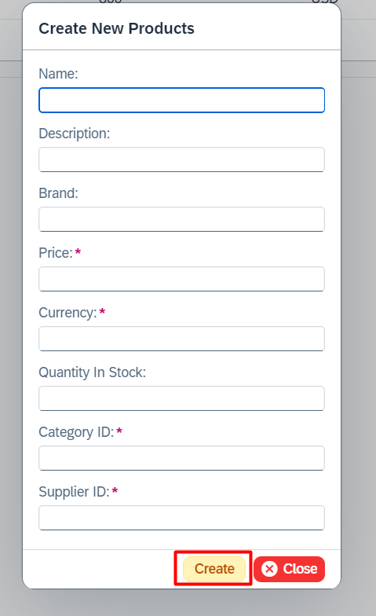

# Entry Create

The EntryCreateCL class is responsible for managing the CREATE (POST) operation through the OData V2 model. This class eliminates the need for developers to concern themselves with fragments, user input validations, and value help creation when working on custom SAPUI5 applications or Fiori Elements extensions. The following section outlines the key features of the Entry Create class.

## Features

[DIALOG_URL]: https://sapui5.hana.ondemand.com/#/api/sap.m.Dialog
[SIMPLEFORM_URL]: https://sapui5.hana.ondemand.com/#/api/sap.ui.layout.form.SimpleForm
[SMARTFORM_URL]: https://sapui5.hana.ondemand.com/#/api/sap.ui.comp.smartform.SmartForm
[OBJECT_PAGE_URL]: https://sapui5.hana.ondemand.com/#/api/sap.uxap.ObjectPageLayout
[VALUEHELP_CLASS_URL]: ./value_help.md

- [sap.m.Dialog][DIALOG_URL] generation with a [SmartForm][SMARTFORM_URL], [SimpleForm][SIMPLEFORM_URL], or custom content
- [sap.uxap.ObjectPageLayout][OBJECT_PAGE_URL] generation with a [SmartForm][SMARTFORM_URL], [SimpleForm][SIMPLEFORM_URL], or custom content
- User input validation via the [ValidationLogicCL](#validation-logic) class
- Value Help Dialog generation via the [ValueHelpCL][VALUEHELP_CLASS_URL] class
- Property sorting, readonly properties, UUID generation for the properties with `Edm.Guid` type
- Label generation for the [SmartForm][SMARTFORM_URL], [SimpleForm][SIMPLEFORM_URL] elements
- **createEntry()**, **submitChanges()**, and **resetChanges()** handling based on the user interaction
- Call a fragment and bind the context in case you do not want to use the auto-generated dialog

## Use Case

[SMARTFIELD_URL]: https://sapui5.hana.ondemand.com/#/api/sap.ui.comp.smartfield.SmartField

Let's assume you have an EntitySet named **Products** and wish to provide your end-user with the capability to create a new entity via a pop-up screen using the OData V2 service in your custom SAPUI5 application. The following steps are required to achieve this functionality.

1) It is necessary to create a **.fragment.xml** file that contains a dialog with form content (Simple, Smart, etc.) and to call it from the controller or to generate the dialog directly on the controller.

2) If you do not use the [sap.ui.comp.smartfield.SmartField][SMARTFIELD_URL] component with the OData Annotations, you will need to write a significant amount of Value Help code.

3) It is essential to validate user input, such as checking mandatory fields and ensuring that the values entered align with your business logic.

4) It is necessary to create a transient entity (createEntry) and either submit it or reset it based on the user interaction.

The [EntryCreateCL](#entry-create) class is responsible for executing all of the steps mentioned above.

## Constructor

[CONTROLLER_URL]: https://sapui5.hana.ondemand.com/#/api/sap.ui.core.mvc.Controller

In order to utilise the functionality of EntryCreateCL, it is necessary to initialise the object.

<table>
    <thead>
        <tr>
            <th>Parameter</th>
            <th>Type</th>
            <th>Mandatory</th>
            <th>Default Value</th>
            <th>Description</th>
        </tr>
    </thead>
    <tbody>
        <tr>
            <td>controller</td>
            <td><a href="https://sapui5.hana.ondemand.com/#/api/sap.ui.core.mvc.Controller">sap.ui.core.mvc.Controller</a></td>
            <td>Yes</td>
            <td></td>
            <td>The controller object (usually <code>this</code> object)</td>
        </tr>
        <tr>
            <td>entityPath</td>
            <td><code>string</code></td>
            <td>Yes</td>
            <td></td>
            <td>The name of the <strong>EntitySet</strong>. It can start with a <strong>"/"</strong> (slash)</td>
        </tr>
        <tr>
            <td>modelName?</td>
            <td><code>string</code></td>
            <td>No</td>
            <td><code>undefined</code></td>
            <td>The name of the OData V2 model which can be found on the manifest.json file. <strong>Leave this parameter undefined</strong> if the name of the OData model = "" (empty string)</td>
        </tr>
    </tbody>
</table>

!!! tip "Tip for TypeScript"

    The **EntryCreateCL&lt;EntityT&gt;** class is a generic class that can be initialized with a type that contains the properties of the EntitySet used as a parameter on the class constructor. The `EntityT` type is used as the `data?` parameter type for the **createNewEntry(data?: EntityT)** method.    

    Additionally, it is utilized as the return type of the **getResponse(): EntityT** method of the `ResponseCL` class, whose object is passed as a parameter into the function attached by the **attachSubmitCompleted(submitCompleted: (response: ResponseCL&lt;EntityT&gt;) => void, listener?: object)** method.


=== "TypeScript"

    ``` ts linenums="1" hl_lines="2 14 19 24"
    import Controller from "sap/ui/core/mvc/Controller";
    import EntryCreateCL from "ui5/antares/entry/v2/EntryCreateCL"; // Import the class

    /**
    * @namespace your.apps.namespace
    */
    export default class YourController extends Controller {
        public onInit() {

        }

        public async onCreateProduct() {
            // Initialize without a type
            const entry = new EntryCreateCL(this, "Products"); 
        }

        public async onCreateCategory() {
            // Initialize with a type
            const entry = new EntryCreateCL<ICategory>(this, "Categories"); 
        }

        public async onCreateCustomer() {
            // Initialize with a model name
            const entry = new EntryCreateCL(this, "Customers", "myODataModelName"); 
        }
    }

    interface ICategory {
        ID: string;
        name?: string;
    }
    ```

=== "JavaScript"

    ``` js linenums="1" hl_lines="3 18 23"
    sap.ui.define([
        "sap/ui/core/mvc/Controller",
        "ui5/antares/entry/v2/EntryCreateCL" // Import the class
    ], 
        /**
        * @param {typeof sap.ui.core.mvc.Controller} Controller
        */
        function (Controller, EntryCreateCL) {
            "use strict";

            return Controller.extend("your.apps.namespace.YourController", {
                onInit: function () {

                },

                onCreateProduct: async function () {
                    // Initialize
                    const entry = new EntryCreateCL(this, "Products"); 
                },

                onCreateCategory: async function () {
                    // Initialize with a model name
                    const entry = new EntryCreateCL(this, "Categories", "myODataModelName");
                }
            });

        });
    ```

## Create New Entry

[CREATE_ENTRY_URL]: https://sapui5.hana.ondemand.com/#/api/sap.ui.model.odata.v2.ODataModel%23methods/createEntry
[META_MODEL_URL]: https://sapui5.hana.ondemand.com/#/api/sap.ui.model.odata.ODataMetaModel

**The createNewEntry(data?: EntityT)** method creates an entry for the `EntitySet` specified through the [class constructor](#constructor) and binds it to the automatically generated or loaded dialog, which is located in the application files. The [createEntry()][CREATE_ENTRY_URL] method from the SAPUI5 library is utilized to create an entry, and the dialog is then opened after the entry is created.

The **createNewEntry()** method utilizes the [ODataMetaModel][META_MODEL_URL] to determine the `EntityType` of the `EntitySet` designated through the [constructor](#constructor). It then generates the form with the properties in the same order as the OData metadata, in accordance with the `EntityType`.

!!! note

    Please note that all **key** properties are marked as mandatory/required, and the labels are generated assuming that the naming convention of the `EntityType` is **camelCase**. For further details, please see the [Label Generation](#label-generation) section.

!!! warning

    Please be advised that the **createNewEntry()** method must be called after any configurations have been made through the public methods of the [Entry Create](#entry-create) class. Any configurations (form title, mandatory properties, etc.) made after the **createNewEntry()** method will not be reflected. As a best practice, the **createNewEntry()** method should be called at the end of your code block.

!!! note

    The default setting for **key** properties with the `Edm.Guid` type is to generate a random UUID value, which is not visible on the generated form. However, this behavior can be modified using the [setGenerateRandomGuid()](#properties-with-edmguid-type) and [setDisplayGuidProperties()](#properties-with-edmguid-type) methods.

### Method Parameters

<table>
    <thead>
        <tr>
            <th>Parameter</th>
            <th>Type</th>
            <th>Mandatory</th>
            <th>Default Value</th>
            <th>Description</th>
        </tr>
    </thead>
    <tbody>
        <tr>
            <td>data?</td>
            <td><code>EntityT</code> or <code>object</code></td>
            <td>No</td>
            <td><code>undefined</code></td>
            <td>The initial values of the entry</td>
        </tr>
    </tbody>
</table>

<table>
    <thead>
        <tr>
            <th>Returns</th>
            <th>Description</th>
        </tr>
    </thead>
    <tbody>
        <tr>
            <td><code>Promise&lt;void&gt;</code></td>
            <td>Once the promise has been fulfilled, the newly created entry can be retrieved using the <strong>getEntryContext()</strong> method with the object instantiated from the <a href="#constructor">EntryCreateCL</a> class.</td>
        </tr>
    </tbody>
</table>

!!! info

    The **createNewEntry()** method utilizes the default configurations when creating the dialog. However, these configurations can be modified through the use of the public setter methods.

### Default Values

<table>
    <thead>
        <tr>
            <th>Term</th>
            <th>Default Value</th>
            <th>Description</th>
            <th>Setter</th>
            <th>Getter</th>
        </tr>
    </thead>
    <tbody>
        <tr>
            <td>Naming Strategy</td>
            <td><a href="#namingstrategies-enum">NamingStrategies.CAMEL_CASE</a></td>
            <td>The default naming strategy is <strong>CAMEL_CASE</strong></td>
            <td><a href="#naming-strategy">setNamingStrategy()</a></td>
            <td><a href="#naming-strategy">getNamingStrategy()</a></td>
        </tr>
        <tr>
            <td>Resource Bundle Prefix</td>
            <td><code>antares</code></td>
            <td>The default resource bundle prefix is <strong>antares</strong></td>
            <td><a href="#resource-bundle-prefix">setResourceBundlePrefix()</a></td>
            <td><a href="#resource-bundle-prefix">getResourceBundlePrefix()</a></td>
        </tr>
        <tr>
            <td>Use Metadata Labels</td>
            <td><code>false</code></td>
            <td>The labels are not derived from the metadata, but rather generated.</td>
            <td><a href="#use-metadata-labels">setUseMetadataLabels()</a></td>
            <td><a href="#use-metadata-labels">getUseMetadataLabels()</a></td>
        </tr>
        <tr>
            <td>Form Type</td>
            <td><a href="#formtypes-enum">FormTypes.SMART</a></td>
            <td>The SmartForm with SmartFields is generated as the default option.</td>
            <td><a href="#form-type">setFormType()</a></td>
            <td><a href="#form-type">getFormType()</a></td>
        </tr>
        <tr>
            <td>Form Title</td>
            <td><code>Create New + ${entityPath}</code></td>
            <td>The <code>entityPath</code> parameter of the <a href="#constructor">constructor</a> is used</td>
            <td><a href="#form-title">setFormTitle()</a></td>
            <td><a href="#form-title">getFormTitle()</a></td>
        </tr>
        <tr>
            <td>Begin Button Text</td>
            <td><code>Create</code></td>
            <td>The default begin button text is <strong>Create</strong></td>
            <td><a href="#begin-button-text">setBeginButtonText()</a></td>
            <td><a href="#begin-button-text">getBeginButtonText()</a></td>
        </tr>
        <tr>
            <td>Begin Button Type</td>
            <td><a href="https://sapui5.hana.ondemand.com/#/api/sap.m.ButtonType">ButtonType.Success</a></td>
            <td>The default button type is <strong>Success</strong></td>
            <td><a href="#begin-button-type">setBeginButtonType()</a></td>
            <td><a href="#begin-button-type">getBeginButtonType()</a></td>
        </tr>
        <tr>
            <td>End Button Text</td>
            <td><code>Close</code></td>
            <td>The default end button text is <strong>Close</strong></td>
            <td><a href="#end-button-text">setEndButtonText()</a></td>
            <td><a href="#end-button-text">getEndButtonText()</a></td>
        </tr>
        <tr>
            <td>End Button Type</td>
            <td><a href="https://sapui5.hana.ondemand.com/#/api/sap.m.ButtonType">ButtonType.Negative</a></td>
            <td>The default button type is <strong>Negative</strong></td>
            <td><a href="#end-button-type">setEndButtonType()</a></td>
            <td><a href="#end-button-type">getEndButtonType()</a></td>
        </tr>
        <tr>
            <td>Mandatory Error Message</td>
            <td><code>Please fill in all required fields.</code></td>
            <td>The displayed message when the mandatory check is unsuccessful</td>
            <td><a href="#mandatory-error-message">setMandatoryErrorMessage()</a></td>
            <td><a href="#mandatory-error-message">getMandatoryErrorMessage()</a></td>
        </tr>
    </tbody>
</table>

!!! example

    Let's assume you have an EntitySet named **Products** and wish to provide your end-user with the capability to create a new entity via a pop-up screen using the OData V2 service in your custom SAPUI5 application.

=== "TypeScript"

    ``` ts linenums="1" hl_lines="2 17 25-28"
    import Controller from "sap/ui/core/mvc/Controller";
    import EntryCreateCL from "ui5/antares/entry/v2/EntryCreateCL"; // Import the class

    /**
     * @namespace your.apps.namespace
     */
    export default class YourController extends Controller {
      public onInit() {

      }

      public async onCreateProduct() {
        // Initialize without a type
        const entry = new EntryCreateCL(this, "Products");

        // Call without the initial values
        entry.createNewEntry(); 
      }

      public async onCreateCategory() {
        // Initialize with a type
        const entry = new EntryCreateCL<ICategory>(this, "Categories"); 

        // Call with the initial values
        entry.createNewEntry({
          ID: "ELEC",
          name: "Electronics"
        });
      }
    }

    interface ICategory {
      ID: string;
      name?: string;
    }
    ```

=== "JavaScript"

    ``` js linenums="1" hl_lines="3 21 29-32"
    sap.ui.define([
        "sap/ui/core/mvc/Controller",
        "ui5/antares/entry/v2/EntryCreateCL" // Import the class
    ], 
        /**
         * @param {typeof sap.ui.core.mvc.Controller} Controller
         */
        function (Controller, EntryCreateCL) {
          "use strict";

          return Controller.extend("your.apps.namespace.YourController", {
            onInit: function () {

            },

            onCreateProduct: async function () {
              // Initialize
              const entry = new EntryCreateCL(this, "Products"); 

              // Call without the initial values
              entry.createNewEntry();
            },

            onCreateCategory: async function () {
              // Initialize
              const entry = new EntryCreateCL(this, "Categories"); 

              // Call with the initial values
              entry.createNewEntry({
                ID: "ELEC",
                name: "Electronics"
              });
            }
          });

        });
    ```

The generated form with default values will be similar in appearance to the following example. However, it should be noted that the exact appearance may vary depending on the configurations and the `EntityType` properties of the `EntitySet`.


## Manual Submit

[ENTRY_UPDATE_URL]: ./entry_update.md

As a default setting, any changes made by the end user on the auto-generated form will be automatically submitted by the [Entry Create](#entry-create) and [Entry Update][ENTRY_UPDATE_URL] classes upon pressing the **begin button**. There may be a necessity, however, to run some code prior to submitting the changes via the OData V2 model.

It is possible to register a function that will be called in replacement of the automatic submit mechanism when the end user presses the **begin button**.

!!! danger "Attention"

    - Please be advised that the manual submit feature is only available for the [Entry Create](#entry-create) and [Entry Update][ENTRY_UPDATE_URL] classes.
    - Please be advised that this feature cannot be used in conjunction with the [Object Page](#object-page) feature.

To register a function, the **registerManualSubmit()** method can be used. Upon pressing the begin button, the registered function will be called, and an object constructed from the [Entry Create](#constructor) or [Entry Update][ENTRY_UPDATE_URL] class will be passed as a parameter to the function.

Once you have run your own code in the registered function, please call the **submitManually()** method using the object passed as a parameter to the function in order to complete the process.

Furthermore, the auto-generated dialog ([sap.m.Dialog][DIALOG_URL]) can be obtained by calling the **getGeneratedDialog()** method with the object passed as a parameter to the function.

=== "Setter (registerManualSubmit)"

    <table>
        <thead>
            <tr>
                <th>Parameter</th>
                <th>Type</th>
                <th>Mandatory</th>
                <th>Description</th>
            </tr>
        </thead>
        <tbody>
            <tr>
                <td>submitter</td>
                <td><code>(entry: EntryCreateCL&lt;EntityT&gt; | EntryUpdateCL&lt;EntityT&gt;) => void</code></td>
                <td>Yes</td>
                <td>The function that will be called when the user presses the begin button</td>
            </tr>
        </tbody>
    </table>

=== "Getter (getGeneratedDialog)"

    <table>
        <thead>
            <tr>
                <th>Returns</th>
                <th>Description</th>
            </tr>
        </thead>
        <tbody>
            <tr>
                <td><a href="https://sapui5.hana.ondemand.com/#/api/sap.m.Dialog">sap.m.Dialog</a></td>
                <td>Returns the auto-generated dialog</td>
            </tr>
        </tbody>
    </table>

!!! example

    Let us consider an `EntitySet` named **Products**. Before submitting the changes through the OData V2 model, we would like to run some code.

=== "TypeScript"

    ``` ts linenums="1" hl_lines="2 3 18 25-37 47 54-66"
    import Controller from "sap/ui/core/mvc/Controller";
    import EntryCreateCL from "ui5/antares/entry/v2/EntryCreateCL"; // Import the class
    import EntryUpdateCL from "ui5/antares/entry/v2/EntryUpdateCL"; // Import the class

    /**
     * @namespace your.apps.namespace
     */
    export default class YourController extends Controller {
      public onInit() {

      }

      public onCreateProduct() {
        // initialize
        const entry = new EntryCreateCL<IProducts>(this, "Products");

        // register the submitter function
        entry.registerManualSubmit(this.createProductManually, this);

        // call the dialog
        entry.createNewEntry();
      }

      // use the same generic type with the constructor in onCreateProduct method
      private async createProductManually(entry: EntryCreateCL<IProducts>) {
        // obtain the generated dialog
        const dialog = entry.getGeneratedDialog();

        dialog.getContent().forEach((content) => {
          // here you can access each element of the dialog
        });

        // run your own code (can also be async)

        // do not forget to complete the submit process
        entry.submitManually();
      }

      public async onUpdateProduct() {
        // Initialize with a type and use the table id as the initializer
        const entry = new EntryUpdateCL<IProducts, IProductKeys>(this, {
          entityPath: "Products",
          initializer: "tblProducts" // table id
        });

        // register the submitter function
        entry.registerManualSubmit(this.updateProductManually, this);

        // call the dialog
        entry.updateEntry();    
      }

      // use the same generic type with the constructor in onUpdateProduct method
      private async updateProductManually(entry: EntryUpdateCL<IProducts>) {
        // obtain the generated dialog
        const dialog = entry.getGeneratedDialog();

        dialog.getContent().forEach((content) => {
          // here you can access each element of the dialog
        });

        // run your own code (can also be async)

        // do not forget to complete the submit process
        entry.submitManually();    
      }

    }

    interface IProducts {
      ID: string;
      name: string;
      description: string;
      brand: string;
      price: number;
      currency: string;
      quantityInStock: number;
      categoryID: string;
      supplierID: string;
    }

    interface IProductKeys {
      ID: string;
    }
    ```

=== "JavaScript"

    ``` js linenums="1" hl_lines="3 4 22 28-40 50 56-68"
    sap.ui.define([
        "sap/ui/core/mvc/Controller",
        "ui5/antares/entry/v2/EntryCreateCL", // Import the class
        "ui5/antares/entry/v2/EntryUpdateCL" // Import the class
    ], 
        /**
         * @param {typeof sap.ui.core.mvc.Controller} Controller
         */
        function (Controller, EntryCreateCL, EntryUpdateCL) {
          "use strict";

          return Controller.extend("your.apps.namespace.YourController", {
            onInit: function () {

            },

            onCreateProduct: async function () {
              // initialize
              const entry = new EntryCreateCL(this, "Products");

              // register the submitter function
              entry.registerManualSubmit(this._createProductManually, this);

              // call the dialog
              entry.createNewEntry(); 
            },

            _createProductManually: async function (entry) {
              // obtain the generated dialog
              const dialog = entry.getGeneratedDialog();

              dialog.getContent().forEach((content) => {
                // here you can access each element of the dialog
              });

              // run your own code (can also be async)

              // do not forget to complete the submit process
              entry.submitManually();          
            },

            onUpdateProduct: async function () {
              // Initialize and use the table id as the initializer
              const entry = new EntryUpdateCL(this, {
                entityPath: "Products",
                initializer: "tblProducts" // table id
              });

              // register the submitter function
              entry.registerManualSubmit(this._updateProductManually, this);

              // call the dialog
              entry.updateEntry();      
            },

            _updateProductManually: async function (entry) {
              // obtain the generated dialog
              const dialog = entry.getGeneratedDialog();

              dialog.getContent().forEach((content) => {
                // here you can access each element of the dialog
              });

              // run your own code (can also be async)

              // do not forget to complete the submit process
              entry.submitManually();    
            }

          });

        });
    ```

## Disable Auto Dialog Close

The generated dialog is closed and destroyed after the submission is completed by default in the [Entry Create](#entry-create) and [Entry Update][ENTRY_UPDATE_URL] classes. However, this auto-close feature can be disabled if you still need to access the dialog content after the submission. This feature is particularly useful when there are custom contents that will be managed after the submission is completed.

!!! tip

    To close and destroy the dialog afterwards, the **closeAndDestroyEntryDialog()** method can be utilized through the object instantiated from the [Entry Create](#constructor) or [Entry Update][ENTRY_UPDATE_URL] class.

To disable the auto close feature, the **setDisableAutoClose()** method can be utilized.

=== "Setter (setDisableAutoClose)"

    <table>
        <thead>
            <tr>
                <th>Parameter</th>
                <th>Type</th>
                <th>Mandatory</th>
                <th>Description</th>
            </tr>
        </thead>
        <tbody>
            <tr>
                <td>disable</td>
                <td><code>boolean</code></td>
                <td>Yes</td>
                <td>When this parameter is set to <strong>true</strong>, the auto close feature will be disabled</td>
            </tr>
        </tbody>
    </table>

=== "Getter (getDisableAutoClose)"

    <table>
        <thead>
            <tr>
                <th>Returns</th>
                <th>Description</th>
            </tr>
        </thead>
        <tbody>
            <tr>
                <td><code>boolean</code></td>
                <td>Returns the value that was set using <strong>setDisableAutoClose()</strong> method. Default value is <strong>false</strong></td>
            </tr>
        </tbody>
    </table>

**Example**

=== "TypeScript"

    ``` ts linenums="1" hl_lines="2 3 20 23 29-34"
    import Controller from "sap/ui/core/mvc/Controller";
    import EntryCreateCL from "ui5/antares/entry/v2/EntryCreateCL"; // Import the class
    import ResponseCL from "ui5/antares/entry/v2/ResponseCL"; // Import the response class

    /**
     * @namespace your.apps.namespace
     */
    export default class YourController extends Controller {
      private productEntry: EntryCreateCL<IProducts>;

      public onInit() {

      }

      public onCreateProduct() {
        // initialize and set to the class property
        this.productEntry = new EntryCreateCL<IProducts>(this, "Products");

        // disable auto close
        this.productEntry.setDisableAutoClose(true);

        // attach submit completed
        this.productEntry.attachSubmitCompleted(this.onCreateCompleted, this);

        // call the dialog
        this.productEntry.createNewEntry();
      }

      private onCreateCompleted(response: ResponseCL<IProducts>) {
        // do your logic here 

        // do not forget to close and destroy
        this.productEntry.closeAndDestroyEntryDialog();
      }

    }

    interface IProducts {
      ID: string;
      name: string;
      description: string;
      brand: string;
      price: number;
      currency: string;
      quantityInStock: number;
      categoryID: string;
      supplierID: string;
    }

    interface IProductKeys {
      ID: string;
    }
    ```

=== "JavaScript"

    ``` js linenums="1" hl_lines="3 21 24 30-35"
    sap.ui.define([
        "sap/ui/core/mvc/Controller",
        "ui5/antares/entry/v2/EntryCreateCL" // Import the class
    ], 
        /**
         * @param {typeof sap.ui.core.mvc.Controller} Controller
         */
        function (Controller, EntryCreateCL) {
          "use strict";
    
          return Controller.extend("your.apps.namespace.YourController", {
            onInit: function () {
            
            },
    
            onCreateProduct: async function () {
              // initialize and set to the class property
              this.productEntry = new EntryCreateCL<IProducts>(this, "Products");
    
              // disable auto close
              this.productEntry.setDisableAutoClose(true);
    
              // attach submit completed
              this.productEntry.attachSubmitCompleted(this._onCreateCompleted, this);
    
              // call the dialog
              this.productEntry.createNewEntry();
            },
    
            _onCreateCompleted: function (response) {
              // do your logic here 
    
              // do not forget to close and destroy
              this.productEntry.closeAndDestroyEntryDialog();
            }
    
          });
    
        });
    ```

## Label Generation

The [Entry Create](#entry-create) class is designed to generate labels for form elements within the auto-generated SmartForm/SimpleForm, as the default setting. The following steps will be followed during the creation of the labels.

!!! note
    
    In the event that the metadata labels are not utilized when creating the labels, the Resource Model will take precedence.

### Resource Model (i18n)

[RESOURCE_MODEL_URL]: https://sapui5.hana.ondemand.com/#/api/sap.ui.model.resource.ResourceModel

In the event that the application in question has a [Resource Model][RESOURCE_MODEL_URL] named `i18n` within its **manifest.json** file, the [Entry Create](#entry-create) class will search for the texts associated with each property of the EntityType, operating under the assumption that the **key** of the i18n text is written in the format outlined below.

!!! info

    **Default format of the i18n keys:** antares + [entityPath](#constructor) + propertyName

In this context, `antares` is the default prefix, which can be modified using the [setResourceBundlePrefix()](#resource-bundle-prefix) method. The `entityPath` is derived from the [class constructor](#constructor), while the `propertyName` represents the technical name of an `EntityType` property in the OData V2 metadata.

```json title="manifest.json"
{
  "_version": "1.59.0",
  "sap.app": {
    ...
    "i18n": "path/to/i18n.properties"
  },
  ...
  "sap.ui5": {
    ...
    "models": {
      "i18n": {
          "type": "sap.ui.model.resource.ResourceModel",
          "settings": {
              "bundleName": "your.apps.namespace.i18n.i18n"
          }
      }      
    }
  }
}
```

!!! example

    If you have an `EntitySet` named **Products** with the properties shown in the metadata below, your application's `i18n.properties` file will be checked for the following keys.

```properties title="i18n.properties"
antaresProductsID=Label of the ID property
antaresProductsname=Label of the name property
antaresProductsdescription=Label of the description property
...
```

```xml title="$metadata.xml"
<?xml version="1.0" encoding="utf-8"?>
<edmx:Edmx Version="1.0" xmlns:edmx="http://schemas.microsoft.com/ado/2007/06/edmx" xmlns:m="http://schemas.microsoft.com/ado/2007/08/dataservices/metadata">
    <edmx:DataServices m:DataServiceVersion="2.0">
        <Schema Namespace="OnlineShopping" xmlns="http://schemas.microsoft.com/ado/2008/09/edm">
            <EntityContainer Name="EntityContainer" m:IsDefaultEntityContainer="true">
                <EntitySet Name="Products" EntityType="OnlineShopping.Product"/>
            </EntityContainer>
            <EntityType Name="Product">
                <Key>
                    <PropertyRef Name="ID"/>
                </Key>
                <Property Name="ID" Type="Edm.Guid" Nullable="false"/>
                <Property Name="name" Type="Edm.String" MaxLength="50"/>
                <Property Name="description" Type="Edm.String" MaxLength="255"/>
                <Property Name="brand" Type="Edm.String" MaxLength="50"/>
                <Property Name="price" Type="Edm.Decimal" Precision="13" Scale="2" Nullable="false"/>
                <Property Name="currency" Type="Edm.String" MaxLength="5" Nullable="false"/>
                <Property Name="quantityInStock" Type="Edm.Int32"/>
                <Property Name="categoryID" Type="Edm.Guid" Nullable="false"/>
                <Property Name="supplierID" Type="Edm.Guid" Nullable="false"/>
            </EntityType>
        </Schema>
    </edmx:DataServices>
</edmx:Edmx>
```

!!! info

    In the event that the [Resource Model](#resource-model-i18n) is unavailable or the text is not present in the `i18n.properties` file, the [Label Generation From The Technical Names](#label-generation-from-the-technical-names) process will be initiated.

### Label Generation From The Technical Names

In the event that a label cannot be generated from the [Resource Model](#resource-model-i18n), the [Entry Create](#entry-create) class attempts to parse the technical property names of the `EntityType` into **human-readable** words.

The default assumption is that the naming convention for `EntityType` properties is **camelCase**. However, if a different naming convention was used when creating these properties, [setNamingStrategy()](#naming-strategy) can be used to change the default naming convention.

!!! example

    The following examples illustrate the breakdown of property names into **human-readable** words in various naming strategies.

=== "camelCase"

    <table>
      <thead>
        <tr>
          <th>Technical Name</th>
          <th>Generated Label</th>
        </tr>
      </thead>
      <tbody>
        <tr>
          <td>productID</td>
          <td>Product ID</td>
        </tr>
        <tr>
          <td>firstName</td>
          <td>First Name</td>
        </tr>
        <tr>
          <td>lastName</td>
          <td>Last Name</td>
        </tr>
      </tbody>
    </table>

=== "PascalCase"

    **Note:** Uid, Id and Url words are accepted as special words and converted to upper case after splitting.

    <table>
      <thead>
        <tr>
          <th>Technical Name</th>
          <th>Generated Label</th>
        </tr>
      </thead>
      <tbody>
        <tr>
          <td>ProductId</td>
          <td>Product ID</td>
        </tr>
        <tr>
          <td>FirstName</td>
          <td>First Name</td>
        </tr>
        <tr>
          <td>LastName</td>
          <td>Last Name</td>
        </tr>
      </tbody>
    </table>

=== "kebab-case"

    <table>
      <thead>
        <tr>
          <th>Technical Name</th>
          <th>Generated Label</th>
        </tr>
      </thead>
      <tbody>
        <tr>
          <td>product-id</td>
          <td>Product Id</td>
        </tr>
        <tr>
          <td>first-name</td>
          <td>First Name</td>
        </tr>
        <tr>
          <td>last-name</td>
          <td>Last Name</td>
        </tr>
      </tbody>
    </table>

=== "CONSTANT_CASE"

    <table>
      <thead>
        <tr>
          <th>Technical Name</th>
          <th>Generated Label</th>
        </tr>
      </thead>
      <tbody>
        <tr>
          <td>PRODUCT_ID</td>
          <td>Product Id</td>
        </tr>
        <tr>
          <td>FIRST_NAME</td>
          <td>First Name</td>
        </tr>
        <tr>
          <td>LAST_NAME</td>
          <td>Last Name</td>
        </tr>
      </tbody>
    </table>

=== "snake_case"

    <table>
      <thead>
        <tr>
          <th>Technical Name</th>
          <th>Generated Label</th>
        </tr>
      </thead>
      <tbody>
        <tr>
          <td>product_id</td>
          <td>Product Id</td>
        </tr>
        <tr>
          <td>first_name</td>
          <td>First Name</td>
        </tr>
        <tr>
          <td>last_name</td>
          <td>Last Name</td>
        </tr>
      </tbody>
    </table>

### Use Metadata Labels

If you have a **com.sap.vocabularies.Common.v1.Label** annotation or a **sap:label** extension for your `EntityType` properties in the OData V2 metadata, you can utilize them as labels for the auto-generated form elements.

!!! warning

    If the value is set to **true** using the setter method and the labels are not found in the metadata, the [Entry Create](#entry-create) class will generate the labels in accordance with the instructions set out in the [Label Generation](#label-generation) section.

=== "Setter (setUseMetadataLabels)"

    <table>
      <thead>
        <tr>
          <th>Parameter</th>
          <th>Type</th>
          <th>Mandatory</th>
          <th>Description</th>
        </tr>
      </thead>
      <tbody>
        <tr>
          <td>useMetadataLabels</td>
          <td><code>boolean</code></td>
          <td>Yes</td>
          <td>If the value is <strong>true</strong>, the OData V2 metadata labels will be used when creating labels for the auto-generated form elements</td>
        </tr>
      </tbody>
    </table>

=== "Getter (getUseMetadataLabels)"

    <table>
      <thead>
        <tr>
          <th>Returns</th>
          <th>Description</th>
        </tr>
      </thead>
      <tbody>
        <tr>
          <td><code>boolean</code></td>
          <td>Returns the value that was set using <strong>setUseMetadataLabels()</strong> method. Default value is <strong>false</strong></td>
        </tr>
      </tbody>
    </table>

**Example**

=== "TypeScript"

    ``` ts linenums="1" hl_lines="2 16"
    import Controller from "sap/ui/core/mvc/Controller";
    import EntryCreateCL from "ui5/antares/entry/v2/EntryCreateCL"; // Import the class

    /**
     * @namespace your.apps.namespace
     */
    export default class YourController extends Controller {
      public onInit() {

      }

      public async onCreateProduct() {
        const entry = new EntryCreateCL(this, "Products");

        // The OData V2 metadata labels will be used for the form elements.
        entry.setUseMetadataLabels(true);

        entry.createNewEntry(); 
      }
    }
    ```

=== "JavaScript"

    ``` js linenums="1" hl_lines="3 20"
    sap.ui.define([
        "sap/ui/core/mvc/Controller",
        "ui5/antares/entry/v2/EntryCreateCL" // Import the class
    ], 
        /**
         * @param {typeof sap.ui.core.mvc.Controller} Controller
         */
        function (Controller, EntryCreateCL) {
          "use strict";

          return Controller.extend("your.apps.namespace.YourController", {
            onInit: function () {

            },

            onCreateProduct: async function () {
              const entry = new EntryCreateCL(this, "Products");

              // The OData V2 metadata labels will be used for the form elements.
              entry.setUseMetadataLabels(true);

              entry.createNewEntry(); 
            }
          });

        });
    ```

## Resource Bundle Prefix

To modify the default resource bundle prefix utilized in the text lookup process outlined in the [Resource Model (i18n)](#resource-model-i18n), the **setResourceBundlePrefix()** method can be utilized.

!!! tip 

    If you do not wish to utilize a prefix, it is recommended that you pass an empty string, represented by `""`, as a parameter to the **setResourceBundlePrefix()** method.

=== "Setter (setResourceBundlePrefix)"

    <table>
      <thead>
        <tr>
          <th>Parameter</th>
          <th>Type</th>
          <th>Mandatory</th>
          <th>Description</th>
        </tr>
      </thead>
      <tbody>
        <tr>
          <td>prefix</td>
          <td><code>string</code></td>
          <td>Yes</td>
          <td>The prefix that is used for text lookup in the <strong>i18n</strong> file of the application</td>
        </tr>
      </tbody>
    </table>

=== "Getter (getResourceBundlePrefix)"

    <table>
      <thead>
        <tr>
          <th>Returns</th>
          <th>Description</th>
        </tr>
      </thead>
      <tbody>
        <tr>
          <td><code>string</code></td>
          <td>Returns the value that was set using <strong>setResourceBundlePrefix()</strong> method. Default value is <strong>antares</strong></td>
        </tr>
      </tbody>
    </table>

!!! example

    Let us assume that you have created an `EntitySet` named **Products**, which contains the following properties: `productID` and `productName`. If you have set the resource bundle prefix to `myPrefix`, the [Entry Create](#entry-create) class will search for the following texts in the application's **i18n** file:

```properties title="i18n.properties"
myPrefixProductsproductID=Label of the productID property
myPrefixProductsproductName=Label of the productName property
```

=== "TypeScript"

    ``` ts linenums="1" hl_lines="2 16 25"
    import Controller from "sap/ui/core/mvc/Controller";
    import EntryCreateCL from "ui5/antares/entry/v2/EntryCreateCL"; // Import the class

    /**
     * @namespace your.apps.namespace
     */
    export default class YourController extends Controller {
      public onInit() {

      }

      public async onCreateProduct() {
        const entry = new EntryCreateCL(this, "Products");

        // New i18n text lookup format will be => myPrefix + entityPath + propertyName
        entry.setResourceBundlePrefix("myPrefix");

        entry.createNewEntry(); 
      }

      public async onCreateCategory() {
        const entry = new EntryCreateCL(this, "Categories");

        // New i18n text lookup format will be => entityPath + propertyName
        entry.setResourceBundlePrefix("");

        entry.createNewEntry();
      }
    }
    ```

=== "JavaScript"

    ``` js linenums="1" hl_lines="3 20 29"
    sap.ui.define([
        "sap/ui/core/mvc/Controller",
        "ui5/antares/entry/v2/EntryCreateCL" // Import the class
    ], 
        /**
         * @param {typeof sap.ui.core.mvc.Controller} Controller
         */
        function (Controller, EntryCreateCL) {
          "use strict";

          return Controller.extend("your.apps.namespace.YourController", {
            onInit: function () {

            },

            onCreateProduct: async function () {
              const entry = new EntryCreateCL(this, "Products");

              // New i18n text lookup format will be => myPrefix + entityPath + propertyName
              entry.setResourceBundlePrefix("myPrefix");

              entry.createNewEntry(); 
            },

            onCreateCategory: async function () {
              const entry = new EntryCreateCL(this, "Categories");

              // New i18n text lookup format will be => entityPath + propertyName
              entry.setResourceBundlePrefix("");

              entry.createNewEntry();          
            }
          });

        });
    ```

## Naming Strategy

To modify the default naming strategy employed during label generation, as outlined in the [Label Generation From The Technical Names](#label-generation-from-the-technical-names) documentation, the **setNamingStrategy()** method can be utilized.

=== "Setter (setNamingStrategy)"

    <table>
      <thead>
        <tr>
          <th>Parameter</th>
          <th>Type</th>
          <th>Mandatory</th>
          <th>Description</th>
        </tr>
      </thead>
      <tbody>
        <tr>
          <td>strategy</td>
          <td><a href="#namingstrategies-enum">NamingStrategies</a></td>
          <td>Yes</td>
          <td>The naming strategy that is used for label generation</td>
        </tr>
      </tbody>
    </table>

=== "Getter (getNamingStrategy)"

    <table>
      <thead>
        <tr>
          <th>Returns</th>
          <th>Description</th>
        </tr>
      </thead>
      <tbody>
        <tr>
          <td><a href="#namingstrategies-enum">NamingStrategies</a></td>
          <td>Returns the value that was set using <strong>setNamingStrategy()</strong> method. Default value is <strong>CAMEL_CASE</strong></td>
        </tr>
      </tbody>
    </table>

!!! example

    Let us consider the following scenario: You have an `EntitySet` named **Products** with the properties `product_id` and `product_name`. You have opted not to utilize the labels from the metadata or the i18n file. Instead, you would like the library to generate the labels. To achieve this, you can set the naming strategy as follows:

=== "TypeScript"

    ``` ts linenums="1" hl_lines="2 3 17"
    import Controller from "sap/ui/core/mvc/Controller";
    import EntryCreateCL from "ui5/antares/entry/v2/EntryCreateCL"; // Import the class
    import { NamingStrategies } from "ui5/antares/types/entry/enums"; // Import the enum

    /**
     * @namespace your.apps.namespace
     */
    export default class YourController extends Controller {
      public onInit() {

      }

      public async onCreateProduct() {
        const entry = new EntryCreateCL(this, "Products");

        // Set the naming strategy to snake_case
        entry.setNamingStrategy(NamingStrategies.SNAKE_CASE);

        entry.createNewEntry(); 
      }
    }
    ```

=== "JavaScript"

    ``` js linenums="1" hl_lines="3 4 13 24"
    sap.ui.define([
        "sap/ui/core/mvc/Controller",
        "ui5/antares/entry/v2/EntryCreateCL", // Import the class
        "ui5/antares/types/entry/enums" // Import the enums
    ], 
        /**
         * @param {typeof sap.ui.core.mvc.Controller} Controller
         */
        function (Controller, EntryCreateCL, EntryEnums) {
          "use strict";

          // Destructure the object to retrieve the NamingStrategies enum
          const { NamingStrategies } = EntryEnums;

          return Controller.extend("your.apps.namespace.YourController", {
            onInit: function () {

            },

            onCreateProduct: async function () {
              const entry = new EntryCreateCL(this, "Products");

              // Set the naming strategy to snake_case
              entry.setNamingStrategy(NamingStrategies.SNAKE_CASE);

              entry.createNewEntry(); 
            }
          });

        });
    ```

### NamingStrategies Enum

<table>
  <thead>
    <tr>
      <th>Name</th>
      <th>Description</th>
    </tr>
  </thead>
  <tbody>
    <tr>
      <td>NamingStrategies.CAMEL_CASE</td>
      <td><code>EntityType</code> properties use <strong>camelCase</strong> naming convention</td>
    </tr>
    <tr>
      <td>NamingStrategies.PASCAL_CASE</td>
      <td><code>EntityType</code> properties use <strong>PascalCase</strong> naming convention</td>
    </tr>
    <tr>
      <td>NamingStrategies.KEBAB_CASE</td>
      <td><code>EntityType</code> properties use <strong>kebab-case</strong> naming convention</td>
    </tr>
    <tr>
      <td>NamingStrategies.CONSTANT_CASE</td>
      <td><code>EntityType</code> properties use <strong>CONSTANT_CASE</strong> naming convention</td>
    </tr>
    <tr>
      <td>NamingStrategies.SNAKE_CASE</td>
      <td><code>EntityType</code> properties use <strong>snake_case</strong> naming convention</td>
    </tr>
  </tbody>
</table>

## Form Type

[INPUT_URL]: https://sapui5.hana.ondemand.com/#/api/sap.m.Input
[DATEPICKER_URL]: https://sapui5.hana.ondemand.com/#/api/sap.m.DatePicker
[DATETIMEPICKER_URL]: https://sapui5.hana.ondemand.com/#/api/sap.m.DateTimePicker
[CHECKBOX_URL]: https://sapui5.hana.ondemand.com/#/api/sap.m.CheckBox
[VALUELIST_ANNOTATION_URL]: https://sap.github.io/odata-vocabularies/vocabularies/Common.html#ValueListType

The [createNewEntry()](#create-new-entry) method automatically generates a [sap.ui.comp.smartform.SmartForm][SMARTFORM_URL] with [sap.ui.comp.smartfield.SmartField][SMARTFIELD_URL] content. This form type offers several advantages.

1) The form fields are rendered as Input, DatePicker, DateTimePicker, ComboBox, CheckBox, and so on, based on the **EDM type** of the `EntityType` property.

2) When the `EntityType` property is annotated with [com.sap.vocabularies.Common.v1.ValueList][VALUELIST_ANNOTATION_URL], the Value Help List is automatically added to the smart fields.

The UI5 Antares is capable of creating a [sap.ui.layout.form.SimpleForm][SIMPLEFORM_URL] with [sap.m.Input][INPUT_URL], [sap.m.DatePicker][DATEPICKER_URL], [sap.m.DateTimePicker][DATETIMEPICKER_URL], and [sap.m.CheckBox][CHECKBOX_URL] content based on the **EDM types**.

!!! danger "Attention"

    The [Value Help][VALUEHELP_CLASS_URL] class is only available when the form type is set to **SIMPLE**.

**Rendered Controls for SIMPLE Form Type**

<table>
  <thead>
    <tr>
      <th>EDM Type</th>
      <th>Control</th>
      <th>Description</th>
    </tr>
  </thead>
  <tbody>
    <tr>
      <td><code>Boolean</code></td>
      <td><a href="https://sapui5.hana.ondemand.com/#/api/sap.m.CheckBox" target="_blank">sap.m.CheckBox</a></td>
      <td></td>
    </tr>
    <tr>
      <td><code>DateTime</code></td>
      <td>
        <a href="https://sapui5.hana.ondemand.com/#/api/sap.m.DatePicker" target="_blank">sap.m.DatePicker</a> or 
        <a href="https://sapui5.hana.ondemand.com/#/api/sap.m.DateTimePicker" target="_blank">sap.m.DateTimePicker</a>
      </td>
      <td>If the property has <strong>sap:display-format="Date"</strong> extension, it is rendered as 
        <a href="https://sapui5.hana.ondemand.com/#/api/sap.m.DatePicker" target="_blank">sap.m.DatePicker</a>, 
        otherwise as <a href="https://sapui5.hana.ondemand.com/#/api/sap.m.DateTimePicker" target="_blank">sap.m.DateTimePicker</a>
      </td>
    </tr>
    <tr>
      <td><code>DateTimeOffset</code></td>
      <td><a href="https://sapui5.hana.ondemand.com/#/api/sap.m.DateTimePicker" target="_blank">sap.m.DateTimePicker</a></td>
      <td></td>
    </tr>
    <tr>
      <td><code>Others</code></td>
      <td><a href="https://sapui5.hana.ondemand.com/#/api/sap.m.Input" target="_blank">sap.m.Input</a></td>
      <td>If the EDM type of the property is <strong>Edm.Decimal</strong>, precision and scale constraints are added into the input</td>
    </tr>
  </tbody>
</table>

To modify the default form type, the setFormType() method can be utilized.

=== "Setter (setFormType)"

    <table>
      <thead>
        <tr>
          <th>Parameter</th>
          <th>Type</th>
          <th>Mandatory</th>
          <th>Description</th>
        </tr>
      </thead>
      <tbody>
        <tr>
          <td>formType</td>
          <td><a href="#formtypes-enum">FormTypes</a></td>
          <td>Yes</td>
          <td>The form type that is generated</td>
        </tr>
      </tbody>
    </table>

=== "Getter (getFormType)"

    <table>
      <thead>
        <tr>
          <th>Returns</th>
          <th>Description</th>
        </tr>
      </thead>
      <tbody>
        <tr>
          <td><a href="#formtypes-enum">FormTypes</a></td>
          <td>Returns the value that was set using <strong>setFormType()</strong> method. Default value is <strong>SMART</strong></td>
        </tr>
      </tbody>
    </table>

!!! example

    If you have an `EntitySet` named **Products** and wish to create a simple form within the dialog, you can set the form type as follows.

=== "TypeScript"

    ``` ts linenums="1" hl_lines="2 3 17"
    import Controller from "sap/ui/core/mvc/Controller";
    import EntryCreateCL from "ui5/antares/entry/v2/EntryCreateCL"; // Import the class
    import { FormTypes } from "ui5/antares/types/entry/enums"; // Import the enum

    /**
     * @namespace your.apps.namespace
     */
    export default class YourController extends Controller {
      public onInit() {

      }

      public async onCreateProduct() {
        const entry = new EntryCreateCL(this, "Products");

        // Set the form type to SIMPLE
        entry.setFormType(FormTypes.SIMPLE);

        entry.createNewEntry(); 
      }
    }
    ```

=== "JavaScript"

    ``` js linenums="1" hl_lines="3 4 13 24"
    sap.ui.define([
        "sap/ui/core/mvc/Controller",
        "ui5/antares/entry/v2/EntryCreateCL", // Import the class
        "ui5/antares/types/entry/enums" // Import the enums
    ], 
        /**
         * @param {typeof sap.ui.core.mvc.Controller} Controller
         */
        function (Controller, EntryCreateCL, EntryEnums) {
          "use strict";

          // Destructure the object to retrieve the FormTypes enum
          const { FormTypes } = EntryEnums;

          return Controller.extend("your.apps.namespace.YourController", {
            onInit: function () {

            },

            onCreateProduct: async function () {
              const entry = new EntryCreateCL(this, "Products");

              // Set the form type to SIMPLE
              entry.setFormType(FormTypes.SIMPLE);

              entry.createNewEntry(); 
            }
          });

        });
    ```

### FormTypes Enum

<table>
  <thead>
    <tr>
      <th>Name</th>
      <th>Description</th>
    </tr>
  </thead>
  <tbody>
    <tr>
      <td>FormTypes.SMART</td>
      <td>SmartForm with SmartField content is generated</td>
    </tr>
    <tr>
      <td>FormTypes.SIMPLE</td>
      <td>SimpleForm with Input, DatePicker, DateTimePicker, CheckBox content is generated</td>
    </tr>
  </tbody>
</table>

## Form Title

The generated form's title is automatically generated by combining the words **Create New** with the `entityPath` defined in the [constructor](#constructor). For example, if the `entityPath` is set to **Products**, the title will be **Create New Products**.

To modify the default form title, please utilize the **setFormTitle()** method.

=== "Setter (setFormTitle)"

    <table>
      <thead>
        <tr>
          <th>Parameter</th>
          <th>Type</th>
          <th>Mandatory</th>
          <th>Description</th>
        </tr>
      </thead>
      <tbody>
        <tr>
          <td>title</td>
          <td><code>string</code></td>
          <td>Yes</td>
          <td>The generated form's title</td>
        </tr>
      </tbody>
    </table>

=== "Getter (getFormTitle)"

    <table>
      <thead>
        <tr>
          <th>Returns</th>
          <th>Description</th>
        </tr>
      </thead>
      <tbody>
        <tr>
          <td><code>string</code></td>
          <td>Returns the value that was set using <strong>setFormTitle()</strong> method. Default value is <strong>Create new ${entityPath}</strong></td>
        </tr>
      </tbody>
    </table>

!!! example

    Please refer to the result below, which can be found after the code blocks.

=== "TypeScript"

    ``` ts linenums="1" hl_lines="2 16"
    import Controller from "sap/ui/core/mvc/Controller";
    import EntryCreateCL from "ui5/antares/entry/v2/EntryCreateCL"; // Import the class

    /**
     * @namespace your.apps.namespace
     */
    export default class YourController extends Controller {
      public onInit() {

      }

      public async onCreateProduct() {
        const entry = new EntryCreateCL(this, "Products");

        // Set the form title
        entry.setFormTitle("My Form Title");

        entry.createNewEntry(); 
      }
    }
    ```

=== "JavaScript"

    ``` js linenums="1" hl_lines="3 20"
    sap.ui.define([
        "sap/ui/core/mvc/Controller",
        "ui5/antares/entry/v2/EntryCreateCL" // Import the class
    ], 
        /**
         * @param {typeof sap.ui.core.mvc.Controller} Controller
         */
        function (Controller, EntryCreateCL) {
          "use strict";

          return Controller.extend("your.apps.namespace.YourController", {
            onInit: function () {

            },

            onCreateProduct: async function () {
              const entry = new EntryCreateCL(this, "Products");

              // Set the form title
              entry.setFormTitle("My Form Title");

              entry.createNewEntry(); 
            }
          });

        });
    ```


## Form Grouping

By default, all the properties of an `EntitySet` are placed in a single group or section in the auto-generated dialog or object page, with the title for that group hidden (visible on the object page). It is possible to categorize the properties into different groups in the auto-generated form, should you wish to do so.

!!! info

    Upon activation of the [Object Page](#object-page) feature, the form grouping feature generates sections on the object page.

To create the form groups or object page sections, **setFormGroups()** method can be utilized.

!!! info

	- All of the **key** properties of the `EntitySet` are placed into a default group, and this behavior is not open to modification. The title of this group can be modified using the **setDefaultGroupTitle()** method. If the **setDefaultGroupTitle()** method is not used, the default group title will remain hidden in the auto-generated dialog. However, it will always be visible in the auto-generated object page, and the title will be derived from the [Form Title](#form-title) feature for the object page.

	- Any properties not included in the **setFormGroups()** method or the default group are placed in a group designated as the **Unknown Group**. To disable this group, set the second parameter of the **setFormGroups()** method to false. This configuration allows only the key properties and the other properties specified in the **setFormGroups()** method to be visible in the auto-generated dialog or auto-generated object page.

	- Should you wish to retain the **Unknown Group** but modify the group title, you may utilize the **setUnknownGroupTitle()** method.

=== "Setter (setFormGroups)"

	<table>
	  <thead>
	    <tr>
	      <th>Parameter</th>
	      <th>Type</th>
	      <th>Mandatory</th>
	      <th>Description</th>
	    </tr>
	  </thead>
	  <tbody>
	    <tr>
	      <td>groups</td>
	      <td><a href="#iformgroups-type-definition">IFormGroups[]</a></td>
	      <td>Yes</td>
	      <td>The form groups or sections displayed in the auto-generated dialog or object page</td>
	    </tr>
	    <tr>
	      <td>includeAllProperties?</td>
	      <td><code>boolean</code></td>
	      <td>No</td>
	      <td>If set to <strong>false</strong> all the other <strong>non-key</strong> properties will not be included. Default is true</td>
	    </tr>
	  </tbody>
	</table>

=== "Getter (getFormGroups)"

	<table>
	  <thead>
	    <tr>
	      <th>Returns</th>
	      <th>Description</th>
	    </tr>
	  </thead>
	  <tbody>
	    <tr>
	      <td><a href="#iformgroups-type-definition">IFormGroups[]</a></td>
	      <td>Returns the groups that were set using <strong>setFormGroups()</strong> method. Default value is <strong>[]</strong></td>
	    </tr>
	  </tbody>
	</table>

---

=== "Setter (setDefaultGroupTitle)"

	<table>
	  <thead>
	    <tr>
	      <th>Parameter</th>
	      <th>Type</th>
	      <th>Mandatory</th>
	      <th>Description</th>
	    </tr>
	  </thead>
	  <tbody>
	    <tr>
	      <td>title</td>
	      <td><code>string</code></td>
	      <td>Yes</td>
	      <td>The title of the default group or section that is generated for the <strong>key</strong> properties</td>
	    </tr>
	  </tbody>
	</table>

=== "Getter (getDefaultGroupTitle)"

	<table>
	  <thead>
	    <tr>
	      <th>Returns</th>
	      <th>Description</th>
	    </tr>
	  </thead>
	  <tbody>
	    <tr>
	      <td><code>string</code></td>
	      <td>Returns the title that was set using <strong>setDefaultGroupTitle()</strong> method. Default value is <strong>undefined</strong> for the dialog. However, it is derived from the <a 	href="#form-title">Form Title</a> for the object page</td>
	    </tr>
	  </tbody>
	</table>

---

=== "Setter (setUnknownGroupTitle)"

	<table>
	  <thead>
	    <tr>
	      <th>Parameter</th>
	      <th>Type</th>
	      <th>Mandatory</th>
	      <th>Description</th>
	    </tr>
	  </thead>
	  <tbody>
	    <tr>
	      <td>title</td>
	      <td><code>string</code></td>
	      <td>Yes</td>
	      <td>The title of the unknown group or section that is generated for the <strong>other</strong> properties</td>
	    </tr>
	  </tbody>
	</table>

=== "Getter (getUnknownGroupTitle)"

	<table>
	  <thead>
	    <tr>
	      <th>Returns</th>
	      <th>Description</th>
	    </tr>
	  </thead>
	  <tbody>
	    <tr>
	      <td><code>string</code></td>
	      <td>Returns the title that was set using <strong>setUnknownGroupTitle()</strong> method. Default value is <strong>Unknown Group</strong></td>
	    </tr>
	  </tbody>
	</table>

!!! example

	Let us consider an `EntitySet` named **Products** and the objective is to categorize the properties into different groups in the auto-generated form. Please see the results below after the code blocks for reference.

=== "TypeScript"

	``` ts linenums="1" hl_lines="2 17-23 26 29"
	import Controller from "sap/ui/core/mvc/Controller";
	import EntryCreateCL from "ui5/antares/entry/v2/EntryCreateCL"; // Import the class

	/**
	 * @namespace your.apps.namespace
	 */
	export default class YourController extends Controller {
	  public onInit() {

	  }

	  public onCreateProduct() {
	    // initialize
	    const entry = new EntryCreateCL<IProducts>(this, "Products");

	    // set the form groups and include all the other properties
	    entry.setFormGroups([{
	      title: "My Group 1",
	      properties: ["name", "description"]
	    },{
	      title: "My Group 2",
	      properties: ["brand", "price", "currency"]
	    }]);

	    // set the default group title
	    entry.setDefaultGroupTitle("My Default Group");

	    // set the unknown group title
	    entry.setUnknownGroupTitle("My Unknown Group");

	    // call the dialog
	    entry.createNewEntry();
	  }

	}

	interface IProducts {
	  ID: string;
	  name: string;
	  description: string;
	  brand: string;
	  price: number;
	  currency: string;
	  quantityInStock: number;
	  categoryID: string;
	  supplierID: string;
	}
	```

=== "JavaScript"

	``` js linenums="1" hl_lines="3 21-27 30 33"
	sap.ui.define([
	    "sap/ui/core/mvc/Controller",
	    "ui5/antares/entry/v2/EntryCreateCL" // Import the class
	], 
	    /**
	     * @param {typeof sap.ui.core.mvc.Controller} Controller
	     */
	    function (Controller, EntryCreateCL) {
	      "use strict";

	      return Controller.extend("your.apps.namespace.YourController", {
	        onInit: function () {

	        },

	        onCreateProduct: async function () {
	          // initialize
	          const entry = new EntryCreateCL(this, "Products");

	          // set the form groups and include all the other properties
	          entry.setFormGroups([{
	            title: "My Group 1",
	            properties: ["name", "description"]
	          },{
	            title: "My Group 2",
	            properties: ["brand", "price", "currency"]
	          }]);

	          // set the default group title
	          entry.setDefaultGroupTitle("My Default Group");

	          // set the unknown group title
	          entry.setUnknownGroupTitle("My Unknown Group");

	          // call the dialog
	          entry.createNewEntry(); 
	        }

	      });

	    });
	```


### IFormGroups Type Definition

<table>
  <thead>
    <tr>
      <th>Property</th>
      <th>Type</th>
      <th>Description</th>
    </tr>
  </thead>
  <tbody>
    <tr>
      <td>IFormGroups</td>
      <td><code>object</code></td>
      <td></td>
    </tr>
    <tr>
      <td>&emsp;title</td>
      <td><code>string</code></td>
      <td>The title of the form group or object page section</td>
    </tr>
    <tr>
      <td>&emsp;properties</td>
      <td><code>string[]</code></td>
      <td>The properties that will be included into the group</td>
    </tr>
  </tbody>
</table>

## Custom Data

[CUSTOM_DATA_URL]: https://sapui5.hana.ondemand.com/sdk/#/api/sap.ui.core.CustomData

The UI5 Antares enables users to add [Custom Data][CUSTOM_DATA_URL] to the auto-generated SIMPLE/SMART form elements. To add custom data, simply use the **setFieldCustomData()** method.

=== "Setter (setFieldCustomData)"

	<table>
	  <thead>
	    <tr>
	      <th>Parameter</th>
	      <th>Type</th>
	      <th>Mandatory</th>
	      <th>Description</th>
	    </tr>
	  </thead>
	  <tbody>
	    <tr>
	      <td>customData</td>
	      <td><a href="#ifieldcustomdata-type-definition">IFieldCustomData[]</a></td>
	      <td>Yes</td>
	      <td>The custom data that will be added to the auto-generated form elements</td>
	    </tr>
	  </tbody>
	</table>

=== "Getter (getFieldCustomData)"

	<table>
	  <thead>
	    <tr>
	      <th>Returns</th>
	      <th>Description</th>
	    </tr>
	  </thead>
	  <tbody>
	    <tr>
	      <td><a href="#ifieldcustomdata-type-definition">IFieldCustomData[]</a></td>
	      <td>Returns the value that was set using <strong>setFieldCustomData()</strong> method. Default value is <strong>[]</strong></td>
	    </tr>
	  </tbody>
	</table>

**Example**

=== "TypeScript"

	``` ts linenums="1" hl_lines="2 3 18-24"
	import Controller from "sap/ui/core/mvc/Controller";
	import EntryCreateCL from "ui5/antares/entry/v2/EntryCreateCL"; // Import the class
	import CustomData from "sap/ui/core/CustomData"; // Import the custom data

	/**
	 * @namespace your.apps.namespace
	 */
	export default class YourController extends Controller {
	  public onInit() {

	  }

	  public onCreateProduct() {
	    // initialize
	    const entry = new EntryCreateCL<IProducts>(this, "Products");

	    // set the custom data
	    entry.setFieldCustomData([{
	      propertyName: "name",
	      customData: new CustomData({key: "MyKey1", value:"MyValue1"})
	    },{
	      propertyName: "description",
	      customData: new CustomData({key: "MyKey2", value:"MyValue2"})
	    }]);

	    // call the dialog
	    entry.createNewEntry();
	  }

	}

	interface IProducts {
	  ID: string;
	  name: string;
	  description: string;
	  brand: string;
	  price: number;
	  currency: string;
	  quantityInStock: number;
	  categoryID: string;
	  supplierID: string;
	}
	```

=== "JavaScript"

	``` js linenums="1" hl_lines="3 4 22-28"
	sap.ui.define([
	    "sap/ui/core/mvc/Controller",
	    "ui5/antares/entry/v2/EntryCreateCL", // Import the class
	    "sap/ui/core/CustomData" // Import the custom data
	], 
	    /**
	     * @param {typeof sap.ui.core.mvc.Controller} Controller
	     */
	    function (Controller, EntryCreateCL, CustomData) {
	      "use strict";

	      return Controller.extend("your.apps.namespace.YourController", {
	        onInit: function () {

	        },

	        onCreateProduct: async function () {
	          // initialize
	          const entry = new EntryCreateCL(this, "Products");

	          // set the custom data
	          entry.setFieldCustomData([{
	            propertyName: "name",
	            customData: new CustomData({key: "MyKey1", value:"MyValue1"})
	          },{
	            propertyName: "description",
	            customData: new CustomData({key: "MyKey2", value:"MyValue2"})
	          }]);

	          // call the dialog
	          entry.createNewEntry(); 
	        }

	      });

	    });
	```

### IFieldCustomData Type Definition

<table>
  <thead>
    <tr>
      <th>Property</th>
      <th>Type</th>
      <th>Description</th>
    </tr>
  </thead>
  <tbody>
    <tr>
      <td>IFieldCustomData</td>
      <td><code>object</code></td>
      <td></td>
    </tr>
    <tr>
      <td>&emsp;propertyName</td>
      <td><code>string</code></td>
      <td>The name of the property that will have the custom data</td>
    </tr>
    <tr>
      <td>&emsp;customData</td>
      <td><a href="https://sapui5.hana.ondemand.com/sdk/#/api/sap.ui.core.CustomData">Custom Data</a></td>
      <td>The custom data</td>
    </tr>
  </tbody>
</table>

## Text In Edit Mode Source

[TEXT_IN_EDIT_URL]: https://sapui5.hana.ondemand.com/#/api/sap.ui.comp.smartfield.TextInEditModeSource

The UI5 Antares allows users to set the `textInEditModeSource` property of the [SmartField][SMARTFIELD_URL] when a [SmartForm][SMARTFORM_URL] is generated. To set the `textInEditModeSource` property, the **setTextInEditModeSource()** method can be utilized.

=== "Setter (setTextInEditModeSource)"

	<table>
	  <thead>
	    <tr>
	      <th>Parameter</th>
	      <th>Type</th>
	      <th>Mandatory</th>
	      <th>Description</th>
	    </tr>
	  </thead>
	  <tbody>
	    <tr>
	      <td>textInEditModeSource</td>
	      <td><a href="#itextineditmodesource-type-definition">ITextInEditModeSource[]</a></td>
	      <td>Yes</td>
	      <td>The <code>textInEditModeSource</code> configs for the properties</td>
	    </tr>
	  </tbody>
	</table>

=== "Getter (getTextInEditModeSource)"

	<table>
	  <thead>
	    <tr>
	      <th>Returns</th>
	      <th>Description</th>
	    </tr>
	  </thead>
	  <tbody>
	    <tr>
	      <td><a href="#itextineditmodesource-type-definition">ITextInEditModeSource[]</a></td>
	      <td>Returns the value that was set using <strong>setTextInEditModeSource()</strong> method. Default value is <strong>[]</strong></td>
	    </tr>
	  </tbody>
	</table>

**Example**

=== "TypeScript"

	``` ts linenums="1" hl_lines="2 3 18-24"
	import Controller from "sap/ui/core/mvc/Controller";
	import EntryCreateCL from "ui5/antares/entry/v2/EntryCreateCL"; // Import the class
	import { smartfield } from "sap/ui/comp/library"; // Import the smartfield library

	/**
	 * @namespace your.apps.namespace
	 */
	export default class YourController extends Controller {
	  public onInit() {

	  }

	  public onCreateProduct() {
	    // initialize
	    const entry = new EntryCreateCL<IProducts>(this, "Products");

	    // set the textInEditModeSource
	    entry.setTextInEditModeSource([{
	      propertyName: "name",
	      textInEditModeSource: smartfield.TextInEditModeSource.NavigationProperty
	    },{
	      propertyName: "description",
	      customData: smartfield.TextInEditModeSource.ValueList
	    }]);

	    // call the dialog
	    entry.createNewEntry();
	  }

	}

	interface IProducts {
	  ID: string;
	  name: string;
	  description: string;
	  brand: string;
	  price: number;
	  currency: string;
	  quantityInStock: number;
	  categoryID: string;
	  supplierID: string;
	}
	```

=== "JavaScript"

	``` js linenums="1" hl_lines="3 4 12 24-30"
	sap.ui.define([
	    "sap/ui/core/mvc/Controller",
	    "ui5/antares/entry/v2/EntryCreateCL", // Import the class
	    "sap/ui/comp/library" // Import the comp library
	], 
	    /**
	     * @param {typeof sap.ui.core.mvc.Controller} Controller
	     */
	    function (Controller, EntryCreateCL, UIComp) {
	      "use strict";

	      const { TextInEditModeSource } = UIComp["smartfield"]; // Destructure to get the enum

	      return Controller.extend("your.apps.namespace.YourController", {
	        onInit: function () {

	        },

	        onCreateProduct: async function () {
	          // initialize
	          const entry = new EntryCreateCL(this, "Products");

	          // set the textInEditModeSource
	          entry.setTextInEditModeSource([{
	            propertyName: "name",
	            textInEditModeSource: TextInEditModeSource.NavigationProperty
	          },{
	            propertyName: "description",
	            customData: TextInEditModeSource.ValueList
	          }]);

	          // call the dialog
	          entry.createNewEntry(); 
	        }

	      });

	    });
	```

### ITextInEditModeSource Type Definition

<table>
  <thead>
    <tr>
      <th>Property</th>
      <th>Type</th>
      <th>Description</th>
    </tr>
  </thead>
  <tbody>
    <tr>
      <td>ITextInEditModeSource</td>
      <td><code>object</code></td>
      <td></td>
    </tr>
    <tr>
      <td>&emsp;propertyName</td>
      <td><code>string</code></td>
      <td>The name of the property whose <code>textInEditModeSource</code> property will be set</td>
    </tr>
    <tr>
      <td>&emsp;textInEditModeSource</td>
      <td><a href="https://sapui5.hana.ondemand.com/#/api/sap.ui.comp.smartfield.TextInEditModeSource">TextInEditModeSource</a></td>
      <td>The <code>textInEditModeSource</code> property of the smartfield</td>
    </tr>
  </tbody>
</table>

## Begin Button Text

Upon clicking the `Begin Button`, the [Entry Create](#entry-create) class initiates the validation process and submits the transient entity through the OData V2 model. The default text displayed on the Begin button is **Create**. The text displayed on the `Begin Button` can be modified using the **setBeginButtonText()** method.

=== "Setter (setBeginButtonText)"

	<table>
	  <thead>
	    <tr>
	      <th>Parameter</th>
	      <th>Type</th>
	      <th>Mandatory</th>
	      <th>Description</th>
	    </tr>
	  </thead>
	  <tbody>
	    <tr>
	      <td>text</td>
	      <td><code>string</code></td>
	      <td>Yes</td>
	      <td>The text displayed on the begin button</td>
	    </tr>
	  </tbody>
	</table>

=== "Getter (getBeginButtonText)"

	<table>
	  <thead>
	    <tr>
	      <th>Returns</th>
	      <th>Description</th>
	    </tr>
	  </thead>
	  <tbody>
	    <tr>
	      <td><code>string</code></td>
	      <td>Returns the value that was set using <strong>setBeginButtonText()</strong> method. Default value is <strong>Create</strong></td>
	    </tr>
	  </tbody>
	</table>

!!! example

	Please refer to the result below, which can be found after the code blocks.

=== "TypeScript"

	``` ts linenums="1" hl_lines="2 16"
	import Controller from "sap/ui/core/mvc/Controller";
	import EntryCreateCL from "ui5/antares/entry/v2/EntryCreateCL"; // Import the class

	/**
	 * @namespace your.apps.namespace
	 */
	export default class YourController extends Controller {
	  public onInit() {

	  }

	  public async onCreateProduct() {
	    const entry = new EntryCreateCL(this, "Products");

	    // Set the begin button text
	    entry.setBeginButtonText("My Begin Button Text");

	    entry.createNewEntry(); 
	  }
	}
	```

=== "JavaScript"

	``` js linenums="1" hl_lines="3 20"
	sap.ui.define([
	    "sap/ui/core/mvc/Controller",
	    "ui5/antares/entry/v2/EntryCreateCL" // Import the class
	], 
	    /**
	     * @param {typeof sap.ui.core.mvc.Controller} Controller
	     */
	    function (Controller, EntryCreateCL) {
	      "use strict";

	      return Controller.extend("your.apps.namespace.YourController", {
	        onInit: function () {

	        },

	        onCreateProduct: async function () {
	          const entry = new EntryCreateCL(this, "Products");

	          // Set the begin button text
	          entry.setBeginButtonText("My Begin Button Text");

	          entry.createNewEntry(); 
	        }
	      });

	    });
	```


## Begin Button Type

[BUTTON_TYPE_URL]: https://sapui5.hana.ondemand.com/#/api/sap.m.ButtonType

The default type used on the `Begin Button` is [ButtonType.Success][BUTTON_TYPE_URL]. Should you wish to modify the default Begin Button type, please utilize the **setBeginButtonType()** method.

=== "Setter (setBeginButtonType)"

	<table>
	  <thead>
	    <tr>
	      <th>Parameter</th>
	      <th>Type</th>
	      <th>Mandatory</th>
	      <th>Description</th>
	    </tr>
	  </thead>
	  <tbody>
	    <tr>
	      <td>type</td>
	      <td><a href="https://sapui5.hana.ondemand.com/#/api/sap.m.ButtonType">ButtonType</a></td>
	      <td>Yes</td>
	      <td>The type of the begin button</td>
	    </tr>
	  </tbody>
	</table>

=== "Getter (getBeginButtonType)"

	<table>
	  <thead>
	    <tr>
	      <th>Returns</th>
	      <th>Description</th>
	    </tr>
	  </thead>
	  <tbody>
	    <tr>
	      <td><a href="https://sapui5.hana.ondemand.com/#/api/sap.m.ButtonType">ButtonType</a></td>
	      <td>Returns the value that was set using <strong>setBeginButtonType()</strong> method. Default value is <strong>Success</strong></td>
	    </tr>
	  </tbody>
	</table>

!!! example

	Please refer to the result below, which can be found after the code blocks.

=== "TypeScript"

	``` ts linenums="1" hl_lines="2 3 17"
	import Controller from "sap/ui/core/mvc/Controller";
	import EntryCreateCL from "ui5/antares/entry/v2/EntryCreateCL"; // Import the class
	import { ButtonType } from "sap/m/library"; // Import the ButtonType enum

	/**
	 * @namespace your.apps.namespace
	 */
	export default class YourController extends Controller {
	  public onInit() {

	  }

	  public async onCreateProduct() {
	    const entry = new EntryCreateCL(this, "Products");

	    // Set the begin button type
	    entry.setBeginButtonType(ButtonType.Attention);

	    entry.createNewEntry(); 
	  }
	}
	```

=== "JavaScript"

	``` js linenums="1" hl_lines="3 4 21"
	sap.ui.define([
	    "sap/ui/core/mvc/Controller",
	    "ui5/antares/entry/v2/EntryCreateCL", // Import the class
	    "sap/m/ButtonType" // Import the ButtonType enum
	], 
	    /**
	     * @param {typeof sap.ui.core.mvc.Controller} Controller
	     */
	    function (Controller, EntryCreateCL, ButtonType) {
	      "use strict";

	      return Controller.extend("your.apps.namespace.YourController", {
	        onInit: function () {

	        },

	        onCreateProduct: async function () {
	          const entry = new EntryCreateCL(this, "Products");

	          // Set the begin button type
	          entry.setBeginButtonType(ButtonType.Attention);

	          entry.createNewEntry(); 
	        }
	      });

	    });
	```



## End Button Text

Once the end user clicks the `End Button`, the [Entry Create](#entry-create) class resets the transient entity through the OData V2 Model and destroys the created dialog. The default text displayed on the end button is **Close**. This text can be modified using the **setEndButtonText()** method.

=== "Setter (setEndButtonText)"

	<table>
	  <thead>
	    <tr>
	      <th>Parameter</th>
	      <th>Type</th>
	      <th>Mandatory</th>
	      <th>Description</th>
	    </tr>
	  </thead>
	  <tbody>
	    <tr>
	      <td>text</td>
	      <td><code>string</code></td>
	      <td>Yes</td>
	      <td>The text displayed on the end button</td>
	    </tr>
	  </tbody>
	</table>

=== "Getter (getEndButtonText)"

	<table>
	  <thead>
	    <tr>
	      <th>Returns</th>
	      <th>Description</th>
	    </tr>
	  </thead>
	  <tbody>
	    <tr>
	      <td><code>string</code></td>
	      <td>Returns the value that was set using <strong>setEndButtonText()</strong> method. Default value is <strong>Close</strong></td>
	    </tr>
	  </tbody>
	</table>

!!! example

	Please refer to the result below, which can be found after the code blocks.

=== "TypeScript"

	``` ts linenums="1" hl_lines="2 16"
	import Controller from "sap/ui/core/mvc/Controller";
	import EntryCreateCL from "ui5/antares/entry/v2/EntryCreateCL"; // Import the class

	/**
	 * @namespace your.apps.namespace
	 */
	export default class YourController extends Controller {
	  public onInit() {

	  }

	  public async onCreateProduct() {
	    const entry = new EntryCreateCL(this, "Products");

	    // Set the end button text
	    entry.setEndButtonText("My End Button Text");

	    entry.createNewEntry(); 
	  }
	}
	```

=== "JavaScript"

	``` js linenums="1" hl_lines="3 20"
	sap.ui.define([
	    "sap/ui/core/mvc/Controller",
	    "ui5/antares/entry/v2/EntryCreateCL" // Import the class
	], 
	    /**
	     * @param {typeof sap.ui.core.mvc.Controller} Controller
	     */
	    function (Controller, EntryCreateCL) {
	      "use strict";

	      return Controller.extend("your.apps.namespace.YourController", {
	        onInit: function () {

	        },

	        onCreateProduct: async function () {
	          const entry = new EntryCreateCL(this, "Products");

	          // Set the end button text
	          entry.setEndButtonText("My End Button Text");

	          entry.createNewEntry(); 
	        }
	      });

	    });
	```


## End Button Type

The default type used on the `End Button` is [ButtonType.Negative][BUTTON_TYPE_URL]. Should you wish to modify the default end button type, please utilize the **setEndButtonType()** method.

=== "Setter (setEndButtonType)"

	<table>
	  <thead>
	    <tr>
	      <th>Parameter</th>
	      <th>Type</th>
	      <th>Mandatory</th>
	      <th>Description</th>
	    </tr>
	  </thead>
	  <tbody>
	    <tr>
	      <td>type</td>
	      <td><a href="https://sapui5.hana.ondemand.com/#/api/sap.m.ButtonType">ButtonType</a></td>
	      <td>Yes</td>
	      <td>The type of the end button</td>
	    </tr>
	  </tbody>
	</table>

=== "Getter (getEndButtonType)"

	<table>
	  <thead>
	    <tr>
	      <th>Returns</th>
	      <th>Description</th>
	    </tr>
	  </thead>
	  <tbody>
	    <tr>
	      <td><a href="https://sapui5.hana.ondemand.com/#/api/sap.m.ButtonType">ButtonType</a></td>
	      <td>Returns the value that was set using <strong>setEndButtonType()</strong> method. Default value is <strong>Negative</strong></td>
	    </tr>
	  </tbody>
	</table>

!!! example

	Please refer to the result below, which can be found after the code blocks.

=== "TypeScript"

	``` ts linenums="1" hl_lines="2 3 17"
	import Controller from "sap/ui/core/mvc/Controller";
	import EntryCreateCL from "ui5/antares/entry/v2/EntryCreateCL"; // Import the class
	import { ButtonType } from "sap/m/library"; // Import the ButtonType enum

	/**
	 * @namespace your.apps.namespace
	 */
	export default class YourController extends Controller {
	  public onInit() {

	  }

	  public async onCreateProduct() {
	    const entry = new EntryCreateCL(this, "Products");

	    // Set the end button type
	    entry.setEndButtonType(ButtonType.Transparent);

	    entry.createNewEntry(); 
	  }
	}
	```

=== "JavaScript"

	``` js linenums="1" hl_lines="3 4 21"
	sap.ui.define([
	    "sap/ui/core/mvc/Controller",
	    "ui5/antares/entry/v2/EntryCreateCL", // Import the class
	    "sap/m/ButtonType" // Import the ButtonType enum
	], 
	    /**
	     * @param {typeof sap.ui.core.mvc.Controller} Controller
	     */
	    function (Controller, EntryCreateCL, ButtonType) {
	      "use strict";

	      return Controller.extend("your.apps.namespace.YourController", {
	        onInit: function () {

	        },

	        onCreateProduct: async function () {
	          const entry = new EntryCreateCL(this, "Products");

	          // Set the end button type
	          entry.setEndButtonType(ButtonType.Transparent);

	          entry.createNewEntry(); 
	        }
	      });

	    });
	```


## Properties with Edm.Guid Type

The [Entry Create](#entry-create) class automatically generates unique, randomly generated UUID values for the **key** properties (with `Edm.Guid` type) of the `EntityType`, which are then hidden from view on the form for the end user.

Should you wish to modify the default random UUID generation behavior, please utilize the **setGenerateRandomGuid()** method.

=== "Setter (setGenerateRandomGuid)"

	<table>
	  <thead>
	    <tr>
	      <th>Parameter</th>
	      <th>Type</th>
	      <th>Mandatory</th>
	      <th>Description</th>
	    </tr>
	  </thead>
	  <tbody>
	    <tr>
	      <td>strategy</td>
	      <td><a href="#guidstrategies-enum">GuidStrategies</a></td>
	      <td>Yes</td>
	      <td>The random UUID generation strategy</td>
	    </tr>
	  </tbody>
	</table>

=== "Getter (getGenerateRandomGuid)"

	<table>
	  <thead>
	    <tr>
	      <th>Returns</th>
	      <th>Description</th>
	    </tr>
	  </thead>
	  <tbody>
	    <tr>
	      <td><a href="#guidstrategies-enum">GuidStrategies</a></td>
	      <td>Returns the value that was set using <strong>setGenerateRandomGuid()</strong> method. Default value is <strong>ONLY_KEY</strong></td>
	    </tr>
	  </tbody>
	</table>

To modify the default visibility behavior of the properties with `Edm.Guid` type, please utilize the **setDisplayGuidProperties()** method.

=== "Setter (setDisplayGuidProperties)"

	<table>
	  <thead>
	    <tr>
	      <th>Parameter</th>
	      <th>Type</th>
	      <th>Mandatory</th>
	      <th>Description</th>
	    </tr>
	  </thead>
	  <tbody>
	    <tr>
	      <td>strategy</td>
	      <td><a href="#guidstrategies-enum">GuidStrategies</a></td>
	      <td>Yes</td>
	      <td>The visibility strategy for the properties with <code>Edm.Guid</code> type</td>
	    </tr>
	  </tbody>
	</table>

=== "Getter (getDisplayGuidProperties)"

	<table>
	  <thead>
	    <tr>
	      <th>Returns</th>
	      <th>Description</th>
	    </tr>
	  </thead>
	  <tbody>
	    <tr>
	      <td><a href="#guidstrategies-enum">GuidStrategies</a></td>
	      <td>Returns the value that was set using <strong>setDisplayGuidProperties()</strong> method. Default value is <strong>ONLY_NON_KEY</strong></td>
	    </tr>
	  </tbody>
	</table>

!!! example

	Let us consider the following scenario: You have an `EntitySet` named **Products** with `ID`, `categoryID`, and `supplierID`, all of which have the `Edm.Guid` type. You would like to allow the end user to view all `Edm.Guid` properties and have the library generate random UUID values only for the **non-key** properties.

=== "TypeScript"

	``` ts linenums="1" hl_lines="2 3 17 20"
	import Controller from "sap/ui/core/mvc/Controller";
	import EntryCreateCL from "ui5/antares/entry/v2/EntryCreateCL"; // Import the class
	import { GuidStrategies } from "ui5/antares/types/entry/enums"; // Import the GuidStrategies enum

	/**
	 * @namespace your.apps.namespace
	 */
	export default class YourController extends Controller {
	  public onInit() {

	  }

	  public async onCreateProduct() {
	    const entry = new EntryCreateCL(this, "Products");

	    // Let the end user to display all the properties with Edm.Guid type
	    entry.setDisplayGuidProperties(GuidStrategies.ALL);

	    // Have the library generate random UUID values only for the non-key properties
	    entry.setGenerateRandomGuid(GuidStrategies.ONLY_NON_KEY);

	    entry.createNewEntry(); 
	  }
	}
	```

=== "JavaScript"

	``` js linenums="1" hl_lines="3 4 13 24 27"
	sap.ui.define([
	    "sap/ui/core/mvc/Controller",
	    "ui5/antares/entry/v2/EntryCreateCL", // Import the class
	    "ui5/antares/types/entry/enums" // Import the enums
	], 
	    /**
	     * @param {typeof sap.ui.core.mvc.Controller} Controller
	     */
	    function (Controller, EntryCreateCL, EntryEnums) {
	      "use strict";

	      // Destructure the object to retrieve the GuidStrategies enum
	      const { GuidStrategies } = EntryEnums;

	      return Controller.extend("your.apps.namespace.YourController", {
	        onInit: function () {

	        },

	        onCreateProduct: async function () {
	          const entry = new EntryCreateCL(this, "Products");

	          // Let the end user to display all the properties with Edm.Guid type
	          entry.setDisplayGuidProperties(GuidStrategies.ALL);

	          // Have the library generate random UUID values only for the non-key properties
	          entry.setGenerateRandomGuid(GuidStrategies.ONLY_NON_KEY);

	          entry.createNewEntry(); 
	        }
	      });

	    });
	```


### GuidStrategies Enum

!!! info

	Please note that if a random UUID is generated for a property and marked as visible, this field **cannot be edited** by the end user.

=== "setGenerateRandomGuid()"

	<table>
	  <thead>
	    <tr>
	      <th>Name</th>
	      <th>Description</th>
	    </tr>
	  </thead>
	  <tbody>
	    <tr>
	      <td>GuidStrategies.ALL</td>
	      <td>Generate random UUID values for all the properties with <code>Edm.Guid</code> type</td>
	    </tr>
	    <tr>
	      <td>GuidStrategies.ONLY_KEY</td>
	      <td>Generate random UUID values only for the <strong>key</strong> properties with <code>Edm.Guid</code> type</td>
	    </tr>
	    <tr>
	      <td>GuidStrategies.ONLY_NON_KEY</td>
	      <td>Generate random UUID values only for the properties that are <strong>not key</strong> and have <code>Edm.Guid</code> type</td>
	    </tr>
	    <tr>
	      <td>GuidStrategies.NONE</td>
	      <td>No random UUID generation</td>
	    </tr>
	  </tbody>
	</table>

=== "setDisplayGuidProperties()"

	<table>
	  <thead>
	    <tr>
	      <th>Name</th>
	      <th>Description</th>
	    </tr>
	  </thead>
	  <tbody>
	    <tr>
	      <td>GuidStrategies.ALL</td>
	      <td>The end user can display all the properties with <code>Edm.Guid</code> type</td>
	    </tr>
	    <tr>
	      <td>GuidStrategies.ONLY_KEY</td>
	      <td>The end user can display only the <strong>key</strong> properties with <code>Edm.Guid</code> type</td>
	    </tr>
	    <tr>
	      <td>GuidStrategies.ONLY_NON_KEY</td>
	      <td>The end user can display only the properties that are <strong>not key</strong> and have <code>Edm.Guid</code> type</td>
	    </tr>
	    <tr>
	      <td>GuidStrategies.NONE</td>
	      <td>No property with <code>Edm.Guid</code> is visible to the end user</td>
	    </tr>
	  </tbody>
	</table>

## Form Property Order

The auto-generated form elements are displayed in accordance with the order set forth in the OData V2 metadata.

!!! note

    Please be advised that the **key** properties always come **first** on the auto-generated form. This behavior is not open to modification.

The order of the **non-key** properties can be modified using the **setPropertyOrder()** method.

=== "Setter (setPropertyOrder)"

    <table>
      <thead>
        <tr>
          <th>Parameter</th>
          <th>Type</th>
          <th>Mandatory</th>
          <th>Description</th>
        </tr>
      </thead>
      <tbody>
        <tr>
          <td>order</td>
          <td><code>string[]</code></td>
          <td>Yes</td>
          <td>The order of the <strong>non-key</strong> properties that will be placed into the auto-generated form will be in the same order as this parameter</td>
        </tr>
        <tr>
          <td>useAllProperties?</td>
          <td><code>boolean</code></td>
          <td>No</td>
          <td>If the value is set to <strong>false</strong>, only the <strong>key</strong> properties and the properties specified in the <strong>order</strong> parameter will be visible to the end user</td>
        </tr>
      </tbody>
    </table>

=== "Getter (getPropertyOrder)"

    <table>
      <thead>
        <tr>
          <th>Returns</th>
          <th>Description</th>
        </tr>
      </thead>
      <tbody>
        <tr>
          <td><code>string[]</code></td>
          <td>Returns the value that was set using <strong>setPropertyOrder()</strong> method. Default value is <strong>[]</strong></td>
        </tr>
      </tbody>
    </table>

!!! example

	Please refer to the result below, which can be found after the code blocks.

=== "TypeScript"

    ``` ts linenums="1" hl_lines="2 15 24"
    import Controller from "sap/ui/core/mvc/Controller";
    import EntryCreateCL from "ui5/antares/entry/v2/EntryCreateCL"; // Import the class
    /**
     * @namespace your.apps.namespace
     */
    export default class YourController extends Controller {
      public onInit() {

      }

      public async onCreateProduct() {
        const entry = new EntryCreateCL(this, "Products");

        // Set the property order and bring all the properties
        entry.setPropertyOrder(["categoryID", "supplierID", "price", "currency", "name"]);

        entry.createNewEntry(); 
      }

      public async onCreateCustomer() {
        const entry = new EntryCreateCL(this, "Customers");

        // Set the property order and exclude the other properties
        entry.setPropertyOrder(["country", "name"], false);

        entry.createNewEntry();     
      }
    }
    ```

=== "JavaScript"

    ``` js linenums="1" hl_lines="3 20 29"
    sap.ui.define([
        "sap/ui/core/mvc/Controller",
        "ui5/antares/entry/v2/EntryCreateCL" // Import the class
    ], 
        /**
         * @param {typeof sap.ui.core.mvc.Controller} Controller
         */
        function (Controller, EntryCreateCL) {
          "use strict";

          return Controller.extend("your.apps.namespace.YourController", {
            onInit: function () {

            },

            onCreateProduct: async function () {
              const entry = new EntryCreateCL(this, "Products");

              // Set the property order and bring all the properties
              entry.setPropertyOrder(["categoryID", "supplierID", "price", "currency", "name"]);

              entry.createNewEntry(); 
            },

            onCreateCustomer: async function () {
              const entry = new EntryCreateCL(this, "Customers");

              // Set the property order and exclude the other properties
              entry.setPropertyOrder(["country", "name"], false);

              entry.createNewEntry();     
            }
          });

        });
    ```

<table>
  <thead>
    <tr>
      <th>Before</th>
      <th>After</th>
    </tr>
  </thead>
  <tbody>
    <tr>
      <td></td>
      <td></td>
    </tr>
  </tbody>
</table>

## Excluded Properties

By default, all `EntityType` properties of the `EntitySet` specified in the [class constructor](#constructor) are accessible to the end user.

To exclude properties from the auto-generated form, please utilize the **setExcludedProperties()** method. Please note that it is still possible to set initial values for excluded properties through the [createNewEntry()](#create-new-entry) method's parameter.

!!! danger "Attention"

    It is not possible to exclude any of the **key** properties.

=== "Setter (setExcludedProperties)"

    <table>
      <thead>
        <tr>
          <th>Parameter</th>
          <th>Type</th>
          <th>Mandatory</th>
          <th>Description</th>
        </tr>
      </thead>
      <tbody>
        <tr>
          <td>properties</td>
          <td><code>string[]</code></td>
          <td>Yes</td>
          <td>The properties that will be excluded from the auto-generated form</td>
        </tr>
      </tbody>
    </table>

=== "Getter (getExcludedProperties)"

    <table>
      <thead>
        <tr>
          <th>Returns</th>
          <th>Description</th>
        </tr>
      </thead>
      <tbody>
        <tr>
          <td><code>string[]</code></td>
          <td>Returns the value that was set using <strong>setExcludedProperties()</strong> method. Default value is <strong>[]</strong></td>
        </tr>
      </tbody>
    </table>

!!! example

	Please refer to the result below, which can be found after the code blocks.

=== "TypeScript"

    ``` ts linenums="1" hl_lines="2 16"
    import Controller from "sap/ui/core/mvc/Controller";
    import EntryCreateCL from "ui5/antares/entry/v2/EntryCreateCL"; // Import the class

    /**
     * @namespace your.apps.namespace
     */
    export default class YourController extends Controller {
      public onInit() {

      }

      public async onCreateProduct() {
        const entry = new EntryCreateCL(this, "Products");

        // Set the excluded properties
        entry.setExcludedProperties(["categoryID", "supplierID"]);

        entry.createNewEntry(); 
      }
    }
    ```

=== "JavaScript"

    ``` js linenums="1" hl_lines="3 20"
    sap.ui.define([
        "sap/ui/core/mvc/Controller",
        "ui5/antares/entry/v2/EntryCreateCL" // Import the class
    ], 
        /**
         * @param {typeof sap.ui.core.mvc.Controller} Controller
         */
        function (Controller, EntryCreateCL) {
          "use strict";

          return Controller.extend("your.apps.namespace.YourController", {
            onInit: function () {

            },

            onCreateProduct: async function () {
              const entry = new EntryCreateCL(this, "Products");

              // Set the excluded properties
              entry.setExcludedProperties(["categoryID", "supplierID"]);

              entry.createNewEntry(); 
            }
          });

        });
    ```

<table>
  <thead>
    <tr>
      <th>Before</th>
      <th>After</th>
    </tr>
  </thead>
  <tbody>
    <tr>
      <td></td>
      <td></td>
    </tr>
  </tbody>
</table>

## Mandatory Properties

The [Entry Create](#entry-create) class includes a built-in validation mechanism that checks the mandatory properties and applies the relevant [Validation Logic](#validation-logic) before submitting the transient entity.

!!! info

    The default setting marks all **key** properties and properties with the `Nullable=false` attribute as mandatory.

In order to include properties in the mandatory check mechanism, the **setMandatoryProperties()** method can be utilized.

=== "Setter (setMandatoryProperties)"

    <table>
      <thead>
        <tr>
          <th>Parameter</th>
          <th>Type</th>
          <th>Mandatory</th>
          <th>Description</th>
        </tr>
      </thead>
      <tbody>
        <tr>
          <td>properties</td>
          <td><code>string[]</code></td>
          <td>Yes</td>
          <td>The properties that will be included into the mandatory check mechanism</td>
        </tr>
      </tbody>
    </table>

=== "Getter (getMandatoryProperties)"

    <table>
      <thead>
        <tr>
          <th>Returns</th>
          <th>Description</th>
        </tr>
      </thead>
      <tbody>
        <tr>
          <td><code>string[]</code></td>
          <td>Returns the value that was set using <strong>setMandatoryProperties()</strong> method. Default value is <strong>[]</strong></td>
        </tr>
      </tbody>
    </table>

!!! example

	Please refer to the result below, which can be found after the code blocks.

=== "TypeScript"

    ``` ts linenums="1" hl_lines="2 16"
    import Controller from "sap/ui/core/mvc/Controller";
    import EntryCreateCL from "ui5/antares/entry/v2/EntryCreateCL"; // Import the class

    /**
     * @namespace your.apps.namespace
     */
    export default class YourController extends Controller {
      public onInit() {

      }

      public async onCreateProduct() {
        const entry = new EntryCreateCL(this, "Products");

        // Set the mandatory properties
        entry.setMandatoryProperties(["name", "description"]);

        entry.createNewEntry(); 
      }
    }
    ```

=== "JavaScript"

    ``` js linenums="1" hl_lines="3 20"
    sap.ui.define([
        "sap/ui/core/mvc/Controller",
        "ui5/antares/entry/v2/EntryCreateCL" // Import the class
    ], 
        /**
         * @param {typeof sap.ui.core.mvc.Controller} Controller
         */
        function (Controller, EntryCreateCL) {
          "use strict";

          return Controller.extend("your.apps.namespace.YourController", {
            onInit: function () {

            },

            onCreateProduct: async function () {
              const entry = new EntryCreateCL(this, "Products");

              // Set the mandatory properties
              entry.setMandatoryProperties(["name", "description"]);

              entry.createNewEntry(); 
            }
          });

        });
    ```

<table>
  <thead>
    <tr>
      <th>Before</th>
      <th>After</th>
    </tr>
  </thead>
  <tbody>
    <tr>
      <td></td>
      <td></td>
    </tr>
  </tbody>
</table>

### Mandatory Error Message

[MESSAGEBOX_URL]: https://sapui5.hana.ondemand.com/#/api/sap.m.MessageBox

In the event that a property fails the mandatory check mechanism, the value state of the UI control (SmartField, Input, etc.) is set to `Error`, and a default message is displayed in the [sap.m.MessageBox.error][MESSAGEBOX_URL] to the end user.

!!! info

    **Default Message:** Please fill in all required fields.

To customize the default error message, please utilize the **setMandatoryErrorMessage()** method.

=== "Setter (setMandatoryErrorMessage)"

    <table>
      <thead>
        <tr>
          <th>Parameter</th>
          <th>Type</th>
          <th>Mandatory</th>
          <th>Description</th>
        </tr>
      </thead>
      <tbody>
        <tr>
          <td>message</td>
          <td><code>string</code></td>
          <td>Yes</td>
          <td>The displayed message when the mandatory check mechanism fails</td>
        </tr>
      </tbody>
    </table>

=== "Getter (getMandatoryErrorMessage)"

    <table>
      <thead>
        <tr>
          <th>Returns</th>
          <th>Description</th>
        </tr>
      </thead>
      <tbody>
        <tr>
          <td><code>string</code></td>
          <td>Returns the value that was set using <strong>setMandatoryErrorMessage()</strong> method. Default value is <strong>Please fill in all required fields.</strong></td>
        </tr>
      </tbody>
    </table>

!!! example

	Please refer to the result below, which can be found after the code blocks.

=== "TypeScript"

    ``` ts linenums="1" hl_lines="2 16"
    import Controller from "sap/ui/core/mvc/Controller";
    import EntryCreateCL from "ui5/antares/entry/v2/EntryCreateCL"; // Import the class

    /**
     * @namespace your.apps.namespace
     */
    export default class YourController extends Controller {
      public onInit() {

      }

      public async onCreateProduct() {
        const entry = new EntryCreateCL(this, "Products");

        // Set the mandatory error message
        entry.setMandatoryErrorMessage("My Mandatory Error Message");

        entry.createNewEntry(); 
      }
    }
    ```

=== "JavaScript"

    ``` js linenums="1" hl_lines="3 20"
    sap.ui.define([
        "sap/ui/core/mvc/Controller",
        "ui5/antares/entry/v2/EntryCreateCL" // Import the class
    ], 
        /**
         * @param {typeof sap.ui.core.mvc.Controller} Controller
         */
        function (Controller, EntryCreateCL) {
          "use strict";

          return Controller.extend("your.apps.namespace.YourController", {
            onInit: function () {

            },

            onCreateProduct: async function () {
              const entry = new EntryCreateCL(this, "Products");

              // Set the mandatory error message
              entry.setMandatoryErrorMessage("My Mandatory Error Message");

              entry.createNewEntry(); 
            }
          });

        });
    ```


## Readonly Properties

In the event that the property type is `Edm.Guid` and the library generates a random UUID for it, the end user will be unable to edit it.

!!! tip

    For additional details regarding properties with an `Edm.Guid` type, please refer to the [Properties with Edm.Guid Type](#properties-with-edmguid-type) section.

To prevent end users from editing certain properties, the **setReadonlyProperties()** method can be utilized.

!!! info

    It is possible to set the initial values for readonly properties.

=== "Setter (setReadonlyProperties)"

    <table>
      <thead>
        <tr>
          <th>Parameter</th>
          <th>Type</th>
          <th>Mandatory</th>
          <th>Description</th>
        </tr>
      </thead>
      <tbody>
        <tr>
          <td>properties</td>
          <td><code>string[]</code></td>
          <td>Yes</td>
          <td>The read-only properties</td>
        </tr>
      </tbody>
    </table>

=== "Getter (getReadonlyProperties)"

    <table>
      <thead>
        <tr>
          <th>Returns</th>
          <th>Description</th>
        </tr>
      </thead>
      <tbody>
        <tr>
          <td><code>string[]</code></td>
          <td>Returns the value that was set using <strong>setReadonlyProperties()</strong> method. Default value is <strong>[]</strong></td>
        </tr>
      </tbody>
    </table>

!!! example

	Please refer to the result below, which can be found after the code blocks.

=== "TypeScript"

    ``` ts linenums="1" hl_lines="2 16"
    import Controller from "sap/ui/core/mvc/Controller";
    import EntryCreateCL from "ui5/antares/entry/v2/EntryCreateCL"; // Import the class

    /**
     * @namespace your.apps.namespace
     */
    export default class YourController extends Controller {
      public onInit() {

      }

      public async onCreateProduct() {
        const entry = new EntryCreateCL(this, "Products");

        // Set the read-only properties
        entry.setReadonlyProperties(["name", "description"]);

        entry.createNewEntry({
          name: "My Product Name",
          description: "My Product Description"
        }); 
      }
    }
    ```

=== "JavaScript"

    ``` js linenums="1" hl_lines="3 20"
    sap.ui.define([
        "sap/ui/core/mvc/Controller",
        "ui5/antares/entry/v2/EntryCreateCL" // Import the class
    ], 
        /**
         * @param {typeof sap.ui.core.mvc.Controller} Controller
         */
        function (Controller, EntryCreateCL) {
          "use strict";

          return Controller.extend("your.apps.namespace.YourController", {
            onInit: function () {

            },

            onCreateProduct: async function () {
              const entry = new EntryCreateCL(this, "Products");

              // Set the read-only properties
              entry.setReadonlyProperties(["name", "description"]);

              entry.createNewEntry({
                name: "My Product Name",
                description: "My Product Description"
              }); 
            }
          });

        });
    ```


## Attach Submit Completed

Once the transient entity has been successfully submitted, the [Entry Create](#entry-create) class can then call a function with a specific signature. The result of the submission is then passed to the attached function.

To attach a function, **attachSubmitCompleted()** method can be utilized.

**Setter (attachSubmitCompleted)**

<table>
  <thead>
    <tr>
      <th>Parameter</th>
      <th>Type</th>
      <th>Mandatory</th>
      <th>Description</th>
    </tr>
  </thead>
  <tbody>
    <tr>
      <td>submitCompleted</td>
      <td>(response: <a href="#response-class">ResponseCL&lt;ResponseT = object&gt;</a>) =&gt; void</td>
      <td>Yes</td>
      <td>The function that will be called after the successful submit</td>
    </tr>
    <tr>
      <td>listener?</td>
      <td>object</td>
      <td>No</td>
      <td>The default listener is the <strong>controller</strong> from <a href="#constructor">constructor</a></td>
    </tr>
  </tbody>
</table>

!!! example

    Let us assume that once the submission is successful, you would like to receive a response and take the necessary actions.

=== "TypeScript"

    ``` ts linenums="1" hl_lines="2 3 16 22-33"
    import Controller from "sap/ui/core/mvc/Controller";
    import EntryCreateCL from "ui5/antares/entry/v2/EntryCreateCL"; // Import the class
    import ResponseCL from "ui5/antares/entry/v2/ResponseCL"; // Import the ResponseCL class
    /**
     * @namespace your.apps.namespace
     */
    export default class YourController extends Controller {
      public onInit() {

      }

      public async onCreateProduct() {
        const entry = new EntryCreateCL<IProducts>(this, "Products");

        // Attach the submit completed function
        entry.attachSubmitCompleted(this.productSubmitCompleted, this);

        entry.createNewEntry();
      }

      // Please use the same type for the ResponseCL generic as you did for EntryCreateCL
      private productSubmitCompleted(response: ResponseCL<IProducts>): void {
        // Get the status code. Please be aware, it may also be undefined
        const statusCode = response.getStatusCode();

        // Get the data that was submitted. Please be aware, it may also be undefined
        const submittedData = response.getResponse();

        if (submittedData) {
          // Some operations
          const createdProductID = submittedData.ID;
        }
      }
    }

    interface IProducts {
      ID: string;
      name: string;
      description: string;
      brand: string;
      price: number;
      currency: string;
      quantityInStock: number;
      categoryID: string;
      supplierID: string;
    }
    ```

=== "JavaScript"

    ``` js linenums="1" hl_lines="3 20 25-36"
    sap.ui.define([
        "sap/ui/core/mvc/Controller",
        "ui5/antares/entry/v2/EntryCreateCL" // Import the class
    ], 
        /**
         * @param {typeof sap.ui.core.mvc.Controller} Controller
         */
        function (Controller, EntryCreateCL) {
          "use strict";

          return Controller.extend("your.apps.namespace.YourController", {
            onInit: function () {

            },

            onCreateProduct: async function () {
              const entry = new EntryCreateCL(this, "Products");

              // Attach the submit completed function
              entry.attachSubmitCompleted(this._productSubmitCompleted, this);

              entry.createNewEntry();
            },

            _productSubmitCompleted: function (response) {
              // Get the status code. Please be aware, it may also be undefined
              const statusCode = response.getStatusCode();

              // Get the data that was submitted. Please be aware, it may also be undefined
              const submittedData = response.getResponse();

              if (submittedData) {
                // Some operations
                const createdProductID = submittedData.ID;
              }          
            }
          });

        });
    ```

## Attach Submit Failed

In the event that the submission of the transient entity is unsuccessful, the [Entry Create](#entry-create) class can then call a function with a specific signature. The result of the submission will then be passed to the attached function for processing.

To attach a function, **attachSubmitFailed()** method can be utilized.

**Setter (attachSubmitFailed)**

<table>
  <thead>
    <tr>
      <th>Parameter</th>
      <th>Type</th>
      <th>Mandatory</th>
      <th>Description</th>
    </tr>
  </thead>
  <tbody>
    <tr>
      <td>submitFailed</td>
      <td>(response: <a href="#response-class">ResponseCL&lt;ISubmitResponse&gt;</a>) =&gt; void</td>
      <td>Yes</td>
      <td>The function that will be called after the submission fails</td>
    </tr>
    <tr>
      <td>listener?</td>
      <td>object</td>
      <td>No</td>
      <td>The default listener is the <strong>controller</strong> from <a href="#constructor">constructor</a></td>
    </tr>
  </tbody>
</table>

!!! example

    Let us assume that once the submission is unsuccessful, you would like to receive a response and take the necessary actions.

=== "TypeScript"

    ``` ts linenums="1" hl_lines="3 4 5 18 24-35"
    import Controller from "sap/ui/core/mvc/Controller";
    import MessageBox from "sap/m/MessageBox";
    import EntryCreateCL from "ui5/antares/entry/v2/EntryCreateCL"; // Import the class
    import ResponseCL from "ui5/antares/entry/v2/ResponseCL"; // Import the ResponseCL class
    import { ISubmitResponse } from "ui5/antares/types/entry/submit"; // Import the error type
    /**
     * @namespace your.apps.namespace
     */
    export default class YourController extends Controller {
      public onInit() {

      }

      public async onCreateProduct() {
        const entry = new EntryCreateCL<IProducts>(this, "Products");

        // Attach the submit failed function
        entry.attachSubmitFailed(this.productSubmitFailed, this);

        entry.createNewEntry();
      }

      // Please use the ISubmitResponse type for the ResponseCL generic
      private productSubmitFailed(response: ResponseCL<ISubmitResponse>): void {
        // Get the status code. Please be aware, it may also be undefined
        const statusCode = response.getStatusCode();

        // Get the response. Please be aware, it may also be undefined
        const reason = response.getResponse();

        // Get the statusText
        if (reason) {
          MessageBox.error(reason.statusText || "The product was not created!");
        }
      }
    }

    interface IProducts {
      ID: string;
      name: string;
      description: string;
      brand: string;
      price: number;
      currency: string;
      quantityInStock: number;
      categoryID: string;
      supplierID: string;
    }
    ```

=== "JavaScript"

    ``` js linenums="1" hl_lines="4 21 26-37"
    sap.ui.define([
        "sap/ui/core/mvc/Controller",
        "sap/m/MessageBox",
        "ui5/antares/entry/v2/EntryCreateCL" // Import the class
    ], 
        /**
         * @param {typeof sap.ui.core.mvc.Controller} Controller
         */
        function (Controller, MessageBox, EntryCreateCL) {
          "use strict";

          return Controller.extend("your.apps.namespace.YourController", {
            onInit: function () {

            },

            onCreateProduct: async function () {
              const entry = new EntryCreateCL(this, "Products");

              // Attach the submit failed function
              entry.attachSubmitFailed(this._productSubmitFailed, this);

              entry.createNewEntry();
            },

            _productSubmitFailed: function (response) {
              // Get the status code. Please be aware, it may also be undefined
              const statusCode = response.getStatusCode();

              // Get the response. Please be aware, it may also be undefined
              const reason = response.getResponse();

              // Get the statusText
              if (reason) {
                MessageBox.error(reason.statusText || "The product was not created!");
              }     
            }
          });

        });
    ```

## Response Class

Once the transient entity has been submitted, the generic **ResponseCL&lt;ResponseT = object&gt;** object is instantiated and passed to the functions attached using the [attachSubmitCompleted()](#attach-submit-completed) or [attachSubmitFailed()](#attach-submit-failed) methods.

Once the submit has been completed, the class has two public methods that can be used to retrieve information. The return type of the **getResponse()** method is dependent on the response type (success or failure).

=== "Submit Completed (getResponse)"

    <table>
      <thead>
        <tr>
          <th>Returns</th>
          <th>Description</th>
        </tr>
      </thead>
      <tbody>
        <tr>
          <td><code>ResponseT</code> | <code>object</code> | <code>undefined</code></td>
          <td>Returns the data that was submitted successfully through the OData V2 Model.</td>
        </tr>
      </tbody>
    </table>

=== "Submit Failed (getResponse)"

    <table>
      <thead>
        <tr>
          <th>Returns</th>
          <th>Description</th>
        </tr>
      </thead>
      <tbody>
        <tr>
          <td><code>object</code></td>
          <td></td>
        </tr>
        <tr>
          <td>&emsp;statusCode?: <code>string</code> | <code>undefined</code></td>
          <td>The status code of the HTTP request.</td>
        </tr>
        <tr>
          <td>&emsp;body?: <code>string</code> | <code>undefined</code></td>
          <td>The HTTP response body.</td>
        </tr>
        <tr>
          <td>&emsp;statusText?: <code>string</code> | <code>undefined</code></td>
          <td>The HTTP status text.</td>
        </tr>
        <tr>
          <td>&emsp;headers?: <code>object</code> | <code>undefined</code></td>
          <td>The HTTP response headers.</td>
        </tr>
      </tbody>
    </table>

**Submit Completed and Failed (getStatusCode)**

<table>
  <thead>
    <tr>
      <th>Returns</th>
      <th>Description</th>
    </tr>
  </thead>
  <tbody>
    <tr>
      <td><code>string</code> | <code>undefined</code></td>
      <td>Returns the status code of the HTTP request.</td>
    </tr>
  </tbody>
</table>

## Validation Logic

## Object Page