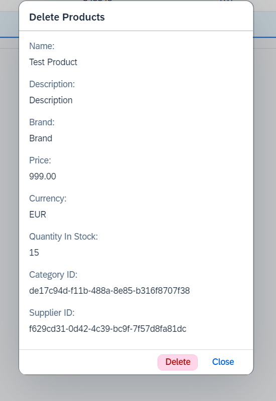

# Entry Delete

The EntryDeleteCL class is responsible for managing the DELETE operation through the OData V2 model. This class eliminates the need for developers to concern themselves with fragments, user input validations, and value help creation when working on custom SAPUI5 applications or Fiori Elements extensions. The following section outlines the key features of the Entry Delete class.

## Features

[DIALOG_URL]: https://sapui5.hana.ondemand.com/#/api/sap.m.Dialog
[SIMPLEFORM_URL]: https://sapui5.hana.ondemand.com/#/api/sap.ui.layout.form.SimpleForm
[SMARTFORM_URL]: https://sapui5.hana.ondemand.com/#/api/sap.ui.comp.smartform.SmartForm
[OBJECT_PAGE_URL]: https://sapui5.hana.ondemand.com/#/api/sap.uxap.ObjectPageLayout
[ENTRY_CREATE_URL]: ./entry_create.md
[ENTRY_UPDATE_URL]: ./entry_update.md
[ENTRY_READ_URL]: ./entry_read.md

- [sap.m.Dialog][DIALOG_URL] generation with a [SmartForm][SMARTFORM_URL], [SimpleForm][SIMPLEFORM_URL], or custom content
- [sap.uxap.ObjectPageLayout][OBJECT_PAGE_URL] generation with a [SmartForm][SMARTFORM_URL], [SimpleForm][SIMPLEFORM_URL], or custom content
- Property sorting
- Label generation for the [SmartForm][SMARTFORM_URL], [SimpleForm][SIMPLEFORM_URL] elements
- **delete()** handling based on the user interaction
- Call a fragment and bind the context in case you do not want to use the auto-generated dialog

!!! danger "Attention"

    Please be advised that the majority of features available in the [Entry Create][ENTRY_CREATE_URL] class are also accessible in the [Entry Delete](#entry-delete) class. However, please note that the original documentation was created on the [Entry Create][ENTRY_CREATE_URL] page. To view a list of available features, please refer to the [Available Features](#available-features) section.

## Use Case

[SMARTFIELD_URL]: https://sapui5.hana.ondemand.com/#/api/sap.ui.comp.smartfield.SmartField

Let's assume you have an `EntitySet` named **Products**, which is bound to a table. You would like to enable the end user to select a line from the table and delete the selected entity from the database through the OData V2 Model. To do so, you must follow these steps.

1) Should you wish for the user to view the data of the selected entity on a pop-up screen, it is necessary to create a **.fragment.xml** file that contains a dialog with form content (Simple, Smart, etc.) and call it from the controller or generate the dialog directly on the controller.

2) It is necessary to handle the selection of the table and the binding of the selected entity to the dialog or form.

3) It is essential to utilize the OData V2 Model to execute the deletion process.

The [EntryDeleteCL](#entry-delete) class is responsible for executing all of the steps mentioned above.

## Constructor

[CONTROLLER_URL]: https://sapui5.hana.ondemand.com/#/api/sap.ui.core.mvc.Controller

In order to utilise the functionality of EntryDeleteCL, it is necessary to initialise the object.

<table>
  <thead>
    <tr>
      <th>Parameter</th>
      <th>Type</th>
      <th>Mandatory</th>
      <th>Default Value</th>
      <th>Description</th>
    </tr>
  </thead>
  <tbody>
    <tr>
      <td>controller</td>
      <td><a href="https://sapui5.hana.ondemand.com/#/api/sap.ui.core.mvc.Controller">sap.ui.core.mvc.Controller</a></td>
      <td>Yes</td>
      <td></td>
      <td>The controller object (usually <code>this</code> object)</td>
    </tr>
    <tr>
      <td>settings</td>
      <td><code>object</code></td>
      <td>Yes</td>
      <td></td>
      <td></td>
    </tr>
    <tr>
      <td>&emsp;entityPath</td>
      <td><code>string</code></td>
      <td>Yes</td>
      <td></td>
      <td>The name of the <strong>EntitySet</strong>. It can start with a <strong>"/"</strong> (slash)</td>
    </tr>
    <tr>
      <td>&emsp;initializer</td>
      <td><code>string</code> | <a href="https://sapui5.hana.ondemand.com/#/api/sap.ui.model.Context">sap.ui.model.Context</a> | <code>EntityKeysT</code></td>
      <td>Yes</td>
      <td></td>
      <td>This parameter identifies the table ID, context binding, or key values of the entity that will be deleted.</td>
    </tr>
    <tr>
      <td>modelName?</td>
      <td><code>string</code></td>
      <td>No</td>
      <td><code>undefined</code></td>
      <td>The name of the OData V2 model which can be found on the manifest.json file. <strong>Leave this parameter undefined</strong> if the name of the OData model = "" (empty string)</td>
    </tr>
  </tbody>
</table>

There are three distinct methods for constructing an object from the [Entry Delete](#entry-delete) class.

### Constructor with a Table ID

[MESSAGEBOX_URL]: https://sapui5.hana.ondemand.com/#/api/sap.m.MessageBox

The most straightforward method for utilizing the capabilities of the [Entry Delete](#entry-delete) class is to construct an object with the ID of a table that you have on your XML view. This method offers several advantages.

1) The table row selected by the end user is automatically detected by the [Entry Delete](#entry-delete) class, and the context binding of the selected row will be bound to the auto-generated dialog.

2) If no table row is selected by the end user, a default message is displayed in the [sap.m.MessageBox.error][MESSAGEBOX_URL] to the end user.

!!! danger "Attention"

    Please note that this method supports only the table types and selection modes listed below. In the event that the selection mode of the table whose ID is being used for object construction is not supported, an error will be thrown by the library.

!!! tip

    The default message displayed when the end user has not selected a row from the table yet can be modified using the [setSelectRowMessage()](#select-row-message) method.

#### Supported Table Types

<table>
  <thead>
    <tr>
      <th>Table Type</th>
      <th>Selection Mode</th>
    </tr>
  </thead>
  <tbody>
    <tr>
      <td><a href="https://sapui5.hana.ondemand.com/#/api/sap.m.Table">sap.m.Table</a></td>
      <td><a href="https://sapui5.hana.ondemand.com/#/api/sap.m.ListMode">SingleSelect</a> | <a href="https://sapui5.hana.ondemand.com/#/api/sap.m.ListMode">SingleSelectLeft</a> | <a href="https://sapui5.hana.ondemand.com/#/api/sap.m.ListMode">SingleSelectMaster</a></td>
    </tr>
    <tr>
      <td><a href="https://sapui5.hana.ondemand.com/#/api/sap.ui.table.Table">sap.ui.table.Table</a></td>
      <td><a href="https://sapui5.hana.ondemand.com/#/api/sap.ui.table.SelectionMode">Single</a></td>
    </tr>
    <tr>
      <td><a href="https://sapui5.hana.ondemand.com/#/api/sap.ui.comp.smarttable.SmartTable">sap.ui.comp.smarttable.SmartTable</a></td>
      <td><a href="https://sapui5.hana.ondemand.com/#/api/sap.ui.table.SelectionMode">Single</a></td>
    </tr>
    <tr>
      <td><a href="https://sapui5.hana.ondemand.com/#/api/sap.ui.table.AnalyticalTable">sap.ui.table.AnalyticalTable</a></td>
      <td><a href="https://sapui5.hana.ondemand.com/#/api/sap.ui.table.SelectionMode">Single</a></td>
    </tr>
    <tr>
      <td><a href="https://sapui5.hana.ondemand.com/#/api/sap.ui.table.TreeTable">sap.ui.table.TreeTable</a></td>
      <td><a href="https://sapui5.hana.ondemand.com/#/api/sap.ui.table.SelectionMode">Single</a></td>
    </tr>
  </tbody>
</table>

[TABLE_URL]: https://sapui5.hana.ondemand.com/#/api/sap.m.Table
[BUTTON_URL]: https://sapui5.hana.ondemand.com/#/api/sap.m.Button

!!! example

    Let us consider an `EntitySet` named **Products**, which is bound to an [sap.m.Table][TABLE_URL] on the XML view. Our objective is to add an [sap.m.Button][BUTTON_URL] to the header toolbar of the table. When the user selects a row from the table and presses the **Delete Product** button, a dialog will open with a **Delete** button so the user can view the data before it is deleted.


!!! tip "Tip for TypeScript"

    The **EntryDeleteCL&lt;EntityT, EntityKeysT&gt;** class is a generic class and can be initialized with 2 types.

    - The `EntityT` type contains **all** properties of the `EntitySet` that is specified on the class constructor.
    - The `EntityKeysT` type contains the **key** properties of the `EntitySet` that is specified on the class constructor.

    The `EntityT` type is used for the parameter of the function that is attached using the [attachDeleteCompleted()](#attach-delete-completed) method. This allows you to retrieve the data of the deleted entity after it has been successfully deleted.

    The `EntityKeysT` type is utilized as one of the types of the `initializer` parameter in the class [constructor](#constructor).

=== "TypeScript"

    ``` ts linenums="1" hl_lines="2 14-17 22-25 30-33"
    import Controller from "sap/ui/core/mvc/Controller";
    import EntryDeleteCL from "ui5/antares/entry/v2/EntryDeleteCL"; // Import the class
    
    /**
     * @namespace your.apps.namespace
     */
    export default class YourController extends Controller {
      public onInit() {
    
      }
    
      public async onDeleteCategory() {
        // Initialize without a type and with the table id
        const entry = new EntryDeleteCL(this, {
          entityPath: "Categories",
          initializer: "tblCategories" // table id       
        }); 
      }
    
      public async onDeleteProduct() {
        // Initialize with a type and the table id
        const entry = new EntryDeleteCL<IProducts, IProductKeys>(this, {
          entityPath: "Products",
          initializer: "tblProducts" // table id       
        }); 
      }
    
      public async onDeleteCustomer() {
        // Initialize with a model name and the table id
        const entry = new EntryDeleteCL(this, {
          entityPath: "Customers",
          initializer: "tblCustomers" // table id      
        }, "myODataModelName"); 
      }
    }
    
    interface IProducts {
      ID: string;
      name: string;
      description: string;
      brand: string;
      price: number;
      currency: string;
      quantityInStock: number;
      categoryID: string;
      supplierID: string;
    }
    
    interface IProductKeys {
      ID: string;
    }
    ```

=== "JavaScript"

    ``` js linenums="1" hl_lines="3 18-21 26-29"
    sap.ui.define([
        "sap/ui/core/mvc/Controller",
        "ui5/antares/entry/v2/EntryDeleteCL" // Import the class
    ], 
        /**
         * @param {typeof sap.ui.core.mvc.Controller} Controller
         */
        function (Controller, EntryDeleteCL) {
          "use strict";

          return Controller.extend("your.apps.namespace.YourController", {
            onInit: function () {

            },

            onDeleteProduct: async function () {
              // Initialize with the table id
              const entry = new EntryDeleteCL(this, {
                entityPath: "Products",
                initializer: "tblProducts" // table id                
              }); 
            },

            onDeleteCategory: async function () {
              // Initialize with a model name
              const entry = new EntryDeleteCL(this, {
                entityPath: "Categories",
                initializer: "tblCategories" // table id                 
              }, "myODataModelName");
            }
          });

        });
    ```

### Constructor with a Context Binding

An alternative approach to constructing an object from the [Entry Delete](#entry-delete) class is to utilise the [context](https://sapui5.hana.ondemand.com/#/api/sap.ui.model.Context) of the entity that will be deleted by the end user.

!!! example

    Let us consider an `EntitySet` named **Products**, which is bound to an [sap.m.Table][TABLE_URL] on the XML view. Our objective is to add an [sap.m.Button][BUTTON_URL] to the header toolbar of the table. When the user selects a row from the table and presses the **Delete Product** button, we will retrieve the context of the selected row and use it to construct an object from the [Entry Delete](#entry-delete) class.


!!! tip "Tip for TypeScript"

    The **EntryDeleteCL&lt;EntityT, EntityKeysT&gt;** class is a generic class and can be initialized with 2 types.

    - The `EntityT` type contains **all** properties of the `EntitySet` that is specified on the class constructor.
    - The `EntityKeysT` type contains the **key** properties of the `EntitySet` that is specified on the class constructor.

    The `EntityT` type is used for the parameter of the function that is attached using the [attachDeleteCompleted()](#attach-delete-completed) method. This allows you to retrieve the data of the deleted entity after it has been successfully deleted.

    The `EntityKeysT` type is utilized as one of the types of the `initializer` parameter in the class [constructor](#constructor).

=== "TypeScript"

    ``` ts linenums="1" hl_lines="2 16 18-21 24 27-30 35 37-40 43 46-49 54 56-59 62 65-68"
    import Controller from "sap/ui/core/mvc/Controller";
    import EntryDeleteCL from "ui5/antares/entry/v2/EntryDeleteCL"; // Import the class
    import MessageBox from "sap/m/MessageBox";
    import Table from "sap/m/Table";

    /**
     * @namespace your.apps.namespace
     */
    export default class YourController extends Controller {
      public onInit() {

      }

      public async onDeleteCategory() {
        // Get the selected item and warn the end user if no row was selected
        const selectedItem = (this.getView().byId("tblCategories") as Table).getSelectedItem();

        if (!selectedItem) {
          MessageBox.error("Please select a row from the table");
          return;
        }

        // Get the selected context
        const selectedContext = selectedItem.getBindingContext();

        // Initialize without a type and use the binding context
        const entry = new EntryDeleteCL(this, {
          entityPath: "Categories",
          initializer: selectedContext // binding context
        }); 
      }

      public async onDeleteProduct() {
        // Get the selected item and warn the end user if no row was selected
        const selectedItem = (this.getView().byId("tblProducts") as Table).getSelectedItem();

        if (!selectedItem) {
          MessageBox.error("Please select a row from the table");
          return;
        }

        // Get the selected context
        const selectedContext = selectedItem.getBindingContext();

        // Initialize with a type and use the binding context
        const entry = new EntryDeleteCL<IProducts, IProductKeys>(this, {
          entityPath: "Products",
          initializer: selectedContext // binding context
        }); 
      }

      public async onDeleteCustomer() {
        // Get the selected item and warn the end user if no row was selected
        const selectedItem = (this.getView().byId("tblCustomers") as Table).getSelectedItem();

        if (!selectedItem) {
          MessageBox.error("Please select a row from the table");
          return;
        }

        // Get the selected context
        const selectedContext = selectedItem.getBindingContext();

        // Initialize with a model name and use the binding context
        const entry = new EntryDeleteCL(this, {
          entityPath: "Customers",
          initializer: selectedContext // binding context   
        }, "myODataModelName"); 
      }
    }

    interface IProducts {
      ID: string;
      name: string;
      description: string;
      brand: string;
      price: number;
      currency: string;
      quantityInStock: number;
      categoryID: string;
      supplierID: string;
    }

    interface IProductKeys {
      ID: string;
    }
    ```

=== "JavaScript"

    ``` js linenums="1" hl_lines="3 19 21-24 27 30-33 38 40-43 46 49-52"
    sap.ui.define([
        "sap/ui/core/mvc/Controller",
        "ui5/antares/entry/v2/EntryDeleteCL", // Import the class
        "sap/m/MessageBox"
    ], 
        /**
         * @param {typeof sap.ui.core.mvc.Controller} Controller
         */
        function (Controller, EntryDeleteCL, MessageBox) {
          "use strict";

          return Controller.extend("your.apps.namespace.YourController", {
            onInit: function () {

            },

            onDeleteProduct: async function () {
              // Get the selected item and warn the end user if no row was selected
              const selectedItem = this.getView().byId("tblProducts").getSelectedItem();

              if (!selectedItem) {
                MessageBox.error("Please select a row from the table");
                return;
              }

              // Get the selected context
              const selectedContext = selectedItem.getBindingContext();

              // Initialize with the binding context
              const entry = new EntryDeleteCL(this, {
                entityPath: "Products",
                initializer: selectedContext // binding context     
              }); 
            },

            onDeleteCategory: async function () {
              // Get the selected item and warn the end user if no row was selected
              const selectedItem = this.getView().byId("tblCategories").getSelectedItem();

              if (!selectedItem) {
                MessageBox.error("Please select a row from the table");
                return;
              }

              // Get the selected context
              const selectedContext = selectedItem.getBindingContext();

              // Initialize with the binding context
              const entry = new EntryDeleteCL(this, {
                entityPath: "Categories",
                initializer: selectedContext // binding context               
              }, "myODataModelName");
            }
          });

        });
    ```

### Constructor with Entity Keys

The final method for constructing an object from the [Entry Delete](#entry-delete) class is to utilize the **key** values of the entity that will be deleted by the end user.

!!! example

    For the purposes of this example, let us consider an `EntitySet` named **Products** with a single **key** property named `ID`, whose type is `Edm.Guid`. We would like to allow the end user to delete a specific entity with the key value: **ID = "b2f0013e-418f-42aa-9a24-3770fe17ce18"**.

!!! tip

    Please note that if the `EntitySet` is bound to a table, you can retrieve the values of the **key** properties of the selected row using the **getBindingContext().getObject()** method.

!!! info

    The EntryDeleteCL class creates a binding context with the values of the specified **key** properties using the `initializer` parameter in the class [constructor](#constructor) and subsequently binds the created context to the dialog.

!!! tip "Tip for TypeScript"

    The **EntryDeleteCL&lt;EntityT, EntityKeysT&gt;** class is a generic class and can be initialized with 2 types.

    - The `EntityT` type contains **all** properties of the `EntitySet` that is specified on the class constructor.
    - The `EntityKeysT` type contains the **key** properties of the `EntitySet` that is specified on the class constructor.

    The `EntityT` type is used for the parameter of the function that is attached using the [attachDeleteCompleted()](#attach-delete-completed) method. This allows you to retrieve the data of the deleted entity after it has been successfully deleted.

    The `EntityKeysT` type is utilized as one of the types of the `initializer` parameter in the class [constructor](#constructor).

=== "TypeScript"

    ``` ts linenums="1" hl_lines="2 14-16 19-22 27-29 32-35 40-42 45-48"
    import Controller from "sap/ui/core/mvc/Controller";
    import EntryDeleteCL from "ui5/antares/entry/v2/EntryDeleteCL"; // Import the class

    /**
     * @namespace your.apps.namespace
     */
    export default class YourController extends Controller {
      public onInit() {

      }

      public async onDeleteCategory() {
        // Prepare the key values of a specific entity
        const keyValues = {
          ID: "b2f0013e-418f-42aa-9a24-3770fe17ce18"
        };

        // Initialize without a type and use the key values as the initializer
        const entry = new EntryDeleteCL(this, {
          entityPath: "Categories",
          initializer: keyValues // key values of the entity
        });
      }

      public async onDeleteProduct() {
        // Prepare the key values of a specific entity
        const keyValues = {
          ID: "b2f0013e-418f-42aa-9a24-3770fe17ce18"
        };

        // Initialize with a type and use the key values as the initializer
        const entry = new EntryDeleteCL<IProducts, IProductKeys>(this, {
          entityPath: "Products",
          initializer: keyValues // key values of the entity
        });
      }

      public async onDeleteCustomer() {
        // Prepare the key values of a specific entity
        const keyValues = {
          ID: "b2f0013e-418f-42aa-9a24-3770fe17ce18"
        };

        // Initialize with a model name and use the key values as the initializer
        const entry = new EntryDeleteCL(this, {
          entityPath: "Customers",
          initializer: keyValues // key values of the entity
        }, "myODataModelName"); 
      }
    }

    interface IProducts {
      ID: string;
      name: string;
      description: string;
      brand: string;
      price: number;
      currency: string;
      quantityInStock: number;
      categoryID: string;
      supplierID: string;
    }

    interface IProductKeys {
      ID: string;
    }
    ```

=== "JavaScript"

    ``` js linenums="1" hl_lines="3 18-20 23-26 31-33 36-39"
    sap.ui.define([
        "sap/ui/core/mvc/Controller",
        "ui5/antares/entry/v2/EntryDeleteCL"
    ], 
        /**
         * @param {typeof sap.ui.core.mvc.Controller} Controller
         */
        function (Controller, EntryDeleteCL) {
          "use strict";

          return Controller.extend("your.apps.namespace.YourController", {
            onInit: function () {

            },

            onDeleteProduct: async function () {
              // Prepare the key values of a specific entity
              const keyValues = {
                ID: "b2f0013e-418f-42aa-9a24-3770fe17ce18"
              };

              // Initialize with the entity set name and use the key values as the initializer
              const entry = new EntryDeleteCL(this, {
                entityPath: "Products",
                initializer: keyValues // key values of the entity
              });  
            },

            onDeleteCategory: async function () {
              // Prepare the key values of a specific entity
              const keyValues = {
                ID: "b2f0013e-418f-42aa-9a24-3770fe17ce18"
              };

              // Initialize with the entity set name and use the key values as the initializer
              const entry = new EntryDeleteCL(this, {
                entityPath: "Categories",
                initializer: keyValues // key values of the entity        
              }, "myODataModelName");          
            }
          });

        });
    ```

## Select Row Message

If the object from the [Entry Delete](#entry-delete) class is constructed using the [Constructor with a Table ID](#constructor-with-a-table-id) approach, a default error message is displayed in an [sap.m.MessageBox.error][MESSAGEBOX_URL] to the end user when the user has not yet selected a row from the table.

To change the default message, the **setSelectRowMessage()** method can be utilized.

=== "Setter (setSelectRowMessage)"

    <table>
      <thead>
        <tr>
          <th>Parameter</th>
          <th>Type</th>
          <th>Mandatory</th>
          <th>Description</th>
        </tr>
      </thead>
      <tbody>
        <tr>
          <td>message</td>
          <td><code>string</code></td>
          <td>Yes</td>
          <td>The message that is displayed when the end user has not selected a row from the table</td>
        </tr>
      </tbody>
    </table>

=== "Getter (getSelectRowMessage)"

    <table>
      <thead>
        <tr>
          <th>Returns</th>
          <th>Description</th>
        </tr>
      </thead>
      <tbody>
        <tr>
          <td><code>string</code></td>
          <td>Returns the value that was set using <strong>setSelectRowMessage()</strong> method. Default value is <strong>Please select a row from the table.</strong></td>
        </tr>
      </tbody>
    </table>

## Delete Entry

[META_MODEL_URL]: https://sapui5.hana.ondemand.com/#/api/sap.ui.model.odata.ODataMetaModel

The **deleteEntry(previewBeforeDelete: boolean = true)** method establishes a connection between the context, determined by the `initializer` parameter in the [class constructor](#constructor), and the dialog that is either automatically generated or loaded from the fragment placed in the application files. Once the context is linked, the generated or loaded dialog is opened.

The **deleteEntry()** method utilizes the [ODataMetaModel][META_MODEL_URL] to determine the `EntityType` of the `EntitySet` designated through the [constructor](#constructor). It then generates the form with the properties in the same order as the OData metadata, in accordance with the `EntityType`.

!!! note

    Please note that the labels are generated assuming that the naming convention of the `EntityType` is **camelCase**. For further details, please see the [Label Generation](./entry_create.md/#label-generation) section.

!!! danger "Attention"

    It is not possible to modify any of the properties of an `EntitySet` on the auto-generated dialog. This behaviour cannot be altered.

!!! warning

    Please be advised that the **deleteEntry()** method must be called after any configurations have been made through the public methods of the [Entry Delete](#entry-delete) class. Any configurations (form title, begin button text, etc.) made after the **deleteEntry()** method will not be reflected. As a best practice, the **deleteEntry()** method should be called at the end of your code block.

!!! note

    The key properties with Edm.Guid type are not visible by default on the generated form. However, this behavior can be modified using the [setDisplayGuidProperties()](./entry_create.md/#properties-with-edmguid-type) method.

!!! danger "Attention"

    Please be advised that the random UUID generation for properties with the `Edm.Guid` type is not available in the [Entry Delete](#entry-delete) class.

By default, the **deleteEntry(previewBeforeDelete: boolean = true)** method generates a dialog and opens it with the bound context before the deletion is completed. The automatically generated dialog contains a **Delete** button. When the user presses the **Delete button**, a [sap.m.MessageBox.confirm][MESSAGEBOX_URL] is displayed to the end user to complete the deletion process.

!!! tip

    The automatically generated dialog opening step can be bypassed by setting the **previewBeforeDelete=false** parameter in the **deleteEntry(previewBeforeDelete: boolean = true)** method. With this configuration, the end user will only see a [sap.m.MessageBox.confirm][MESSAGEBOX_URL].

### Method Parameters

<table>
  <thead>
    <tr>
      <th>Parameter</th>
      <th>Type</th>
      <th>Mandatory</th>
      <th>Default Value</th>
      <th>Description</th>
    </tr>
  </thead>
  <tbody>
    <tr>
      <td>previewBeforeDelete</td>
      <td><code>boolean</code></td>
      <td>No</td>
      <td>true</td>
      <td>If set to <strong>false</strong>, no dialog will be displayed by the end user. Only the confirmation MessageBox is displayed</td>
    </tr>
  </tbody>
</table>

<table>
  <thead>
    <tr>
      <th>Returns</th>
      <th>Description</th>
    </tr>
  </thead>
  <tbody>
    <tr>
      <td><code>Promise&lt;void&gt;</code></td>
      <td>Once the promise has been fulfilled, the bound entry can be retrieved using the <strong>getEntryContext()</strong> method with the object instantiated from the <a href="#constructor">EntryDeleteCL</a> class.</td>
    </tr>
  </tbody>
</table>

!!! info

	The **deleteEntry()** method uses the default configurations when creating the dialog. However, these configurations can be modified using the public setter methods.

### Default Values

<table>
    <thead>
        <tr>
            <th>Term</th>
            <th>Default Value</th>
            <th>Description</th>
            <th>Setter</th>
            <th>Getter</th>
        </tr>
    </thead>
    <tbody>
        <tr>
            <td>Naming Strategy</td>
            <td><a href="../entry_create/#namingstrategies-enum">NamingStrategies.CAMEL_CASE</a></td>
            <td>The default naming strategy is <strong>CAMEL_CASE</strong></td>
            <td><a href="../entry_create/#naming-strategy">setNamingStrategy()</a></td>
            <td><a href="../entry_create/#naming-strategy">getNamingStrategy()</a></td>
        </tr>
        <tr>
            <td>Resource Bundle Prefix</td>
            <td><code>antares</code></td>
            <td>The default resource bundle prefix is <strong>antares</strong></td>
            <td><a href="../entry_create/#resource-bundle-prefix">setResourceBundlePrefix()</a></td>
            <td><a href="../entry_create/#resource-bundle-prefix">getResourceBundlePrefix()</a></td>
        </tr>
        <tr>
            <td>Use Metadata Labels</td>
            <td><code>false</code></td>
            <td>The labels are not derived from the metadata, but rather generated.</td>
            <td><a href="../entry_create/#use-metadata-labels">setUseMetadataLabels()</a></td>
            <td><a href="../entry_create/#use-metadata-labels">getUseMetadataLabels()</a></td>
        </tr>
        <tr>
            <td>Form Type</td>
            <td><a href="../entry_create/#formtypes-enum">FormTypes.SMART</a></td>
            <td>The SmartForm with SmartFields is generated as the default option.</td>
            <td><a href="../entry_create/#form-type">setFormType()</a></td>
            <td><a href="../entry_create/#form-type">getFormType()</a></td>
        </tr>
        <tr>
            <td>Form Title</td>
            <td><code>Delete + ${entityPath}</code></td>
            <td>The <code>entityPath</code> parameter of the <a href="#constructor">constructor</a> is used</td>
            <td><a href="../entry_create/#form-title">setFormTitle()</a></td>
            <td><a href="../entry_create/#form-title">getFormTitle()</a></td>
        </tr>
        <tr>
            <td>Begin Button Text</td>
            <td><code>Delete</code></td>
            <td>The default begin button text is <strong>Delete</strong></td>
            <td><a href="../entry_create/#begin-button-text">setBeginButtonText()</a></td>
            <td><a href="../entry_create/#begin-button-text">getBeginButtonText()</a></td>
        </tr>
        <tr>
            <td>Begin Button Type</td>
            <td><a href="https://sapui5.hana.ondemand.com/#/api/sap.m.ButtonType">ButtonType.Reject</a></td>
            <td>The default button type is <strong>Reject</strong></td>
            <td><a href="../entry_create/#begin-button-type">setBeginButtonType()</a></td>
            <td><a href="../entry_create/#begin-button-type">getBeginButtonType()</a></td>
        </tr>
        <tr>
            <td>End Button Text</td>
            <td><code>Close</code></td>
            <td>The default end button text is <strong>Close</strong></td>
            <td><a href="../entry_create/#end-button-text">setEndButtonText()</a></td>
            <td><a href="../entry_create/#end-button-text">getEndButtonText()</a></td>
        </tr>
        <tr>
            <td>End Button Type</td>
            <td><a href="https://sapui5.hana.ondemand.com/#/api/sap.m.ButtonType">ButtonType.Default</a></td>
            <td>The default button type is <strong>Default</strong></td>
            <td><a href="../entry_create/#end-button-type">setEndButtonType()</a></td>
            <td><a href="../entry_create/#end-button-type">getEndButtonType()</a></td>
        </tr>
        <tr>
            <td>Confirmation Text</td>
            <td><code>The selected line will be deleted. Do you confirm?</code></td>
            <td>The message displayed in the MessageBox.confirm</td>
            <td><a href="#confirmation-text">setConfirmationText()</a></td>
            <td><a href="#confirmation-text">getConfirmationText()</a></td>
        </tr>
        <tr>
            <td>Confirmation Title</td>
            <td><code>Confirm Delete</code></td>
            <td>The title of the MessageBox.confirm/td>
            <td><a href="#confirmation-title">setConfirmationTitle()</a></td>
            <td><a href="#confirmation-title">getConfirmationTitle()</a></td>
        </tr>
    </tbody>
</table>

**Example**

=== "TypeScript"

    ``` ts linenums="1" hl_lines="2 22 42 64"
    import Controller from "sap/ui/core/mvc/Controller";
    import EntryDeleteCL from "ui5/antares/entry/v2/EntryDeleteCL"; // Import the class
    import Table from "sap/m/Table";
    import MessageBox from "sap/m/MessageBox";

    /**
     * @namespace your.apps.namespace
     */
    export default class YourController extends Controller {
      public onInit() {

      }

      public async onDeleteProduct() {
        // Initialize without a type and with a table id
        const entry = new EntryDeleteCL(this, {
          entityPath: "Products",
          initializer: "tblProducts"
        });

        // Call with no preview
        entry.deleteEntry(false); 
      }

      public async onDeleteCategory() {
        const selectedItem = (this.getView().byId("tblCategories") as Table).getSelectedItem();

        if (!selectedItem) {
          MessageBox.error("Please select a row from the table");
          return;
        }

        const selectedContext = selectedItem.getBindingContext();

        // Initialize with a type and a binding context
        const entry = new EntryDeleteCL<ICategory>(this, {
          entityPath: "Categories",
          initializer: selectedContext
        }); 

        // Call with the preview
        entry.deleteEntry();
      }

      public async onDeleteCustomer () {
        const selectedItem = (this.getView().byId("tblCustomers") as Table).getSelectedItem();

        if (!selectedItem) {
          MessageBox.error("Please select a row from the table");
          return;
        };

        const customerKeys = {
          ID: selectedItem.getBindingContext().getObject().ID
        };

        // Initialize without a type and with the key values
        const entry = new EntryDeleteCL(this, {
          entityPath: "Customers",
          initializer: customerKeys
        });

        // Call with the preview
        entry.deleteEntry();
      }
    }

    interface ICategory {
      ID: string;
      name?: string;
    }
    ```

=== "JavaScript"

    ``` js linenums="1" hl_lines="3 25 45 67"
    sap.ui.define([
        "sap/ui/core/mvc/Controller",
        "ui5/antares/entry/v2/EntryDeleteCL", // Import the class
        "sap/m/MessageBox"
    ], 
        /**
         * @param {typeof sap.ui.core.mvc.Controller} Controller
         */
        function (Controller, EntryDeleteCL, MessageBox) {
          "use strict";

          return Controller.extend("your.apps.namespace.YourController", {
            onInit: function () {

            },

            onDeleteProduct: async function () {
              // Initialize with a table id
              const entry = new EntryDeleteCL(this, {
                entityPath: "Products",
                initializer: "tblProducts"
              }); 

              // Call with no preview
              entry.deleteEntry(false);
            },

            onDeleteCategory: async function () {
              const selectedItem = this.getView().byId("tblCategories").getSelectedItem();

              if (!selectedItem) {
                MessageBox.error("Please select a row from the table");
                return;
              }

              const selectedContext = selectedItem.getBindingContext();

              // Initialize with a binding context
              const entry = new EntryDeleteCL(this, {
                entityPath: "Categories",
                initializer: selectedContext
              }); 

              // Call with the preview
              entry.deleteEntry();
            },

            onDeleteCustomer: async function () {
              const selectedItem = this.getView().byId("tblCustomers").getSelectedItem();

              if (!selectedItem) {
                MessageBox.error("Please select a row from the table");
                return;
              }

              const customerKeys = {
                ID: selectedItem.getBindingContext().getObject().ID
              };

              // Initialize with the key values
              const entry = new EntryDeleteCL(this, {
                entityPath: "Customers",
                initializer: customerKeys
              }); 

              // Call with the preview
              entry.deleteEntry();          
            }
          });

        });
    ```

The generated form with default values will be similar in appearance to the following example. However, it should be noted that the exact appearance may vary depending on the configurations and the `EntityType` properties of the `EntitySet`.




## Confirmation Text

To prompt the end user for confirmation before deleting data, a default confirmation message is displayed on a [sap.m.MessageBox.confirm][MESSAGEBOX_URL].

To change the default confirmation message, the **setConfirmationText()** method can be utilized.

=== "Setter (setConfirmationText)"

    <table>
      <thead>
        <tr>
          <th>Parameter</th>
          <th>Type</th>
          <th>Mandatory</th>
          <th>Description</th>
        </tr>
      </thead>
      <tbody>
        <tr>
          <td>text</td>
          <td><code>string</code></td>
          <td>Yes</td>
          <td>The message displayed in MessageBox.confirm before the deletion</td>
        </tr>
      </tbody>
    </table>

=== "Getter (getConfirmationText)"

    <table>
      <thead>
        <tr>
          <th>Returns</th>
          <th>Description</th>
        </tr>
      </thead>
      <tbody>
        <tr>
          <td><code>string</code></td>
          <td>Returns the value that was set using <strong>setConfirmationText()</strong> method. Default value is <strong>The selected line will be deleted. Do you confirm?</strong></td>
        </tr>
      </tbody>
    </table>

**Example**

=== "TypeScript"

    ``` ts linenums="1" hl_lines="2 20"
    import Controller from "sap/ui/core/mvc/Controller";
    import EntryDeleteCL from "ui5/antares/entry/v2/EntryDeleteCL"; // Import the class

    /**
     * @namespace your.apps.namespace
     */
    export default class YourController extends Controller {
      public onInit() {

      }

      public async onDeleteProduct() {
        // Initialize with a type and with a table id
        const entry = new EntryDeleteCL<IProducts, IProductKeys>(this, {
          entityPath: "Products",
          initializer: "tblProducts"
        });

        // Change the confirmation message
        entry.setConfirmationText("This line will be removed from the database. Do you want to continue?");

        // Call with no preview
        entry.deleteEntry(false); 
      }

    }

    interface IProducts {
      ID: string;
      name: string;
      description: string;
      brand: string;
      price: number;
      currency: string;
      quantityInStock: number;
      categoryID: string;
      supplierID: string;
    }

    interface IProductKeys {
      ID: string;
    }
    ```

=== "JavaScript"

    ``` js linenums="1" hl_lines="3 24"
    sap.ui.define([
        "sap/ui/core/mvc/Controller",
        "ui5/antares/entry/v2/EntryDeleteCL" // Import the class
    ], 
        /**
         * @param {typeof sap.ui.core.mvc.Controller} Controller
         */
        function (Controller, EntryDeleteCL) {
          "use strict";

          return Controller.extend("your.apps.namespace.YourController", {
            onInit: function () {

            },

            onDeleteProduct: async function () {
              // Initialize with a table id
              const entry = new EntryDeleteCL(this, {
                entityPath: "Products",
                initializer: "tblProducts"
              });

              // Change the confirmation message
              entry.setConfirmationText("This line will be removed from the database. Do you want to continue?");

              // Call with no preview
              entry.deleteEntry(false);  
            }
          });

        });
    ```

## Confirmation Title

To prompt the end user for confirmation before deleting data, a default title is displayed on a [sap.m.MessageBox.confirm][MESSAGEBOX_URL].

To change the default title of the MessageBox, the **setConfirmationTitle()** method can be utilized.

=== "Setter (setConfirmationTitle)"

    <table>
      <thead>
        <tr>
          <th>Parameter</th>
          <th>Type</th>
          <th>Mandatory</th>
          <th>Description</th>
        </tr>
      </thead>
      <tbody>
        <tr>
          <td>title</td>
          <td><code>string</code></td>
          <td>Yes</td>
          <td>The title displayed in MessageBox.confirm before the deletion</td>
        </tr>
      </tbody>
    </table>

=== "Getter (getConfirmationTitle)"

    <table>
      <thead>
        <tr>
          <th>Returns</th>
          <th>Description</th>
        </tr>
      </thead>
      <tbody>
        <tr>
          <td><code>string</code></td>
          <td>Returns the value that was set using <strong>setConfirmationTitle()</strong> method. Default value is <strong>Confirm Delete</strong></td>
        </tr>
      </tbody>
    </table>

**Example**

=== "TypeScript"

    ``` ts linenums="1" hl_lines="2 20"
    import Controller from "sap/ui/core/mvc/Controller";
    import EntryDeleteCL from "ui5/antares/entry/v2/EntryDeleteCL"; // Import the class

    /**
     * @namespace your.apps.namespace
     */
    export default class YourController extends Controller {
      public onInit() {

      }

      public async onDeleteProduct() {
        // Initialize with a type and with a table id
        const entry = new EntryDeleteCL<IProducts, IProductKeys>(this, {
          entityPath: "Products",
          initializer: "tblProducts"
        });

        // Change the confirmation title
        entry.setConfirmationTitle("My Confirmation Title");

        // Call with no preview
        entry.deleteEntry(false); 
      }

    }

    interface IProducts {
      ID: string;
      name: string;
      description: string;
      brand: string;
      price: number;
      currency: string;
      quantityInStock: number;
      categoryID: string;
      supplierID: string;
    }

    interface IProductKeys {
      ID: string;
    }
    ```

=== "JavaScript"

    ``` js linenums="1" hl_lines="3 24"
    sap.ui.define([
        "sap/ui/core/mvc/Controller",
        "ui5/antares/entry/v2/EntryDeleteCL" // Import the class
    ], 
        /**
         * @param {typeof sap.ui.core.mvc.Controller} Controller
         */
        function (Controller, EntryDeleteCL) {
          "use strict";

          return Controller.extend("your.apps.namespace.YourController", {
            onInit: function () {

            },

            onDeleteProduct: async function () {
              // Initialize with a table id
              const entry = new EntryDeleteCL(this, {
                entityPath: "Products",
                initializer: "tblProducts"
              });

              // Change the confirmation title
              entry.setConfirmationTitle("My Confirmation Title");

              // Call with no preview
              entry.deleteEntry(false);  
            }
          });

        });
    ```

## Attach Delete Completed

The [Entry Delete](#entry-delete) class can call a function that has been attached with the **attachDeleteCompleted()** method after a successful deletion. This function will then receive the data of the deleted entity.

To attach a function, the **attachDeleteCompleted()** method can be utilized.

**Setter (attachDeleteCompleted)**

<table>
  <thead>
    <tr>
      <th>Parameter</th>
      <th>Type</th>
      <th>Mandatory</th>
      <th>Description</th>
    </tr>
  </thead>
  <tbody>
    <tr>
      <td>completed</td>
      <td><code>(data: EntityT) =&gt; void</code></td>
      <td>Yes</td>
      <td>The function that will be called after the successful deletion</td>
    </tr>
    <tr>
      <td>listener?</td>
      <td><code>object</code></td>
      <td>No</td>
      <td>The default listener is the <strong>controller</strong> from <a href="#constructor">constructor</a></td>
    </tr>
  </tbody>
</table>

!!! example

    Suppose you want to receive a response after the successful deletion and take the necessary action.

=== "TypeScript"

    ``` ts linenums="1" hl_lines="2 21 28-32"
    import Controller from "sap/ui/core/mvc/Controller";
    import EntryDeleteCL from "ui5/antares/entry/v2/EntryDeleteCL"; // Import the class
    import MessageBox from "sap/m/MessageBox";

    /**
     * @namespace your.apps.namespace
     */
    export default class YourController extends Controller {
      public onInit() {

      }

      public async onDeleteProduct() {
        // Initialize with a type and with a table id
        const entry = new EntryDeleteCL<IProducts, IProductKeys>(this, {
          entityPath: "Products",
          initializer: "tblProducts"
        });

        // Attach the function
        entry.attachDeleteCompleted(this.onDeleteCompleted, this);

        // Call with no preview
        entry.deleteEntry(false); 
      }

      // If possible, use the same type that is used in the constructor
      private onDeleteCompleted (data: IProducts) {
        const productID = data.ID;

        MessageBox.information(`The product with the following ID is removed: ${productID}`);
      }
    }

    interface IProducts {
      ID: string;
      name: string;
      description: string;
      brand: string;
      price: number;
      currency: string;
      quantityInStock: number;
      categoryID: string;
      supplierID: string;
    }

    interface IProductKeys {
      ID: string;
    }
    ```

=== "JavaScript"

    ``` js linenums="1" hl_lines="3 25 32-36"
    sap.ui.define([
        "sap/ui/core/mvc/Controller",
        "ui5/antares/entry/v2/EntryDeleteCL", // Import the class
        "sap/m/MessageBox"
    ], 
        /**
         * @param {typeof sap.ui.core.mvc.Controller} Controller
         */
        function (Controller, EntryDeleteCL, MessageBox) {
          "use strict";

          return Controller.extend("your.apps.namespace.YourController", {
            onInit: function () {

            },

            onDeleteProduct: async function () {
              // Initialize with a table id
              const entry = new EntryDeleteCL(this, {
                entityPath: "Products",
                initializer: "tblProducts"
              });

              // Attach the function
              entry.attachDeleteCompleted(this.onDeleteCompleted, this);

              // Call with no preview
              entry.deleteEntry(false); 
            },

            // Handler function
            onDeleteCompleted: function (data) {
              const productID = data.ID;

              MessageBox.information(`The product with the following ID is removed: ${productID}`);
            }
          });

        });
    ```

## Attach Delete Failed

In the event that the deletion of the entity is unsuccessful, the [Entry Delete](#entry-delete) class can then call a function with a specific signature. The result of the deletion will then be passed to the attached function.

To attach a function, the **attachDeleteFailed()** method can be utilized.

**Setter (attachDeleteFailed)**

<table>
  <thead>
    <tr>
      <th>Parameter</th>
      <th>Type</th>
      <th>Mandatory</th>
      <th>Description</th>
    </tr>
  </thead>
  <tbody>
    <tr>
      <td>failed</td>
      <td><code>(response: <a href="../entry_create/#response-class">ResponseCL&lt;IDeleteFailed&gt;</a>) =&gt; void</code></td>
      <td>Yes</td>
      <td>The function that will be called after the deletion fails</td>
    </tr>
    <tr>
      <td>listener?</td>
      <td><code>object</code></td>
      <td>No</td>
      <td>The default listener is the <strong>controller</strong> from <a href="#constructor-5">constructor</a></td>
    </tr>
  </tbody>
</table>

An object constructed from the [ResponceCL](./entry_create.md/#response-class) class passed as a parameter to the function. This object has 2 public methods.

=== "getResponse()"

    <table>
      <thead>
        <tr>
          <th>Returns</th>
          <th>Description</th>
        </tr>
      </thead>
      <tbody>
        <tr>
          <td><code>object</code> | <code>undefined</code></td>
          <td></td>
        </tr>
        <tr>
          <td>&nbsp;&nbsp;&nbsp;&nbsp;headers?: <code>object</code></td>
          <td>The HTTP response headers.</td>
        </tr>
        <tr>
          <td>&nbsp;&nbsp;&nbsp;&nbsp;message?: <code>string</code></td>
          <td>The HTTP response message.</td>
        </tr>
        <tr>
          <td>&nbsp;&nbsp;&nbsp;&nbsp;responseText?: <code>string</code></td>
          <td>The HTTP response text.</td>
        </tr>
        <tr>
          <td>&nbsp;&nbsp;&nbsp;&nbsp;statusCode?: <code>string</code></td>
          <td>The status code of the HTTP request.</td>
        </tr>
        <tr>
          <td>&nbsp;&nbsp;&nbsp;&nbsp;statusText?: <code>string</code></td>
          <td>The HTTP status text.</td>
        </tr>
      </tbody>
    </table>

=== "getStatusCode()"

    <table>
      <thead>
        <tr>
          <th>Returns</th>
          <th>Description</th>
        </tr>
      </thead>
      <tbody>
        <tr>
          <td><code>string</code> | <code>undefined</code></td>
          <td>Returns the status code of the HTTP Request</td>
        </tr>
      </tbody>
    </table>

!!! example

    Suppose you want to receive a response after the unsuccessful deletion and take the necessary action.

=== "TypeScript"

    ``` ts linenums="1" hl_lines="2 3 4 23 30-37"
    import Controller from "sap/ui/core/mvc/Controller";
    import EntryDeleteCL from "ui5/antares/entry/v2/EntryDeleteCL"; // Import the class
    import ResponseCL from "ui5/antares/entry/v2/ResponseCL"; // Import the ResponseCL class
    import { IDeleteFailed } from "ui5/antares/types/entry/delete"; // Import the Delete Failed type
    import MessageBox from "sap/m/MessageBox";

    /**
     * @namespace your.apps.namespace
     */
    export default class YourController extends Controller {
      public onInit() {

      }

      public async onDeleteProduct() {
        // Initialize with a type and with a table id
        const entry = new EntryDeleteCL<IProducts, IProductKeys>(this, {
          entityPath: "Products",
          initializer: "tblProducts"
        });

        // Attach the function
        entry.attachDeleteFailed(this.onDeleteFailed, this);

        // Call with no preview
        entry.deleteEntry(false); 
      }

      // If possible, use the IDeleteFailed type
      private onDeleteFailed (response: ResponseCL<IDeleteFailed>) {
        const statusCode = response.getStatusCode(); // get the status code
        const deleteResponse = response.getResponse(); // get the response

        if (deleteResponse) {
          MessageBox.error(deleteResponse.message);
        }
      }
    }

    interface IProducts {
      ID: string;
      name: string;
      description: string;
      brand: string;
      price: number;
      currency: string;
      quantityInStock: number;
      categoryID: string;
      supplierID: string;
    }

    interface IProductKeys {
      ID: string;
    }
    ```

=== "JavaScript"

    ``` js linenums="1" hl_lines="3 25 32-39"
    sap.ui.define([
        "sap/ui/core/mvc/Controller",
        "ui5/antares/entry/v2/EntryDeleteCL", // Import the class
        "sap/m/MessageBox"
    ], 
        /**
         * @param {typeof sap.ui.core.mvc.Controller} Controller
         */
        function (Controller, EntryDeleteCL, MessageBox) {
          "use strict";

          return Controller.extend("your.apps.namespace.YourController", {
            onInit: function () {

            },

            onDeleteProduct: async function () {
              // Initialize with a table id
              const entry = new EntryDeleteCL(this, {
                entityPath: "Products",
                initializer: "tblProducts"
              });

              // Attach the function
              entry.attachDeleteFailed(this.onDeleteFailed, this);

              // Call with no preview
              entry.deleteEntry(false); 
            },

            // Handler function
            onDeleteFailed: function (response) {
              const statusCode = response.getStatusCode(); // get the status code
              const deleteResponse = response.getResponse(); // get the response

              if (deleteResponse) {
                MessageBox.error(deleteResponse.message);
              }
            }
          });

        });
    ```

## Available Features

The [EntryDeleteCL](#entry-delete) class is derived from the same abstract class as the [EntryCreateCL][ENTRY_CREATE_URL] class and contains the same methods. However, some of these functions are not applicable to the [EntryDeleteCL](#entry-delete) class. 

!!! warning 

    Please note that the default values for the available functions may differ.

The features listed below are identical to those available in [EntryCreateCL][ENTRY_CREATE_URL]. Methods can be accessed through the object constructed from the [EntryDeleteCL](#entry-delete) class.

!!! tip

    To access the documentation for a particular feature, please click on the name of the feature.

<table>
  <thead>
    <tr>
      <th>Feature</th>
      <th>Availability</th>
      <th>Default Value</th>
      <th>Remarks</th>
    </tr>
  </thead>
  <tbody>
    <tr>
      <td><a href="../entry_create/#manual-submit">Manual Submit</a></td>
      <td align="center">&#x2717;</td>
      <td></td>
      <td></td>
    </tr>
    <tr>
      <td><a href="../entry_create/#disable-auto-dialog-close">Disable Auto Dialog Close</a></td>
      <td align="center">&#x2717;</td>
      <td>false</td>
      <td></td>
    </tr>    
    <tr>
      <td><a href="../entry_create/#label-generation">Label Generation</a></td>
      <td align="center">&#x2714;</td>
      <td></td>
      <td></td>
    </tr>
    <tr>
      <td><a href="../entry_create/#resource-bundle-prefix">Resource Bundle Prefix</a></td>
      <td align="center">&#x2714;</td>
      <td>antares</td>
      <td></td>
    </tr>
    <tr>
      <td><a href="../entry_create/#naming-strategy">Naming Strategy</a></td>
      <td align="center">&#x2714;</td>
      <td>CAMEL_CASE</td>
      <td></td>
    </tr>
    <tr>
      <td><a href="../entry_create/#form-type">Form Type</a></td>
      <td align="center">&#x2714;</td>
      <td>SMART</td>
      <td></td>
    </tr>
    <tr>
      <td><a href="../entry_create/#form-title">Form Title</a></td>
      <td align="center">&#x2714;</td>
      <td>Delete <code>${entityPath}</code></td>
      <td></td>
    </tr>
    <tr>
      <td><a href="../entry_create/#form-grouping">Form Grouping</a></td>
      <td align="center">&#x2714;</td>
      <td>[]</td>
      <td></td>
    </tr>
    <tr>
      <td><a href="../entry_create/#custom-data">Custom Data</a></td>
      <td align="center">&#x2714;</td>
      <td>[]</td>
      <td></td>
    </tr>
    <tr>
      <td><a href="../entry_create/#text-in-edit-mode-source">Text In Edit Mode Source</a></td>
      <td align="center">&#x2717;</td>
      <td>[]</td>
      <td></td>
    </tr>       
    <tr>
      <td><a href="../entry_create/#begin-button-text">Begin Button Text</a></td>
      <td align="center">&#x2714;</td>
      <td>Delete</td>
      <td></td>
    </tr>
    <tr>
      <td><a href="../entry_create/#begin-button-type">Begin Button Type</a></td>
      <td align="center">&#x2714;</td>
      <td><a href="https://sapui5.hana.ondemand.com/#/api/sap.m.ButtonType">ButtonType.Reject</a></td>
      <td></td>
    </tr>
    <tr>
      <td><a href="../entry_create/#end-button-text">End Button Text</a></td>
      <td align="center">&#x2714;</td>
      <td>Close</td>
      <td></td>
    </tr>
    <tr>
      <td><a href="../entry_create/#end-button-type">End Button Type</a></td>
      <td align="center">&#x2714;</td>
      <td><a href="https://sapui5.hana.ondemand.com/#/api/sap.m.ButtonType">ButtonType.Default</a></td>
      <td></td>
    </tr>
    <tr>
      <td><a href="#confirmation-text">Confirmation Text</a></td>
      <td align="center">&#x2714;</td>
      <td>The selected line will be deleted. Do you confirm?</td>
      <td></td>
    </tr>    
    <tr>
      <td><a href="#confirmation-title">Confirmation Title</a></td>
      <td align="center">&#x2714;</td>
      <td>Confirm Delete</td>
      <td></td>
    </tr>    
    <tr>
      <td><a href="../entry_create/#properties-with-edmguid-type">Properties with Edm.Guid Type</a></td>
      <td align="center">&#x2714;</td>
      <td></td>
      <td>The random UUID generation is not available. You can only modify the visibilities of the properties with <code>Edm.Guid</code> type</td>
    </tr>
    <tr>
      <td><a href="../entry_create/#form-property-order">Form Property Order</a></td>
      <td align="center">&#x2714;</td>
      <td>[]</td>
      <td></td>
    </tr>    
    <tr>
      <td><a href="../entry_create/#excluded-properties">Excluded Properties</a></td>
      <td align="center">&#x2714;</td>
      <td>[]</td>
      <td></td>
    </tr>    
    <tr>
      <td><a href="../entry_create/#mandatory-properties">Mandatory Properties</a></td>
      <td align="center">&#x2717;</td>
      <td></td>
      <td></td>
    </tr>    
    <tr>
      <td><a href="../entry_create/#readonly-properties">Readonly Properties</a></td>
      <td align="center">&#x2717;</td>
      <td>[all properties]</td>
      <td>By default, all the properties are readonly and cannot be changed</td>
    </tr>    
    <tr>
      <td><a href="../entry_create/#attach-submit-completed">Attach Submit Completed</a></td>
      <td align="center">&#x2717;</td>
      <td></td>
      <td>Please see <a href="#attach-delete-completed">Attach Delete Completed</a></td>
    </tr>    
    <tr>
      <td><a href="../entry_create/#attach-submit-failed">Attach Submit Failed</a></td>
      <td align="center">&#x2717;</td>
      <td></td>
      <td>Please see <a href="#attach-delete-failed">Attach Delete Failed</a></td>
    </tr>    
    <tr>
      <td><a href="../entry_create/#response-class">Response Class</a></td>
      <td align="center">&#x2714;</td>
      <td></td>
      <td>Only available for <a href="#attach-delete-failed">Attach Delete Failed</a></td>
    </tr>    
    <tr>
      <td><a href="../value-help">Value Help</a></td>
      <td align="center">&#x2717;</td>
      <td></td>
      <td></td>
    </tr>    
    <tr>
      <td><a href="../entry_create/#validation-logic">Validation Logic</a></td>
      <td align="center">&#x2717;</td>
      <td></td>
      <td></td>
    </tr>    
    <tr>
      <td><a href="../entry_create/#object-page">Object Page</a></td>
      <td align="center">&#x2714;</td>
      <td></td>
      <td></td>
    </tr>    
    <tr>
      <td><a href="../entry_create/#custom-control">Custom Control</a></td>
      <td align="center">&#x2714;</td>
      <td></td>
      <td></td>
    </tr>    
    <tr>
      <td><a href="../entry_create/#custom-content">Custom Content</a></td>
      <td align="center">&#x2714;</td>
      <td></td>
      <td></td>
    </tr>    
    <tr>
      <td><a href="../entry_create/#custom-fragment">Custom Fragment</a></td>
      <td align="center">&#x2714;</td>
      <td></td>
      <td></td>
    </tr>    
  </tbody>
</table>