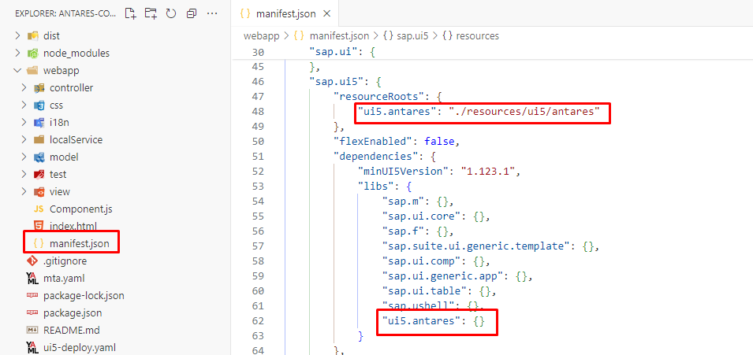
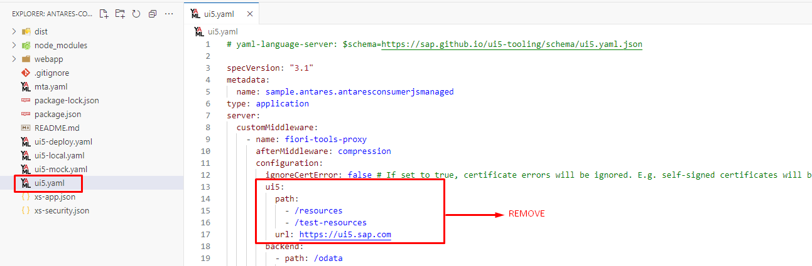
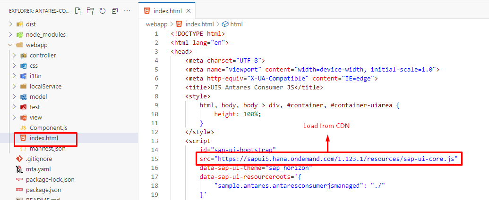

# UI5 Antares

[TS_URL]: https://www.typescriptlang.org
[SAPUI5_URL]: https://sapui5.hana.ondemand.com
[UI5_LICENSE_URL]: https://tools.hana.ondemand.com/developer-license-3_2.txt
[ANTARES_URL]: #ui5-antares

The UI5 Antares library is a custom SAPUI5 library comprising useful classes and methods, specifically designed to streamline the development process when working with OData V2 services.

!!! info

    UI5 Antares is developed in [TypeScript][TS_URL] and is compatible with both SAPUI5 JavaScript and SAPUI5 TypeScript applications.

!!! warning

    This library utilizes the classes and components of the [SAPUI5][SAPUI5_URL] framework without modifying or copying the source code, which is licensed under the [SAP Developer License][UI5_LICENSE_URL]. It is important to carefully review the [SAP Developer License][UI5_LICENSE_URL] terms and conditions, as well as adhere to the restrictions set forth therein when using the [UI5 Antares][ANTARES_URL] library.

## Features

[SIMPLEFORM_URL]: https://sapui5.hana.ondemand.com/#/api/sap.ui.layout.form.SimpleForm
[SMARTFORM_URL]: https://sapui5.hana.ondemand.com/#/api/sap.ui.comp.smartform.SmartForm
[ODATA_MODEL_URL]: https://sapui5.hana.ondemand.com/#/api/sap.ui.model.odata.v2.ODataModel

- OData V2 metadata-based dialog and [Simple Form][SIMPLEFORM_URL] - [Smart Form][SMARTFORM_URL] generation for CRUD operations
- OData V2 metadata-based object page and [Simple Form][SIMPLEFORM_URL] - [Smart Form][SMARTFORM_URL] generation for CRUD operations
- Value Help Dialog generation
- User input validations/mandatory checks
- HTTP request handling for OData V2 CRUD operations
- Promisified OData V2 classes based on the [sap.ui.model.odata.v2.ODataModel][ODATA_MODEL_URL] class

### Auto Generated Dialog


### Auto Generated Object Page


## Core Classes

[ENTRY_CREATE_URL]: ./entry_create.md
[ENTRY_UPDATE_URL]: ./entry_update.md
[ENTRY_DELETE_URL]: ./entry_delete.md
[ENTRY_READ_URL]: ./entry_read.md
[ODATA_CLASSES_URL]: ./odata_classes.md
[FRAGMENT_CLASS_URL]: ./fragment_class.md
[PLANNED_FEATURES_URL]: #planned-features

The UI5 Antares library offers a comprehensive set of core classes, as outlined below.

- [Entry Create][ENTRY_CREATE_URL]
- [Entry Update][ENTRY_UPDATE_URL]
- [Entry Delete][ENTRY_DELETE_URL]
- [Entry Read][ENTRY_READ_URL]
- [Promisified OData V2 Classes][ODATA_CLASSES_URL]
- [Fragment Class][FRAGMENT_CLASS_URL]

Please refer to the [Planned Features][PLANNED_FEATURES_URL] section to learn about the features that will be included in the next releases.

## Prerequisites

[NODEJS_URL]: https://nodejs.org
[NPM_URL]: https://www.npmjs.com
[UI5_TOOLING_URL]: https://sap.github.io/ui5-tooling/v3

- [Node.js][NODEJS_URL]
- [NPM][NPM_URL]
- [UI5 Tooling][UI5_TOOLING_URL] (global or local)

To make sure they are available on your machine, try running the following command.

```sh
npm -v && node -v
10.5.1
v20.11.0
```

=== "Locally installed UI5 Tooling"

    ```sh
    npx ui5 -v
    3.9.2
    ```

=== "Globally installed UI5 Tooling"

    ```sh
    ui5 -v
    3.9.2
    ```

## Versioning

The UI5 Antares and SAPUI5 versions are directly related. The SAPUI5 version used can be determined by ignoring the last three digits of the UI5 Antares version. Please note that the last three digits of the UI5 Antares version increase sequentially after bug fixes or new features. 

!!! tip

    Please ensure that you install the version that corresponds to the version of your SAPUI5/Fiori Elements application.

!!! info

    In the event that the **patch** component of the SAPUI5 version is 0, the UI5 Antares **patch** component will commence with 999, due to the fact that the NPM does not permit leading zeros in the version components.

!!! example

    To illustrate, if the [SAPUI5][SAPUI5_URL] version is **1.124.0**, the [UI5 Antares][ANTARES_URL] version will be **1.124.999001**. The final three digits will be incremented with each bug fix or new feature.

### Examples

Please refer to the examples of versioning below for further information.

!!! note

    Please note that the versions shown in the example below may not be available.

<table>
  <thead>
    <tr>
      <th>UI5 Antares Version</th>
      <th>SAPUI5 Version</th>
      <th>Description</th>
    </tr>
  </thead>
  <tbody>
    <tr>
      <td>1.123.1002</td>
      <td>1.123.1</td>
      <td>The latest UI5 Antares version corresponding to the SAPUI5 1.123.1 version</td>
    </tr>    
    <tr>
      <td>1.123.1001</td>
      <td>1.123.1</td>
      <td>The previous UI5 Antares version corresponding to the SAPUI5 1.123.1 version</td>
    </tr>    
    <tr>
      <td>1.96.32001</td>
      <td>1.96.32</td>
      <td>The latest UI5 Antares version corresponding to the SAPUI5 1.96.32 version</td>
    </tr>    
    <tr>
      <td>1.84.999001</td>
      <td>1.84.0</td>
      <td>The latest UI5 Antares version corresponding to the SAPUI5 1.84.0 version</td>
    </tr>   
  </tbody>
</table>

### Supported SAPUI5 Versions

[UI5_VERSION_URL]: https://sapui5.hana.ondemand.com/versionoverview.html

The table below outlines the currently supported and planned SAPUI5 versions.

!!! info

    Initially, UI5 Antares was released to support version 1.123.1. However, development will also be conducted for versions with long-term maintenance, as outlined in the [SAPUI5 Version Overview][UI5_VERSION_URL]

<table>
  <thead>
    <tr>
      <th>Latest UI5 Antares Version</th>
      <th>SAPUI5 Version</th>
      <th>Status</th>
    </tr>
  </thead>
  <tbody>
    <tr>
      <td>1.124.1002</td>
      <td>1.124.1</td>
      <td>Available</td>
    </tr>
    <tr>
      <td>1.124.999005</td>
      <td>1.124.0</td>
      <td>Available</td>
    </tr>
    <tr>
      <td>1.123.2002</td>
      <td>1.123.2</td>
      <td>Available</td>
    </tr>
    <tr>
      <td>1.123.1003</td>
      <td>1.123.1</td>
      <td>Available</td>
    </tr>
    <tr>
      <td>1.120.15002</td>
      <td>1.120.15</td>
      <td>Available</td>
    </tr>
    <tr>
      <td>1.120.14002</td>
      <td>1.120.14</td>
      <td>Available</td>
    </tr>
    <tr>
      <td>1.120.13002</td>
      <td>1.120.13</td>
      <td>Available</td>
    </tr>
    <tr>
      <td>1.120.12002</td>
      <td>1.120.12</td>
      <td>Available</td>
    </tr>
    <tr>
      <td>1.120.11002</td>
      <td>1.120.11</td>
      <td>Available</td>
    </tr>
    <tr>
      <td>1.120.1012</td>
      <td>1.120.1</td>
      <td>Available</td>
    </tr>
    <tr>
      <td>1.108.32002</td>
      <td>1.108.32</td>
      <td>Available</td>
    </tr>
    <tr>
      <td>1.108.31002</td>
      <td>1.108.31</td>
      <td>Available</td>
    </tr>
    <tr>
      <td>1.108.30002</td>
      <td>1.108.30</td>
      <td>Available</td>
    </tr>
    <tr>
      <td>1.108.23002</td>
      <td>1.108.23</td>
      <td>Available</td>
    </tr>
    <tr>
      <td>1.96.33002</td>
      <td>1.96.33</td>
      <td>Available</td>
    </tr>
    <tr>
      <td>1.96.32002</td>
      <td>1.96.32</td>
      <td>Available</td>
    </tr>
    <tr>
      <td>1.96.31002</td>
      <td>1.96.31</td>
      <td>Available</td>
    </tr>
    <tr>
      <td>1.96.30002</td>
      <td>1.96.30</td>
      <td>Available</td>
    </tr>
    <tr>
      <td>1.96.25003</td>
      <td>1.96.25</td>
      <td>Available</td>
    </tr>
    <tr>
      <td>1.120.*</td>
      <td>1.120.*</td>
      <td>Planned</td>
    </tr>
    <tr>
      <td>1.108.*</td>
      <td>1.108.*</td>
      <td>Planned</td>
    </tr>
    <tr>
      <td>1.96.*</td>
      <td>&gt;1.96.25</td>
      <td>Planned</td>
    </tr>
  </tbody>
</table>

### NPM Package Tags

Should the versioning be unclear, a special tag can be used during the installation process. The most recent version of UI5 Antares that corresponds to a specific SAPUI5 version will always include the following tag.

**Tag Naming Convention:** `ui5-${1}-${2}-${3}-latest`

- **$\{1\}** = The major component of the SAPUI5 version
- **$\{2\}** = The minor component of the SAPUI5 version
- **$\{3\}** = The patch component of the SAPUI5 version

To illustrate, if your SAPUI5 application is version **1.124.0**, you may wish to consider using the following command.

```sh
npm install --save-exact ui5-antares@ui5-1-124-0-latest
```

!!! tip

    The `--save-exact` argument ensures that no additional caret or tilde is added to the version in the package.json file.

## Installation

[PREREQUISITES_URL]: #prerequisites
[VERSIONING_URL]: #versioning

!!! warning

    Prior to installation, please review the [prerequisites][PREREQUISITES_URL] and [versioning][VERSIONING_URL] information.

To install the library, please run the following command in the directory where the **package.json** file of your SAPUI5/Fiori Elements application is located. This file is typically found in the root directory of a SAPUI5/Fiori Elements application.

!!! tip

    In the command below, please replace `version` with the UI5 Antares version that corresponds to the version of your SAPUI5/Fiori Elements application. For example, applications running with **SAPUI5 version 1.123.1** should run the following command: `npm install ui5-antares@1.123.1001` or `npm install ui5-antares@ui5-1-123-1-latest`

!!! note

    Please note that if you are using UI5 Tooling v3, there is no need to add ui5-antares to the `ui5.dependencies` in your application's **package.json** file.

```sh
npm install ui5-antares@version
```


Add `"ui5.antares": {}` to the `"sap.ui5"."dependencies"."libs"` section of your application's **manifest.json** file.

```json title="manifest.json"
{
  ...
  "sap.ui5": {
    ...
    "dependencies": {
      ...
      "libs": {
        "sap.m": {},
        "sap.ui.core": {},
        ...
        "ui5.antares": {}
      }
    }
  }
}
```

Add `"ui5.antares": "./resources/ui5/antares"` to the `"sap.ui5"."resourceRoots"` section of your application's **manifest.json** file.

```json title="manifest.json"
{
  ...
  "sap.ui5": {
    ...
    "resourceRoots": {
      "ui5.antares": "./resources/ui5/antares"
    }
  }
}
```



Add the `--all` argument to the `build` script in your application's **package.json** file. This argument guarantees that all dependencies are included in the application build.

```json title="package.json"
{
  ...
  "scripts": {
    "build": "ui5 build --all --config=ui5.yaml --clean-dest --dest dist"
  }
}
```


To ensure that UI5 Antares is included as a dependency in your application, please use the following command.

=== "Locally installed UI5 Tooling"

    ```sh
    npx ui5 tree
    ```

=== "Globally installed UI5 Tooling"

    ```sh
    ui5 tree
    ```


### TypeScript

If you are developing your SAPUI5/Fiori Elements application with TypeScript, you must add **"./node_modules/ui5-antares"** to the `compilerOptions.typeRoots` array in your application's **tsconfig.json** file. This configuration is required to use type declarations of the UI5 Antares.

```json title="tsconfig.json"
{
  "compilerOptions": {
    "typeRoots": [
      ...
      "./node_modules/ui5-antares"
    ]
  }
}
```


### Approuter

If you are deploying your application with a Standalone or Managed Approuter, please add the route below (first route) to your application's **xs-app.json** file.

!!! warning

    Please note that the Standalone Approuter also has an **xs-app.json** file. However, this configuration should be carried out on the SAPUI5/Fiori Elements application's **xs-app.json** file, rather than on the Standalone Approuter's **xs-app.json** file.

    Please be advised that this route must be added before the route (automatically added by the application generator) with **"source": "^/resources/(.*)$"** and **"destination": "ui5"** properties in order to load the UI5 Antares from the HTML5 Application Repository instead of the UI5 CDN. 

The reason for this configuration is that both the standard UI5 libraries and UI5 Antares utilize the **/resources** path to load the files.

```json title="xs-app.json"
{
  "welcomeFile": "/index.html",
  "authenticationMethod": "route",
  "routes": [
    ...
    {
      "source": "^/resources/ui5/antares/(.*)$",
      "target": "/resources/ui5/antares/$1",
      "service": "html5-apps-repo-rt",
      "authenticationType": "xsuaa"
    },
    {
      "source": "^/resources/(.*)$",
      "target": "/resources/$1",
      "authenticationType": "none",
      "destination": "ui5"
    },
    {
      "source": "^/test-resources/(.*)$",
      "target": "/test-resources/$1",
      "authenticationType": "none",
      "destination": "ui5"
    },
    {
      "source": "^(.*)$",
      "target": "$1",
      "service": "html5-apps-repo-rt",
      "authenticationType": "xsuaa"
    }    
  ]
}
```


## Local Start

[UI5_CLI_URL]: https://www.npmjs.com/package/@ui5/cli
[UX_UI5_TOOLING_URL]: https://www.npmjs.com/package/@sap/ux-ui5-tooling

If you start your application with one of the following commands, UI5 Antares will be loaded automatically, as it is a dependency of your application.

- [@ui5/cli][UI5_CLI_URL]
- [@sap/ux-ui5-tooling][UX_UI5_TOOLING_URL]

=== "@ui5/cli"

    ```sh
    ui5 serve
    ```

=== "@sap/ux-ui5-tooling"

    ```sh
    fiori run
    ```

### Known Issues

If you load the standard UI5 library on the **/resources** path using the `fiori-tools-proxy` middleware of the [@sap/ux-ui5-tooling][UX_UI5_TOOLING_URL] package while starting your application as shown below, the UI5 Antares will not be loaded because it also uses the **/resources** path. 

!!! info

    `fiori-tools-proxy` redirects all requests coming from the **/resources** path to the url defined in the `configuration.ui5.url` property.

#### Solution 1

Remove the `ui5` configuration from the YAML file that is used as the configuration file for the start script (`--config` argument of **ui5 serve** or **fiori run** command).



Modify the `src` attribute of the `sap-ui-bootstrap` script in your application's **index.html** file and load the standard UI5 library from the CDN.



!!! warning

    Please be advised that if you deploy your application to an ABAP repository, you will need to modify the `src` attribute to **"resources/sap-ui-core.js"**. This is necessary because the server may not have internet access. This change will result in the standard UI5 library being loaded directly from the server instead of from the CDN.

#### Solution 2

Don't use the **/resources** path in the `ui5` configuration of `fiori-tools-proxy` on the YAML file that is used as the start script configuration file (`--config` argument of **ui5 serve** or **fiori run** command).


Modify the `src` attribute of the `sap-ui-bootstrap` script in your application's **index.html** file and load the standard UI5 library from the path which is defined in the YAML file.


!!! warning

    Do not forget to change the `src` attribute back to **"resources/sap-ui-core.js"** or **"https://sapui5.hana.ondemand.com/resources/sap-ui-core.js"** before deploying your application.

## Planned Features

Please find below a list of features that are scheduled for inclusion in upcoming releases.

<table>
  <thead>
    <tr>
      <th>Feature</th>
      <th>Supported UI5 Antares Versions</th>
      <th>Scope</th>
      <th>Description</th>
    </tr>
  </thead>
  <tbody>
    <tr>
      <td>Deep Create</td>
      <td>*</td>
      <td width="150"><a href="./entry_create">Entry Create</a></td>
      <td>Creating a deep entity on the auto-generated dialog will be possible. When the cardinality is 1-1, the properties of the associated entity will be added into the auto-generated form in a different group. When the cardinality is 1-N, a table will be placed below the auto-generated form</td>
    </tr>    
  </tbody>
</table>