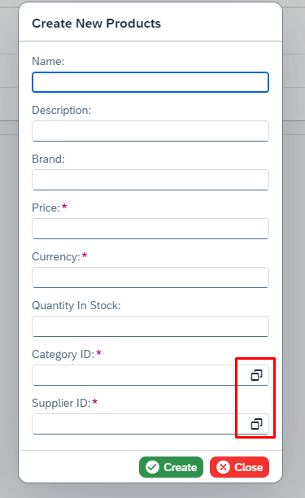

# Value Help

[VALUEHELPDIALOG_URL]: https://sapui5.hana.ondemand.com/#/api/sap.ui.comp.valuehelpdialog.ValueHelpDialog
[ENTRY_CREATE_URL]: ./entry_create.md
[ENTRY_UPDATE_URL]: ./entry_update.md
[INPUT_URL]: https://sapui5.hana.ondemand.com/#/api/sap.m.Input
[FORMTYPE_URL]: ./entry_create.md/#form-type
[DATEPICKER_URL]: https://sapui5.hana.ondemand.com/#/api/sap.m.DatePicker
[LABELGENERATION_URL]: ./entry_create.md/#label-generation

The UI5 Antares library includes a built-in value help class that can be used in conjunction with the [Entry Create][ENTRY_CREATE_URL] and [Entry Update][ENTRY_UPDATE_URL] classes, or as a standalone component with any [sap.m.Input][INPUT_URL] control within a SAPUI5 application.

!!! danger "Attention"

    Please be advised that the Value Help class is only available for the **SIMPLE** Form when it is used in conjunction with the [Entry Create][ENTRY_CREATE_URL] and [Entry Update][ENTRY_UPDATE_URL] classes. Should you require further information, please refer to the [Form Type][FORMTYPE_URL] section.

## Features

1) The [sap.ui.comp.valuehelpdialog.ValueHelpDialog][VALUEHELPDIALOG_URL] is generated with a table and filter bar consisting of the `EntitySet` properties defined in the [class constructor](#constructor).

2) The Value Help class is responsible for managing the search functionality accessible via the filter bar or search field.

3) The Value Help class is responsible for writing the selected value from the table into the input field.

4) The Value Help class enables the initial filters to be applied when the [Value Help Dialog][VALUEHELPDIALOG_URL] is first initiated.

5) The Value Help class enables users to attach a function that will be triggered immediately upon opening the dialog or selecting a value from the table.

!!! warning

    Please note that the Value Help class only supports a **single** selection.

!!! info

    The ValueHelpCL class offers all its features for both entry class-integrated (Entry Create/Entry Update) and standalone usage, even if they are not shown in the examples.

## Constructor

You must initialize an object from **ValueHelpCL** class in order to use it.

<table>
  <thead>
    <tr>
      <th>Parameter</th>
      <th>Type</th>
      <th>Mandatory</th>
      <th>Default Value</th>
      <th>Description</th>
    </tr>
  </thead>
  <tbody>
    <tr>
      <td>controller</td>
      <td><a href="https://sapui5.hana.ondemand.com/#/api/sap.ui.core.mvc.Controller">sap.ui.core.mvc.Controller</a></td>
      <td>Yes</td>
      <td></td>
      <td>The controller object (usually <code>this</code>)</td>
    </tr>
    <tr>
      <td>settings</td>
      <td><code>object</code></td>
      <td>Yes</td>
      <td></td>
      <td></td>
    </tr>
    <tr>
      <td>&nbsp;&nbsp;&nbsp;&nbsp;propertyName</td>
      <td><code>string</code></td>
      <td>Yes</td>
      <td></td>
      <td>This is the property of the entity for which the value help is being created.</td>
    </tr>
    <tr>
      <td>&nbsp;&nbsp;&nbsp;&nbsp;valueHelpEntity</td>
      <td><code>string</code></td>
      <td>Yes</td>
      <td></td>
      <td>This is the name of the <code>EntitySet</code> that will be bound to the table in the <a href="https://sapui5.hana.ondemand.com/#/api/sap.ui.comp.valuehelpdialog.ValueHelpDialog">Value Help Dialog</a></td>
    </tr>
    <tr>
      <td>&nbsp;&nbsp;&nbsp;&nbsp;valueHelpProperty</td>
      <td><code>string</code></td>
      <td>Yes</td>
      <td></td>
      <td>Once a selection has been made in the table, this parameter defines the property of the <code>valueHelpEntity</code> to be used for setting the value of the property defined in the <code>propertyName</code> parameter.</td>
    </tr>
    <tr>
      <td>&nbsp;&nbsp;&nbsp;&nbsp;readonlyProperties?</td>
      <td><code>string[]</code></td>
      <td>No</td>
      <td><code>[]</code></td>
      <td>The properties of the <code>valueHelpEntity</code> that are displayed in the columns of the table</td>
    </tr>
    <tr>
      <td>&nbsp;&nbsp;&nbsp;&nbsp;excludedFilterProperties?</td>
      <td><code>string[]</code></td>
      <td>No</td>
      <td><code>[]</code></td>
      <td>The properties of the <code>valueHelpEntity</code> that are excluded from the filter bar</td>
    </tr>
    <tr>
      <td>&nbsp;&nbsp;&nbsp;&nbsp;title?</td>
      <td><code>string</code></td>
      <td>No</td>
      <td><code>${valueHelpEntity}</code></td>
      <td>The title of the <a href="https://sapui5.hana.ondemand.com/#/api/sap.ui.comp.valuehelpdialog.ValueHelpDialog">Value Help Dialog</a></td>
    </tr>
    <tr>
      <td>&nbsp;&nbsp;&nbsp;&nbsp;searchPlaceholder?</td>
      <td><code>string</code></td>
      <td>No</td>
      <td>Search <code>${valueHelpEntity}</code></td>
      <td>The placeholder in the search field of the <a href="https://sapui5.hana.ondemand.com/#/api/sap.ui.comp.valuehelpdialog.ValueHelpDialog">Value Help Dialog</a></td>
    </tr>
    <tr>
      <td>&nbsp;&nbsp;&nbsp;&nbsp;namingStrategy?</td>
      <td><a href="../entry_create/#namingstrategies-enum">NamingStrategies</a></td>
      <td>No</td>
      <td><code>CAMEL_CASE</code></td>
      <td>The naming strategy that is used to generate the labels for filter bar and table column headers</td>
    </tr>
    <tr>
      <td>&nbsp;&nbsp;&nbsp;&nbsp;resourceBundlePrefix?</td>
      <td><code>string</code></td>
      <td>No</td>
      <td><code>antaresVH</code></td>
      <td>The resource bundle prefix that is used for the i18n text lookup</td>
    </tr>
    <tr>
      <td>&nbsp;&nbsp;&nbsp;&nbsp;useMetadataLabels?</td>
      <td><code>boolean</code></td>
      <td>No</td>
      <td><code>false</code></td>
      <td>Indicates whether the labels should be derived from the metadata to be used in the filter bar and table column headers</td>
    </tr>
    <tr>
      <td>&nbsp;&nbsp;&nbsp;&nbsp;filterModelName?</td>
      <td><code>string</code></td>
      <td>No</td>
      <td><code>UI5AntaresVHFilterModel</code></td>
      <td>The <a href="https://sapui5.hana.ondemand.com/#/api/sap.ui.model.json.JSONModel">JSONModel</a> name of the filter bar which is needed by the ValueHelpCL class</td>
    </tr>
    <tr>
      <td>&nbsp;&nbsp;&nbsp;&nbsp;filterCaseSensitive?</td>
      <td><code>boolean</code></td>
      <td>No</td>
      <td><code>false</code></td>
      <td>Set to <strong>true</strong> for case sensitive search in the filterbar</td>
    </tr>
    <tr>
      <td>modelName?</td>
      <td><code>string</code></td>
      <td>No</td>
      <td><code>undefined</code></td>
      <td>The name of the OData V2 model. <strong>Leave this parameter undefined</strong> if the name of the OData model = "" (empty string)</td>
    </tr>
  </tbody>
</table>

## Dialog Generation Process

[JSONMODEL_URL]: https://sapui5.hana.ondemand.com/#/api/sap.ui.model.json.JSONModel

The following steps outline the process followed by the ValueHelpCL class when creating the Value Help Dialog.

1) The ValueHelpCL class is responsible for creating a table and assigning the `settings.valueHelpProperty` as the first column within the table.

2) The ValueHelpCL class adds all the properties specified in the `settings.readonlyProperties` array as columns to the table adjacent to the first column.

3) The ValueHelpCL class is responsible for binding the `EntitySet` specified in the `settings.valueHelpEntity` to the newly created table.

4) The ValueHelpCL class is responsible for creating a filter bar and UI controls ([sap.m.Input][INPUT_URL], [sap.m.DatePicker][DATEPICKER_URL], etc.) for the properties specified through the `settings.valueHelpProperty` and `settings.readonlyProperties` parameters. It should be noted that the properties defined in the `settings.excludedFilterProperties` are **not included** in the filter bar.

5) The ValueHelpCL class is responsible for creating a [JSONModel][JSONMODEL_URL] to facilitate the filter bar.

6) The ValueHelpCL class is responsible for creating a search field.

7) The ValueHelpCL class utilizes internal functions to facilitate the selection and filter bar search.

!!! tip

    By default, all properties specified through the **readonlyProperties** parameter are included in the filter bar. To exclude properties from the filter bar, use the **excludedFilterProperties** parameter. Please note that properties excluded from the filter bar will still be visible in the table of the Value Help Dialog.

!!! danger "Attention"

    The **key** property specified in the **valueHelpProperty** parameter **cannot be excluded** from the filter bar.

## Label Generation

The **ValueHelpCL** class employs the same methodology as that defined in [Label Generation][LABELGENERATION_URL] section for the generation of labels for table column headers and filter bar elements. Please refer to the list below for settings that can be applied in different label generation scenarios.

**Scenario 1:** To enable the use of labels defined in the OData metadata, please set the [settings.useMetadataLabels](#constructor) parameter to true.

**Scenario 2:** To utilize i18n labels on the label generation, you have two options:

1. Use the default format (antaresVH + `valueHelpEntity` + propertyName) for the text keys in your i18n file.
2. Modify the prefix by using the [settings.resourceBundlePrefix](#constructor) parameter.

**Scenario 3:** In order for the library to generate labels from the technical property names of the `EntitySet` that is defined, it is necessary to set the correct value for the [settings.namingStrategy](#constructor) parameter.

!!! example

    We will consider the following scenario: You have an `EntitySet` named **Products** with the following properties: `ID`, `name`, `categoryID`, and `supplierID`. You also have other `EntitySet`s named **Suppliers** and **Categories**, which you intend to use as a value help for the **Products-supplierID** and **Products-categoryID** properties.

=== "TypeScript"

    ``` ts linenums="1" hl_lines="2 3 4 18-23 26-39 42 45 48"
    import Controller from "sap/ui/core/mvc/Controller";
    import EntryCreateCL from "ui5/antares/entry/v2/EntryCreateCL"; // Import the class
    import ValueHelpCL from "ui5/antares/ui/ValueHelpCL"; // Import the Value Help class
    import { FormTypes } from "ui5/antares/types/entry/enums"; // Import the FormTypes enum

    /**
     * @namespace your.apps.namespace
     */
    export default class YourController extends Controller {
      public onInit() {

      }

      public async onCreateProduct() {
        const entry = new EntryCreateCL(this, "Products");

        // Create an object from the ValueHelpCL class
        const categoryVH = new ValueHelpCL(this, {
            propertyName: "categoryID", // This is the property of the Products entity
            valueHelpEntity: "Categories", // This is the entity set that provides data
            valueHelpProperty: "ID", // This is the property of the entity set that will be mapped to propertyName after the selection is made
            readonlyProperties: ["name"] // These properties will be the columns of the table on the Value Help Dialog
        });

        // Create an object from the ValueHelpCL class
        const supplierVH = new ValueHelpCL(this, {
            propertyName: "supplierID", // This is the property of the Products entity
            valueHelpEntity: "Suppliers", // This is the entity set that provides data
            valueHelpProperty: "ID", // This is the property of the entity set that will be mapped to propertyName after the selection is made
            readonlyProperties: [ // These properties will be the columns of the table on the Value Help Dialog
              "companyName",
              "contactName",
              "contactTitle",
              "country",
              "city",
              "paymentTerms"  
            ],
            excludedFilterProperties: ["contactName"] // These properties will be excluded from the filterbar
        });    

        // Set the form type to SIMPLE to be able to use Value Help feature
        entry.setFormType(FormTypes.SIMPLE);

        // Add the value help object for categoryID
        entry.addValueHelp(categoryVH);

        // Add the value help object for supplierID
        entry.addValueHelp(supplierVH);

        entry.createNewEntry(); 
      }
    }
    ```

=== "JavaScript"

    ``` js linenums="1" hl_lines="3 4 5 25-30 33-46 49 52 55"
    sap.ui.define([
        "sap/ui/core/mvc/Controller",
        "ui5/antares/entry/v2/EntryCreateCL", // Import the class
        "ui5/antares/ui/ValueHelpCL", // Import the Value Help class
        "ui5/antares/types/entry/enums" // Import the enums
    ], 
        /**
         * @param {typeof sap.ui.core.mvc.Controller} Controller
         */
        function (Controller, EntryCreateCL, ValueHelpCL, EntryEnums) {
          "use strict";

          // Destructure the object to retrieve the FormTypes enum
          const { FormTypes } = EntryEnums;

          return Controller.extend("your.apps.namespace.YourController", {
            onInit: function () {

            },

            onCreateProduct: async function () {
              const entry = new EntryCreateCL(this, "Products");

              // Create an object from the ValueHelpCL class
              const categoryVH = new ValueHelpCL(this, {
                  propertyName: "categoryID", // This is the property of the Products entity
                  valueHelpEntity: "Categories", // This is the entity set that provides data
                  valueHelpProperty: "ID", // This is the property of the entity set that will be mapped to propertyName after the selection is made
                  readonlyProperties: ["name"] // These properties will be the columns of the table on the Value Help Dialog
              });

              // Create an object from the ValueHelpCL class
              const supplierVH = new ValueHelpCL(this, {
                  propertyName: "supplierID", // This is the property of the Products entity
                  valueHelpEntity: "Suppliers", // This is the entity set that provides data
                  valueHelpProperty: "ID", // This is the property of the entity set that will be mapped to propertyName after the selection is made
                  readonlyProperties: [ // These properties will be the columns of the table on the Value Help Dialog
                    "companyName",
                    "contactName",
                    "contactTitle",
                    "country",
                    "city",
                    "paymentTerms"  
                  ],
                  excludedFilterProperties: ["contactName"] // These properties will be excluded from the filterbar
              });    

              // Set the form type to SIMPLE to be able to use Value Help feature
              entry.setFormType(FormTypes.SIMPLE);

              // Add the value help object for categoryID
              entry.addValueHelp(categoryVH);

              // Add the value help object for supplierID
              entry.addValueHelp(supplierVH);

              entry.createNewEntry(); 
            }
          });

        });
    ```



<table>
  <thead>
    <tr>
      <th>categoryID</th>
      <th>supplierID</th>
    </tr>
  </thead>
  <tbody>
    <tr>
      <td></td>
      <td></td>
    </tr>
  </tbody>
</table>

## Attach After Select

It is possible to attach a function that will be executed after the user selects a row in the [Value Help Dialog][VALUEHELPDIALOG_URL] table. 

If the ValueHelpCL class is able to retrieve the object from the selected row, it will be passed as a parameter to the attached function. Otherwise, only the value of the `valueHelpProperty` will be passed as a parameter.

To attach a function, the **attachAfterSelect()** method can be utilized.

**Setter (attachAfterSelect)**

<table>
  <thead>
    <tr>
      <th>Parameter</th>
      <th>Type</th>
      <th>Mandatory</th>
      <th>Description</th>
    </tr>
  </thead>
  <tbody>
    <tr>
      <td>afterSelect</td>
      <td><code>(data: string | object) =&gt; void</code></td>
      <td>Yes</td>
      <td>The function that will be executed after the selection</td>
    </tr>
    <tr>
      <td>listener?</td>
      <td><code>object</code></td>
      <td>No</td>
      <td>The default listener is the <strong>controller</strong> from <a href="#constructor">constructor</a></td>
    </tr>
  </tbody>
</table>

**Example**

=== "TypeScript"

    ``` ts linenums="1" hl_lines="2 3 33 39-41"
    import Controller from "sap/ui/core/mvc/Controller";
    import ValueHelpCL from "ui5/antares/ui/ValueHelpCL"; // Import the Value Help class
    import { Input$ValueHelpRequestEvent } from "sap/m/Input"; // Import the Value Help Request event type

    /**
     * @namespace your.apps.namespace
     */
    export default class YourController extends Controller {
      public onInit() {

      }

      // The parameter type should be Input$ValueHelpRequestEvent
      public async onValueHelpRequest(event: Input$ValueHelpRequestEvent) {

        // Create an object from the ValueHelpCL class
        const supplierVH = new ValueHelpCL(this, {
            propertyName: "STANDALONE", // Since this is a mandatory param and not relevant for the standalone usage, you can set anything
            valueHelpEntity: "Suppliers", // This is the entity set that provides data
            valueHelpProperty: "ID", // This is the property of the entity set whose value will be set to the input
            readonlyProperties: [ // These properties will be the columns of the table on the Value Help Dialog
              "companyName",
              "contactName",
              "contactTitle",
              "country",
              "city",
              "paymentTerms"  
            ],
            excludedFilterProperties: ["contactName"] // These properties will be excluded from the filterbar
        });

        // attach the function
        supplierVH.attachAfterSelect(this.afterVHSelect, this);

        // Pass the Input$ValueHelpRequestEvent to the public openValueHelpDialog method.
        supplierVH.openValueHelpDialog(event);
      }

      private afterVHSelect(data: string | object) {
        // here do the logic after the vh selection
      }
    }
    ```

=== "JavaScript"

    ``` js linenums="1" hl_lines="3 34 40-42"
    sap.ui.define([
        "sap/ui/core/mvc/Controller",
        "ui5/antares/ui/ValueHelpCL" // Import the Value Help class
    ], 
        /**
         * @param {typeof sap.ui.core.mvc.Controller} Controller
         */
        function (Controller, ValueHelpCL) {
          "use strict";

          return Controller.extend("your.apps.namespace.YourController", {
            onInit: function () {

            },

            onValueHelpRequest: async function (event) {
              // Create an object from the ValueHelpCL class
              const supplierVH = new ValueHelpCL(this, {
                  propertyName: "STANDALONE", // Since this is a mandatory param and not relevant for the standalone usage, you can set anything
                  valueHelpEntity: "Suppliers", // This is the entity set that provides data
                  valueHelpProperty: "ID", // This is the property of the entity set whose value will be set to the input
                  readonlyProperties: [ // These properties will be the columns of the table on the Value Help Dialog
                    "companyName",
                    "contactName",
                    "contactTitle",
                    "country",
                    "city",
                    "paymentTerms"  
                  ],
                  excludedFilterProperties: ["contactName"] // These properties will be excluded from the filterbar
              });    

              // attach the function
              supplierVH.attachAfterSelect(this._afterVHSelect, this);

              // Pass the event to the public openValueHelpDialog method.
              supplierVH.openValueHelpDialog(event);
            },

            _afterVHSelect: function (data) {
              // here do the logic after the vh selection
            }
          });

        });
    ```

## Attach After Dialog Opened

It is possible to attach a function that will be executed after the value help dialog is opened. 

The generated [Value Help Dialog][VALUEHELPDIALOG_URL] object will be passed as a parameter to the attached function.

To attach a function, the **attachAfterDialogOpened()** method can be utilized.

**Setter (attachAfterDialogOpened)**

<table>
  <thead>
    <tr>
      <th>Parameter</th>
      <th>Type</th>
      <th>Mandatory</th>
      <th>Description</th>
    </tr>
  </thead>
  <tbody>
    <tr>
      <td>afterDialogOpened</td>
      <td><code>(dialog: <a href="https://sapui5.hana.ondemand.com/#/api/sap.ui.comp.valuehelpdialog.ValueHelpDialog">ValueHelpDialog</a>) =&gt; void</code></td>
      <td>Yes</td>
      <td>The function that will be executed after the value help dialog is opened</td>
    </tr>
    <tr>
      <td>listener?</td>
      <td><code>object</code></td>
      <td>No</td>
      <td>The default listener is the <strong>controller</strong> from <a href="#constructor">constructor</a></td>
    </tr>
  </tbody>
</table>

**Example**

=== "TypeScript"

    ``` ts linenums="1" hl_lines="2 3 4 34 40-42"
    import Controller from "sap/ui/core/mvc/Controller";
    import ValueHelpCL from "ui5/antares/ui/ValueHelpCL"; // Import the Value Help class
    import { Input$ValueHelpRequestEvent } from "sap/m/Input"; // Import the Value Help Request event type
    import ValueHelpDialog from "sap/ui/comp/valuehelpdialog/ValueHelpDialog"; // Import the ValueHelpDialog class

    /**
     * @namespace your.apps.namespace
     */
    export default class YourController extends Controller {
      public onInit() {

      }

      // The parameter type should be Input$ValueHelpRequestEvent
      public async onValueHelpRequest(event: Input$ValueHelpRequestEvent) {

        // Create an object from the ValueHelpCL class
        const supplierVH = new ValueHelpCL(this, {
            propertyName: "STANDALONE", // Since this is a mandatory param and not relevant for the standalone usage, you can set anything
            valueHelpEntity: "Suppliers", // This is the entity set that provides data
            valueHelpProperty: "ID", // This is the property of the entity set whose value will be set to the input
            readonlyProperties: [ // These properties will be the columns of the table on the Value Help Dialog
              "companyName",
              "contactName",
              "contactTitle",
              "country",
              "city",
              "paymentTerms"  
            ],
            excludedFilterProperties: ["contactName"] // These properties will be excluded from the filterbar
        });

        // attach the function
        supplierVH.attachAfterDialogOpened(this.afterVHOpened, this);

        // Pass the Input$ValueHelpRequestEvent to the public openValueHelpDialog method.
        supplierVH.openValueHelpDialog(event);
      }

      private afterVHOpened(dialog: ValueHelpDialog) {
        // here do the logic after the vh is opened
      }
    }
    ```

=== "JavaScript"

    ``` js linenums="1" hl_lines="3 34 40-42"
    sap.ui.define([
        "sap/ui/core/mvc/Controller",
        "ui5/antares/ui/ValueHelpCL" // Import the Value Help class
    ], 
        /**
         * @param {typeof sap.ui.core.mvc.Controller} Controller
         */
        function (Controller, ValueHelpCL) {
          "use strict";

          return Controller.extend("your.apps.namespace.YourController", {
            onInit: function () {

            },

            onValueHelpRequest: async function (event) {
              // Create an object from the ValueHelpCL class
              const supplierVH = new ValueHelpCL(this, {
                  propertyName: "STANDALONE", // Since this is a mandatory param and not relevant for the standalone usage, you can set anything
                  valueHelpEntity: "Suppliers", // This is the entity set that provides data
                  valueHelpProperty: "ID", // This is the property of the entity set whose value will be set to the input
                  readonlyProperties: [ // These properties will be the columns of the table on the Value Help Dialog
                    "companyName",
                    "contactName",
                    "contactTitle",
                    "country",
                    "city",
                    "paymentTerms"  
                  ],
                  excludedFilterProperties: ["contactName"] // These properties will be excluded from the filterbar
              });    

              // attach the function
              supplierVH.attachAfterDialogOpened(this._afterVHOpened, this);

              // Pass the event to the public openValueHelpDialog method.
              supplierVH.openValueHelpDialog(event);
            },

            _afterVHOpened: function (dialog) {
              // here do the logic after the vh is opened
            }
          });

        });
    ```

## Initial Filter Values

It is possible to set initial filter values that will be applied to the Value Help `EntitySet` when the [Value Help Dialog][VALUEHELPDIALOG_URL] is opened.

!!! danger "Attention"

    The properties included in the initial filter must either be equal to the `valueHelpProperty` or included in the `readonlyProperties` array. Any properties included in the `excludedFilterProperties` array will be ignored in the initial filter.

To set the initial filter values, the **setInitialFilters()** method can be utilized.

**Setter (setInitialFilters)**

<table>
  <thead>
    <tr>
      <th>Parameter</th>
      <th>Type</th>
      <th>Mandatory</th>
      <th>Description</th>
    </tr>
  </thead>
  <tbody>
    <tr>
      <td>filters</td>
      <td><code><a href="#ivaluehelpinitialfilter-type-definition">IValueHelpInitialFilter[]</a></code></td>
      <td>Yes</td>
      <td>The initial filter values</td>
    </tr>
  </tbody>
</table>

**Example**

=== "TypeScript"

    ``` ts linenums="1" hl_lines="2 3 33-39"
    import Controller from "sap/ui/core/mvc/Controller";
    import ValueHelpCL from "ui5/antares/ui/ValueHelpCL"; // Import the Value Help class
    import { Input$ValueHelpRequestEvent } from "sap/m/Input"; // Import the Value Help Request event type

    /**
     * @namespace your.apps.namespace
     */
    export default class YourController extends Controller {
      public onInit() {

      }

      // The parameter type should be Input$ValueHelpRequestEvent
      public async onValueHelpRequest(event: Input$ValueHelpRequestEvent) {

        // Create an object from the ValueHelpCL class
        const supplierVH = new ValueHelpCL(this, {
            propertyName: "STANDALONE", // Since this is a mandatory param and not relevant for the standalone usage, you can set anything
            valueHelpEntity: "Suppliers", // This is the entity set that provides data
            valueHelpProperty: "ID", // This is the property of the entity set whose value will be set to the input
            readonlyProperties: [ // These properties will be the columns of the table on the Value Help Dialog
              "companyName",
              "contactName",
              "contactTitle",
              "country",
              "city",
              "paymentTerms"  
            ],
            excludedFilterProperties: ["contactName"] // These properties will be excluded from the filterbar
        });

        // set the initial filters
        supplierVH.setInitialFilters([{
          propertyName: "companyName",
          value: "ABC"
        }, {
          propertyName: "country",
          value: "TR"
        }]);

        // Pass the Input$ValueHelpRequestEvent to the public openValueHelpDialog method.
        supplierVH.openValueHelpDialog(event);
      }
    }
    ```

=== "JavaScript"

    ``` js linenums="1" hl_lines="3 34-40"
    sap.ui.define([
        "sap/ui/core/mvc/Controller",
        "ui5/antares/ui/ValueHelpCL" // Import the Value Help class
    ], 
        /**
         * @param {typeof sap.ui.core.mvc.Controller} Controller
         */
        function (Controller, ValueHelpCL) {
          "use strict";

          return Controller.extend("your.apps.namespace.YourController", {
            onInit: function () {

            },

            onValueHelpRequest: async function (event) {
              // Create an object from the ValueHelpCL class
              const supplierVH = new ValueHelpCL(this, {
                  propertyName: "STANDALONE", // Since this is a mandatory param and not relevant for the standalone usage, you can set anything
                  valueHelpEntity: "Suppliers", // This is the entity set that provides data
                  valueHelpProperty: "ID", // This is the property of the entity set whose value will be set to the input
                  readonlyProperties: [ // These properties will be the columns of the table on the Value Help Dialog
                    "companyName",
                    "contactName",
                    "contactTitle",
                    "country",
                    "city",
                    "paymentTerms"  
                  ],
                  excludedFilterProperties: ["contactName"] // These properties will be excluded from the filterbar
              });    

              // set the initial filters
              supplierVH.setInitialFilters([{
                propertyName: "companyName",
                value: "ABC"
              }, {
                propertyName: "country",
                value: "TR"
              }]);

              // Pass the event to the public openValueHelpDialog method.
              supplierVH.openValueHelpDialog(event);
            }
          });

        });
    ```

### IValueHelpInitialFilter Type Definition

<table>
  <thead>
    <tr>
      <th>Property</th>
      <th>Type</th>
      <th>Description</th>
    </tr>
  </thead>
  <tbody>
    <tr>
      <td>IValueHelpInitialFilter</td>
      <td><code>object</code></td>
      <td></td>
    </tr>
    <tr>
      <td>&nbsp;&nbsp;&nbsp;&nbsp;propertyName</td>
      <td><code>string</code></td>
      <td>The property name</td>
    </tr>
    <tr>
      <td>&nbsp;&nbsp;&nbsp;&nbsp;value</td>
      <td><code>string</code> | <code>number</code> | <code>boolean</code> | <code>Date</code></td>
      <td>The filter value of the property</td>
    </tr>
  </tbody>
</table>

## Standalone Usage

The **ValueHelpCL** class can also be utilized as a standalone component for any [sap.m.Input][INPUT_URL] control within a SAPUI5 application.

!!! note

    All of the aforementioned features are also available for standalone use.

[VALUEHELP_REQUEST_EVENT_URL]: https://sapui5.hana.ondemand.com/#/api/sap.m.Input%23events/valueHelpRequest

!!! example

    Let us consider a scenario in which a [sap.m.Input][INPUT_URL] is present on an XML View. The objective is to create a [Value Help Dialog][VALUEHELPDIALOG_URL] when the [valueHelpRequest][VALUEHELP_REQUEST_EVENT_URL] event is triggered by the end user.


=== "TypeScript"

    ``` ts linenums="1" hl_lines="2 3 17-30 33"
    import Controller from "sap/ui/core/mvc/Controller";
    import ValueHelpCL from "ui5/antares/ui/ValueHelpCL"; // Import the Value Help class
    import { Input$ValueHelpRequestEvent } from "sap/m/Input"; // Import the Value Help Request event type

    /**
     * @namespace your.apps.namespace
     */
    export default class YourController extends Controller {
      public onInit() {

      }

      // The parameter type should be Input$ValueHelpRequestEvent
      public async onValueHelpRequest(event: Input$ValueHelpRequestEvent) {

        // Create an object from the ValueHelpCL class
        const supplierVH = new ValueHelpCL(this, {
            propertyName: "STANDALONE", // Since this is a mandatory param and not relevant for the standalone usage, you can set anything
            valueHelpEntity: "Suppliers", // This is the entity set that provides data
            valueHelpProperty: "ID", // This is the property of the entity set whose value will be set to the input
            readonlyProperties: [ // These properties will be the columns of the table on the Value Help Dialog
              "companyName",
              "contactName",
              "contactTitle",
              "country",
              "city",
              "paymentTerms"  
            ],
            excludedFilterProperties: ["contactName"] // These properties will be excluded from the filterbar
        });    

        // Pass the Input$ValueHelpRequestEvent to the public openValueHelpDialog method.
        supplierVH.openValueHelpDialog(event);
      }
    }
    ```

=== "JavaScript"

    ``` js linenums="1" hl_lines="3 18-31 34"
    sap.ui.define([
        "sap/ui/core/mvc/Controller",
        "ui5/antares/ui/ValueHelpCL" // Import the Value Help class
    ], 
        /**
         * @param {typeof sap.ui.core.mvc.Controller} Controller
         */
        function (Controller, ValueHelpCL) {
          "use strict";

          return Controller.extend("your.apps.namespace.YourController", {
            onInit: function () {

            },

            onValueHelpRequest: async function (event) {
              // Create an object from the ValueHelpCL class
              const supplierVH = new ValueHelpCL(this, {
                  propertyName: "STANDALONE", // Since this is a mandatory param and not relevant for the standalone usage, you can set anything
                  valueHelpEntity: "Suppliers", // This is the entity set that provides data
                  valueHelpProperty: "ID", // This is the property of the entity set whose value will be set to the input
                  readonlyProperties: [ // These properties will be the columns of the table on the Value Help Dialog
                    "companyName",
                    "contactName",
                    "contactTitle",
                    "country",
                    "city",
                    "paymentTerms"  
                  ],
                  excludedFilterProperties: ["contactName"] // These properties will be excluded from the filterbar
              });    

              // Pass the event to the public openValueHelpDialog method.
              supplierVH.openValueHelpDialog(event);
            }
          });

        });
    ```